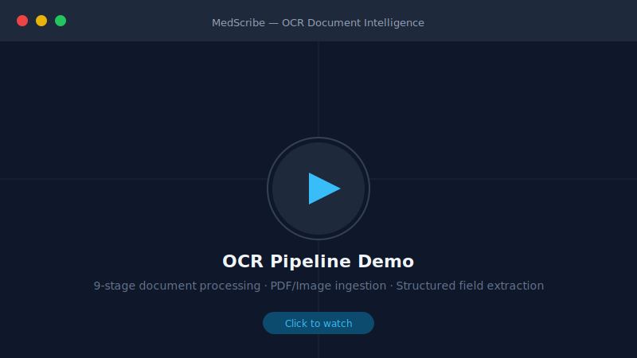
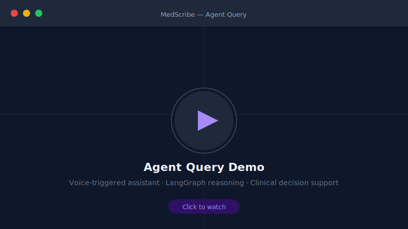
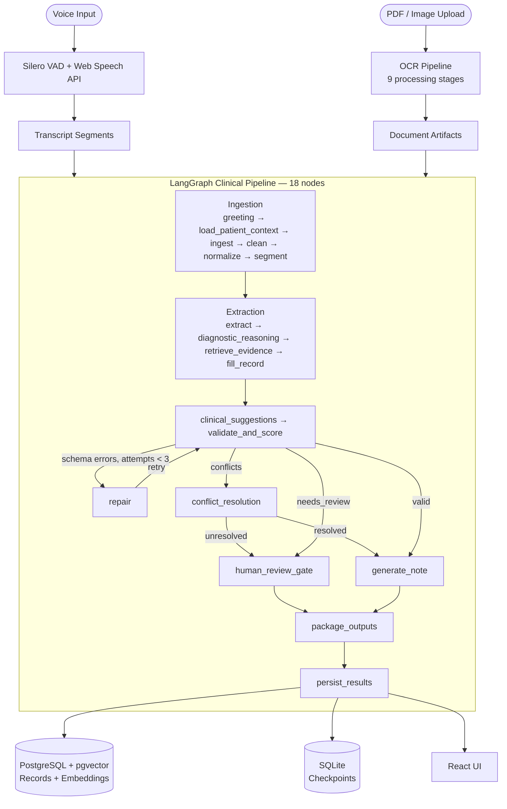

# MedScribe

A Real-Time, LangGraph-Orchestrated Medical Intelligence System for Automated Clinical Documentation and Patient-First Clinical Decision Support

---

## Demo

| OCR Document Intelligence | Agent Query |
|:-:|:-:|
| [](examples/OCR.mp4) | [](examples/Agent%20Query.mp4) |
| 9-stage OCR pipeline — PDF/image ingestion, deskew, layout detection, structured field extraction | Voice-triggered assistant query with LangGraph clinical reasoning and decision support |

---

## The Problem

Clinical documentation consumes an estimated 30–50% of physician time per shift. Existing transcription tools produce raw text, leaving the burden of structure extraction, conflict detection, and decision support entirely to the clinician. Legacy records exist in fragmented formats — handwritten notes, scanned PDFs, discharge summaries — that cannot be queried or integrated at the point of care.

## The Solution

MedScribe implements a multi-stage LangGraph clinical reasoning pipeline that:

- Ingests live voice transcriptions and uploaded historical documents
- Extracts structured clinical facts through layered NLP and LLM reasoning
- Grounds each extracted fact to its source utterance via pgvector semantic search, providing a verifiable audit trail
- Generates SOAP notes and multi-format medical records within a single async request cycle

---

## Pipeline Overview



---

## Key Features

**VAD-Gated Live Transcription**
Browser-side Silero VAD (ONNX via `@ricky0123/vad-react`, ~50–100ms onset latency) gates the Web Speech API, eliminating false activations and capturing complete utterances. An 800ms pre-speech audio buffer prevents truncation of utterance-initial words.

**18-Node LangGraph Clinical Pipeline**
A stateful, checkpointed directed graph executes the full clinical reasoning workflow. Conditional edges implement a repair loop (validate → repair → validate, max 3 iterations) and route to conflict resolution or a physician interrupt gate when validation fails. LangGraph's `SqliteSaver` checkpoints state after each node, enabling interrupt/resume without bespoke session recovery code.

**Multi-Stage OCR Document Intelligence**
Uploaded PDFs and images traverse a 9-stage pipeline: page splitting, deskew/denoise, layout detection, handwriting classification, RapidOCR extraction with engine fallback, medical normalization, document classification, structured field extraction with per-field confidence scores, and conflict detection against existing patient history.

**Semantic Evidence Grounding and Auditability**
Every extracted clinical fact is anchored to its originating source chunk via sentence-transformer embeddings and pgvector ANN search. Per-field confidence scores come from deterministic contract validation — each field has a `min_confidence` threshold defined in `validation_contracts.py`. No "magic" outputs: confidence score and source reference are logged to the per-node audit trace for every field.

**Clinical Decision Support**
Per-session allergy cross-checking and drug-drug interaction detection run as deterministic rule-based lookups over the patient's stored allergy list and medication history. LLM reasoning is used only for disambiguation. The validation node also performs cross-visit contradiction detection — comparing the current session's record against prior finalized records in PostgreSQL.

**Real-Time Pipeline Progress**
The `WorkflowEngine` streams node-level events to a server-side progress store as each of the 18 nodes completes. The frontend polls `GET /api/session/{id}/pipeline/status` to drive a real-time progress sidebar with per-node status, duration, and detail (e.g. "3 clinical facts extracted", "validation passed").

**Multi-Format Record Generation**
SOAP notes, discharge summaries, and referral letters are generated via Jinja2 templates rendered to HTML or PDF via WeasyPrint. Structured patient profiles persist across sessions in PostgreSQL, queryable by patient ID, MRN, or semantic similarity.

---

## Tech Stack

| Category | Technologies |
|---|---|
| Frontend | React 18, TypeScript, Create React App, Tailwind CSS |
| Voice | Silero VAD (ONNX via `@ricky0123/vad-react`), Web Speech API |
| Agent Orchestration | LangGraph, LangChain |
| LLM Inference | Groq API (llama-3.3-70b-versatile) |
| Backend | FastAPI, Uvicorn, Python 3.11+ |
| Database | PostgreSQL 15 + pgvector, SQLAlchemy 2.0, Alembic |
| Graph Checkpointing | SQLite (LangGraph `SqliteSaver`) |
| Embeddings | sentence-transformers (all-MiniLM-L6-v2) |
| OCR | RapidOCR, pdf2image, OpenCV |
| Document Generation | Jinja2, WeasyPrint |
| Auth | python-jose (JWT) |
| Containerisation | Docker, Docker Compose |

---

## Getting Started

### Prerequisites

- Docker Desktop
- Groq API key — free at [console.groq.com](https://console.groq.com)

### Quick Start

```bash
# Clone and configure
git clone https://github.com/GuchaIll/MedicalTranscriptionApp.git
cd MedicalTranscriptionApp
cp server/.env.example .env
# Open .env and set GROQ_API_KEY and SECRET_KEY

# Start all services
docker compose up
```

Access the app at `http://localhost:3000`

This starts:
1. PostgreSQL 15 + pgvector (database migrations run automatically on startup)
2. FastAPI backend at `http://localhost:3001`
3. React dev server at `http://localhost:3000` with hot-reload

```bash
docker compose down        # stop containers, keep database volume
docker compose down -v     # stop containers and delete database volume
docker compose up --build  # rebuild after dependency changes
```

### Minimum Required Environment Variables

```env
# Groq API key — required for LLM inference (SOAP note generation, field extraction)
GROQ_API_KEY=gsk_...

# JWT signing secret — generate with: python -c "import secrets; print(secrets.token_hex(32))"
SECRET_KEY=your_random_secret_key_here
```

`DATABASE_URL` is set automatically by `docker-compose.yml` — do not override it when using Docker.

Optional:

```env
# ElevenLabs TTS — browser SpeechSynthesis API is used as fallback if omitted
ELEVEN_LABS_API_KEY=sk_...

# HuggingFace — only needed for local embedding or diarisation models
HUGGINGFACE_API_KEY=hf_...
```

See [`server/.env.example`](server/.env.example) for the full variable reference.

---

## Key Engineering Decisions

**LangGraph over a custom state machine**
LangGraph provides native state serialisation, conditional edge routing, and interrupt/resume semantics. Each node checkpoints state to SQLite via `SqliteSaver`. A physician can interrupt before `human_review_gate`, and the graph resumes by calling `graph.invoke(None, config={"configurable": {"thread_id": session_id}})` — LangGraph replays from the checkpoint. Note: interrupts are currently disabled in the `/pipeline` endpoint (`enable_interrupts=False`) — the infrastructure is in place and can be re-enabled without code changes.

**pgvector over an external vector store**
Storing embeddings in PostgreSQL via pgvector eliminates an external dependency and keeps all patient data co-located under a single governance boundary — important for HIPAA-friendly architecture. The trade-off is that ANN index performance degrades under high concurrent query load relative to purpose-built vector databases, which is acceptable at clinic-scale volumes.

**Groq inference over local model serving**
Whisper and pyannote-audio are disabled at startup due to a `torchvision::nms` DLL conflict on Windows. Using Groq's hosted llama-3.3-70b produced an unexpected benefit: the server deploys on CPU-only machines with no CUDA dependency. SOAP note generation runs in approximately 1–3 seconds. Local Whisper inference remains on the roadmap once the dependency conflict is resolved.

For full engineering rationale see [docs/design-decisions.md](docs/design-decisions.md).

---

## API Endpoints

| Method | Endpoint | Description |
|--------|----------|-------------|
| POST | `/api/session/start` | Start a new session |
| POST | `/api/session/{id}/end` | End a session |
| POST | `/api/session/{id}/transcribe` | Add a transcript segment |
| POST | `/api/session/{id}/upload` | Upload a document for OCR |
| POST | `/api/session/{id}/pipeline` | Execute the 18-node LangGraph pipeline |
| GET | `/api/session/{id}/pipeline/status` | Poll real-time node-level pipeline progress |
| GET | `/api/session/{id}/record` | Get the session's structured record |
| GET | `/api/session/{id}/documents` | List OCR-processed documents |
| GET | `/api/clinical/suggestions` | On-demand clinical decision support |
| POST | `/api/records/generate` | Generate SOAP note / PDF / HTML |
| GET | `/api/patient/{id}` | Get patient profile |

---

## Future Improvements

**Immediate (post-dependency resolution)**
- Server-side Whisper + pyannote-audio for higher-accuracy transcription and automatic doctor/patient diarisation

**Near-term**
- Enable interrupt/resume for the human review gate (infrastructure built, `enable_interrupts=False` at the route level)
- SSE streaming for real-time pipeline progress (LangGraph `astream_events` + frontend `PipelineSteps` component already designed for this)
- Celery + Redis task queue to offload pipeline execution from the HTTP request cycle

**Roadmap**
- Prometheus metrics and OpenTelemetry tracing per LangGraph node
- FHIR R4 export for direct EHR integration (Epic, Cerner)
- Row-level security in PostgreSQL for multi-tenant clinic deployments

---

## Architecture

Full C4 component diagram, node reference table, and GraphState schema: [docs/architecture.md](docs/architecture.md)
