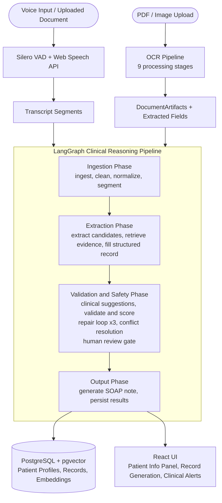

# MedScribe

A Real-Time, LangGraph-Orchestrated Medical Intelligence System for Automated Clinical Documentation and Patient-First Clinical Decision Support

MedScribe reduces physician documentation burden by turning live clinical conversations and uploaded legacy records into structured, queryable patient profiles — with HIPAA-friendly audit trails, inline drug-interaction alerts, and multi-format document generation.

---

## The Problem

Clinical documentation consumes an estimated 30–50% of physician time per shift. Existing transcription tools produce raw text, leaving the burden of structure extraction, conflict detection, and decision support entirely to the clinician. Legacy records exist in fragmented formats — handwritten notes, scanned PDFs, discharge summaries — that cannot be queried or integrated at the point of care.

## The Solution

MedScribe implements a multi-stage LangGraph clinical reasoning pipeline that:

- Ingests live voice transcriptions and uploaded historical documents
- Extracts structured clinical facts through layered NLP and LLM reasoning
- Grounds each extracted fact to its source utterance via pgvector semantic search, providing a verifiable audit trail
- Generates SOAP notes and multi-format medical records within a single async request cycle

Uploaded legacy records pass through a multi-stage OCR pipeline that:

- Classifies document types (lab report, discharge summary, referral, etc.)
- Extracts structured fields with confidence scores
- Detects conflicts with the existing patient history

This allows historical records to be integrated directly into the current clinical session without manual re-entry.

---

## Pipeline Overview



---

## System Architecture — C4 Component Diagram

```mermaid
C4Component
    title MedScribe System Architecture

    Container_Boundary(fe, "Browser Client — React 18 + TypeScript") {
        Component(vad, "Silero VAD + Web Speech API", "ONNX / Browser API", "50-100ms speech onset detection; gates Web Speech to prevent missed utterance starts")
        Component(ui, "MedicalTranscription", "React Component", "Session lifecycle, segment accumulation, pipeline trigger, record display")
        Component(upload, "Document Upload", "React Component", "Multipart PDF and image upload")
    }

    Container_Boundary(api, "FastAPI Backend — Port 3001") {
        Component(sess, "Session Router", "FastAPI Router", "/api/session/* — start, end, transcribe, upload, queue")
        Component(pipe, "Pipeline Endpoint", "FastAPI Router", "POST /api/session/{id}/pipeline — initialises GraphState and invokes WorkflowEngine")
        Component(clin, "Clinical Router", "FastAPI Router", "/api/clinical/* — on-demand allergy and interaction checks")
        Component(rec, "Records Router", "FastAPI Router", "/api/records/* — Jinja2 template selection and WeasyPrint document generation")
    }

    Container_Boundary(lg, "LangGraph Workflow Engine — server/app/agents/") {

        Container_Boundary(phase1, "Ingestion Phase") {
            Component(ingest, "ingest", "LangGraph Node", "Loads transcript segments and OCR DocumentArtifacts into GraphState")
            Component(clean, "clean + normalize", "LangGraph Node", "Removes disfluencies, expands medical abbreviations, standardises terminology")
            Component(segment, "segment_and_chunk", "LangGraph Node", "Splits conversation into topical clinical chunks for downstream extraction")
        }

        Container_Boundary(phase2, "Extraction Phase") {
            Component(extract, "extract_candidates", "LangGraph Node", "NLP entity extraction — medications, diagnoses, lab values, ICD-10 codes")
            Component(evidence, "retrieve_evidence", "LangGraph Node", "pgvector ANN search anchors each CandidateFact to source utterance or document chunk")
            Component(fill, "fill_structured_record", "LangGraph Node", "Maps candidate facts to typed StructuredRecord Pydantic schema")
        }

        Container_Boundary(phase3, "Validation and Safety Phase") {
            Component(sugg, "clinical_suggestions", "LangGraph Node", "Structured lookup against patient allergy list and medication history; LLM used only for disambiguation")
            Component(validate, "validate_and_score", "LangGraph Node", "Pydantic schema validation, per-field confidence scoring, flag assignment")
            Component(repair, "repair [loop max 3x]", "LangGraph Node", "LLM-guided schema repair on validation failure; routes back to validate")
            Component(conflict, "conflict_resolution", "LangGraph Node", "Resolves value discrepancies between extracted facts and stored patient history")
            Component(gate, "human_review_gate", "LangGraph Node — INTERRUPT", "Pauses graph execution for physician approval on critical risk flags before any write")
        }

        Container_Boundary(phase4, "Output Phase") {
            Component(generate, "generate_note", "LangGraph Node", "LLM generates structured SOAP clinical note from filled record and patient context")
            Component(persist, "persist_results", "LangGraph Node", "Writes StructuredRecord, embeddings, and full node-level audit trace to PostgreSQL")
        }
    }

    Container_Boundary(ocr, "OCR Pipeline — server/app/core/ocr/") {
        Component(splitter, "page_splitter", "Stage 1", "Converts PDF pages and images to normalised page images")
        Component(pre, "preprocessor + layout_detector", "Stages 2-3", "Deskew, denoise, contrast enhancement, region segmentation")
        Component(hw, "handwriting_detector", "Stage 4", "Classifies handwritten vs printed text regions for engine selection")
        Component(ocreng, "extractor", "Stage 5", "RapidOCR with engine fallback for per-region text extraction")
        Component(norm, "normalizer + document_classifier", "Stages 6-7", "Medical spelling correction; document type classification")
        Component(field, "field_extractor", "Stage 8", "Medical NLP patterns and LLM extraction of structured fields with confidence scores")
        Component(conf, "conflict_detector", "Stage 9", "Flags value conflicts between OCR fields and active patient record")
    }

    Container_Boundary(data, "Data Layer") {
        Component(pg, "PostgreSQL + pgvector", "Database", "Patient profiles, sessions, records, audit logs, vector embeddings")
        Component(chk, "SQLite Checkpoints", "LangGraph Persistence", "Graph state snapshot after each node — enables interrupt/resume across physician review")
        Component(groq, "Groq API — llama-3.3-70b-versatile", "External LLM", "SOAP note generation, speaker reclassification, field disambiguation")
        Component(elevenlabs, "ElevenLabs TTS", "External API", "Clinical note text-to-speech readback with browser SpeechSynthesis fallback")
    }

    Rel(vad, ui, "Utterances with timestamps")
    Rel(ui, sess, "POST /api/session/start, /transcribe")
    Rel(ui, pipe, "POST /api/session/{id}/pipeline with accumulated segments")
    Rel(upload, sess, "POST /api/session/{id}/upload multipart")

    Rel(sess, ocr, "Dispatches uploaded file to OCR pipeline")
    Rel(splitter, pre, "")
    Rel(pre, hw, "")
    Rel(hw, ocreng, "")
    Rel(ocreng, norm, "")
    Rel(norm, field, "")
    Rel(field, conf, "")
    Rel(conf, sess, "DocumentProcessingResult stored in session queue")

    Rel(pipe, ingest, "Initialises GraphState with segments and document artifacts")
    Rel(ingest, clean, "")
    Rel(clean, segment, "")
    Rel(segment, extract, "")
    Rel(extract, evidence, "")
    Rel(evidence, fill, "")
    Rel(fill, sugg, "")
    Rel(sugg, validate, "")
    Rel(validate, repair, "schema_errors=true AND attempts < 3")
    Rel(repair, validate, "retry")
    Rel(validate, conflict, "conflict flag set")
    Rel(validate, gate, "needs_review flag set")
    Rel(validate, generate, "valid, no interrupt required")
    Rel(conflict, generate, "")
    Rel(gate, generate, "physician approved")
    Rel(generate, persist, "")

    Rel(evidence, pg, "pgvector ANN embedding query")
    Rel(generate, groq, "LLM completion for SOAP note")
    Rel(field, groq, "LLM field disambiguation")
    Rel(persist, pg, "SQLAlchemy ORM — patient record and embeddings write")
    Rel(persist, chk, "LangGraph checkpoint commit")

    Rel(clin, pg, "Patient allergy and medication history lookup")
    Rel(rec, pg, "Fetch structured record for template rendering")
    Rel(rec, elevenlabs, "TTS synthesis on generated note")
```

---

## Key Features

**VAD-Gated Live Transcription**

Browser-side Silero VAD (ONNX, ~50–100ms onset latency) detects speech boundaries and gates the Web Speech API, eliminating false activations and capturing complete utterances. An 800ms pre-speech audio buffer prevents truncation of utterance-initial words. Speaker labels are assigned per utterance and can be reclassified post-session via LLM. The Web Speech API is the current transcription layer for development; server-side Whisper with pyannote-audio diarisation is planned once the PyTorch dependency conflict is resolved (see Engineering Decisions).

**Multi-Stage LangGraph Clinical Reasoning Pipeline**

A stateful, checkpointed directed graph executes the full clinical reasoning workflow across four phases:

- **Ingestion:** cleans and segments raw transcript into topical clinical chunks
- **Extraction:** NLP entity recognition followed by pgvector evidence grounding
- **Validation and Safety:** Pydantic schema validation with a repair loop (max 3 iterations), structured drug and allergy checks, conditional conflict resolution, and a human-in-the-loop interrupt gate that pauses execution for physician sign-off before any write
- **Output:** LLM SOAP note generation and PostgreSQL persistence with full node-level audit trace

**Multi-Stage OCR Document Intelligence**

Uploaded PDFs and images traverse a sequential pipeline that:

- Deskews, denoises, and segments page layout
- Classifies handwritten vs. printed regions for engine selection
- Extracts text via RapidOCR with engine fallback
- Classifies the document type and extracts structured fields using medical NLP patterns and LLM disambiguation with per-field confidence scores
- Detects conflicts against existing patient history before merging into the active session

**Semantic Evidence Grounding and Auditability**

Every candidate clinical fact extracted from transcripts is anchored to its originating source chunk via sentence-transformer embeddings and pgvector approximate nearest-neighbor search. This provides field-level provenance and auditability — each medication dose, diagnosis, or lab value is traceable to a specific utterance or document passage. The system does not produce "magic" outputs: every structured field has a confidence score and a source reference logged to the audit trail. This architecture is designed with HIPAA-friendly data handling in mind, including per-node trace logs, a physician approval gate, and co-located PHI storage under a single data governance boundary.

**Clinical Decision Support**

Per-session allergy cross-checking, drug-drug interaction detection, and contraindication warnings are computed by performing structured lookups against the patient's stored allergy list and medication history. LLM reasoning is used only for disambiguation of ambiguous drug names — the risk stratification logic (critical / high / medium / low) runs on deterministic rules over structured patient data. Alerts are surfaced inline during pipeline execution and via dedicated REST endpoints for real-time UI queries.

**Patient Profile Querying and Multi-Format Record Generation**

Structured patient profiles persist across sessions in PostgreSQL and are queryable by patient ID, MRN, or semantic similarity via pgvector. Physicians can generate SOAP notes, discharge summaries, and referral letters from any session using Jinja2 templates rendered to HTML or PDF via WeasyPrint.

---

## Tech Stack

| Category | Tooling |
|---|---|
| Frontend Framework | React 18 + TypeScript, Create React App |
| Frontend Styling | Tailwind CSS |
| Voice Capture | Silero VAD (ONNX via onnxruntime-web), Web Speech API |
| Agent Orchestration | LangGraph 1.0.5, LangChain |
| LLM Inference | Groq API (llama-3.3-70b-versatile) |
| Backend Web Framework | FastAPI, Uvicorn |
| Database ORM | SQLAlchemy 2.0, Alembic |
| Relational Database | PostgreSQL 13+ |
| Vector Database | pgvector (PostgreSQL extension) |
| Embeddings | sentence-transformers |
| OCR Engine | RapidOCR, pdf2image, OpenCV |
| Document Generation | Jinja2, WeasyPrint (PDF) |
| Text-to-Speech | ElevenLabs, browser SpeechSynthesis API |
| Authentication | FastAPI OAuth2 + JWT |
| Testing | Pytest, FastAPI TestClient |
| Containerisation | Docker, nginx |

---

## Getting Started

### Prerequisites

- Python 3.10+
- Node.js 18+
- PostgreSQL 13+ with the `pgvector` extension installed
- Groq API key (for LLM inference)
- ElevenLabs API key (optional — browser SpeechSynthesis fallback is available)

### Installation and Usage

```bash
# Clone the repository
git clone https://github.com/your-username/MedicalTranscriptionApp.git
cd MedicalTranscriptionApp

# Configure environment variables
cp .env.example .env
# Edit .env and set DATABASE_URL, GROQ_API_KEY, ELEVENLABS_API_KEY, SECRET_KEY

# Install backend dependencies
cd server
python -m venv .venv

# Activate virtual environment
# Windows (Command Prompt):  .venv\Scripts\activate
# Windows (PowerShell):      .venv\Scripts\Activate.ps1
# macOS / Linux:             source .venv/bin/activate

pip install -r requirements.txt

# Run database migrations
alembic upgrade head

# Start the FastAPI backend
uvicorn main:app --reload --port 3001

# In a separate terminal — install and start the React frontend
cd ../client/medscribe
npm install
npm start
# Frontend available at http://localhost:3000
```

### Environment Variables

| Variable | Description |
|---|---|
| `DATABASE_URL` | PostgreSQL connection string (pgvector extension must be installed) |
| `GROQ_API_KEY` | Groq API key for LLM inference |
| `ELEVENLABS_API_KEY` | ElevenLabs API key for TTS (optional) |
| `SECRET_KEY` | JWT signing secret |
| `EMBEDDING_MODEL` | Sentence-transformer model name (default: `all-MiniLM-L6-v2`) |

---

## Engineering Decisions

**LangGraph with Checkpoint Persistence Over a Custom State Machine**

LangGraph was selected over a hand-rolled pipeline because it provides native state serialisation, conditional edge routing, and interrupt/resume semantics out of the box. The checkpoint-to-SQLite pattern means a physician can interrupt the workflow for review, close the browser, and resume exactly where the graph paused — without bespoke session recovery code. The `AgentContext` dependency injection pattern means each node receives its services (LLMClient, EmbeddingService, PatientRepository) explicitly rather than importing singletons, keeping nodes independently testable.

**Groq Inference Over Local Model Serving**

Whisper and pyannote-audio are present in the dependency list but are disabled at startup due to a `torchvision::nms` DLL conflict introduced by the PyTorch/Lightning version intersection on Windows. Rather than blocking development on a package conflict, Groq's hosted llama-3.3-70b was adopted as the inference backend. This pragmatic decision produced an unexpected benefit: the server now deploys on CPU-only machines with no CUDA dependency, significantly reducing the infrastructure footprint during the prototype phase. SOAP note generation runs in approximately 1–3 seconds depending on transcript length. Local Whisper inference remains on the roadmap once the dependency conflict is resolved.

**Silero VAD Gating the Web Speech API**

The Web Speech API alone misses the first 100–400ms of each utterance because the browser delays recognition start until audio crosses a noise threshold. Silero VAD runs in a Web Worker and fires `onSpeechStart` at approximately 50–100ms after voice onset, at which point the parent thread initialises the recognition session. An 800ms pre-speech audio pad is buffered so the recogniser has framing context for the full utterance. This hybrid approach is specific to the current browser-based prototype; server-side Whisper will replace it when GPU resources are available.

**pgvector for Evidence Grounding Rather Than a Separate Vector Store**

Storing embeddings in PostgreSQL via pgvector eliminates an external dependency (Pinecone, Weaviate, Chroma) and keeps all patient data co-located under a single data governance boundary — important for HIPAA-friendly architecture. The trade-off is that ANN index performance degrades at very large embedding counts relative to purpose-built vector databases, which is acceptable at clinic-scale patient volumes but would require migration to a dedicated store at enterprise scale.

**`server/main.py` Instead of `server/app.py`**

The FastAPI application was moved from `app.py` to `main.py` because the `server/app/` package directory shadows the `app` module name in Python's import resolution, causing an ASGI lookup failure at startup. The server is launched as `uvicorn main:app --reload --port 3001` from the `server/` directory.

**Trade-off: Synchronous Pipeline Execution via HTTP**

The full LangGraph graph runs synchronously within a single POST response to `/api/session/{id}/pipeline`. This simplifies the client — no polling loop or WebSocket handshake is required — but caps request duration at Uvicorn's worker timeout. To handle potential long-running OCR tasks within the synchronous request boundary, the React client implements a 120-second axios timeout with optimistic UI updates for the transcript segment log, so the interface remains responsive while the pipeline executes. A streaming SSE endpoint backed by LangGraph's `astream_events` interface would resolve the timeout constraint without sacrificing real-time progress visibility.

---

## Future Improvements

**Whisper and Pyannote Speaker Diarisation:** Once the PyTorch/Lightning DLL conflict is resolved, replace browser-side Web Speech API with server-side Whisper for higher accuracy and pyannote-audio for multi-speaker diarisation — enabling automatic doctor/patient label assignment without a post-session LLM reclassification step.

**Streaming Pipeline via Server-Sent Events:** Replace the synchronous `/pipeline` response with an SSE stream emitting node-level progress events. The frontend already contains a `PipelineSteps` animation component designed for this; the backend change is adopting the LangGraph `astream_events` interface.

**Task Queue for Pipeline Execution:** Move the LangGraph WorkflowEngine behind a task queue (Celery + Redis or Ray) so concurrent pipeline runs do not share a single event loop and GPU-bound OCR and embedding workloads can be offloaded to dedicated workers. This also eliminates the synchronous HTTP timeout constraint.

**Prometheus Metrics and Distributed Tracing:** Expose per-node execution latency, LLM token consumption, validation failure rates, and OCR confidence distributions via a `/metrics` endpoint. Integrate OpenTelemetry tracing across LangGraph nodes to correlate slow pipeline runs with specific document types or transcript characteristics.

**FHIR R4 Export:** Add a FHIR R4 serialisation layer over the existing `StructuredRecord` schema to enable direct integration with EHR systems (Epic, Cerner) via their FHIR APIs, removing PDF as the only external data pathway.

**Role-Based Multi-Tenant Data Isolation:** Extend the existing RBAC model to enforce row-level security in PostgreSQL so that multi-clinic deployments share infrastructure without cross-tenant data visibility, meeting the isolation requirements of a cloud-hosted SaaS deployment.
