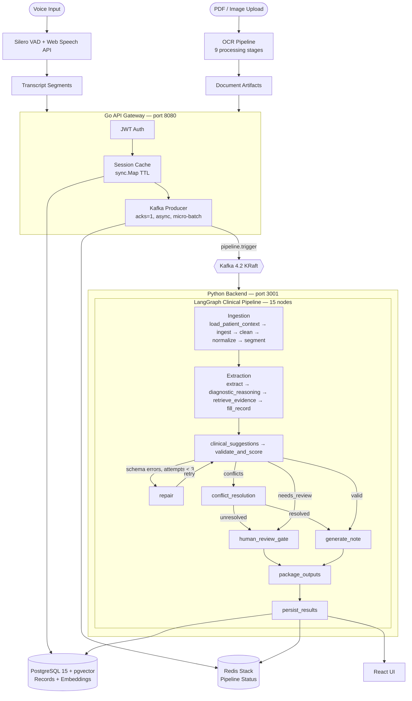

# MedScribe

A distributed, real-time clinical intelligence platform built on a Go API gateway, Kafka event bus, and LangGraph orchestration pipeline for automated medical documentation and patient-first clinical decision support

---

## Demo

**OCR Document Intelligence** — 9-stage pipeline: PDF/image ingestion, deskew, layout detection, structured field extraction

<video src="https://github.com/user-attachments/assets/9d75ba9a-ab37-4bcf-937e-ec9ca55ee5d3" controls poster="examples/thumbnail-agent-query.png" width="100%"></video>

**Agent Query** — Live transcription and voice-triggered assistant with LangGraph clinical reasoning and decision support

<video src="https://github.com/user-attachments/assets/07d598fc-aa8a-4a00-932c-156e4e08d6d4" controls poster="examples/thumbnail-ocr.png" width="100%"></video>


---

## The Problem

Clinical documentation consumes an estimated 30–50% of physician time per shift. Existing transcription tools produce raw text, leaving the burden of structure extraction, conflict detection, and decision support entirely to the clinician. Legacy records exist in fragmented formats — handwritten notes, scanned PDFs, discharge summaries — that cannot be queried or integrated at the point of care.

## The Solution

MedScribe implements a distributed microservices architecture where a Go API gateway handles authentication, session management, and request routing at 500 QPS (p50 < 1ms), publishes pipeline triggers to Kafka, and delegates clinical reasoning to a 15-node LangGraph pipeline running on a Python backend. The system:

- Ingests live voice transcriptions and uploaded historical documents through the Go gateway
- Publishes pipeline triggers asynchronously via Kafka with micro-batching for throughput
- Extracts structured clinical facts through layered NLP and LLM reasoning on the Python service
- Grounds each extracted fact to its source utterance via pgvector semantic search, providing a verifiable audit trail
- Generates SOAP notes and multi-format medical records within a single async pipeline cycle

---

## Pipeline Overview



---

## Key Features

**VAD-Gated Live Transcription**
Browser-side Silero VAD (ONNX via `@ricky0123/vad-react`, ~50–100ms onset latency) gates the Web Speech API, eliminating false activations and capturing complete utterances. An 800ms pre-speech audio buffer prevents truncation of utterance-initial words.

**15-Node LangGraph Clinical Pipeline**
A stateful directed graph executes the full clinical reasoning workflow behind the Go gateway. The gateway publishes a Kafka trigger; the Python backend consumes it and runs the pipeline. Conditional edges implement a repair loop (validate -> repair -> validate, max 3 iterations) and route to conflict resolution or a physician interrupt gate when validation fails. Pipeline status is streamed to Redis for real-time frontend polling.

**Multi-Stage OCR Document Intelligence**
Uploaded PDFs and images traverse a 9-stage pipeline: page splitting, deskew/denoise, layout detection, handwriting classification, RapidOCR extraction with engine fallback, medical normalization, document classification, structured field extraction with per-field confidence scores, and conflict detection against existing patient history.

**Semantic Evidence Grounding and Auditability**
Every extracted clinical fact is anchored to its originating source chunk via sentence-transformer embeddings and pgvector ANN search. Per-field confidence scores come from deterministic contract validation — each field has a `min_confidence` threshold defined in `validation_contracts.py`. No "magic" outputs: confidence score and source reference are logged to the per-node audit trace for every field.

**Clinical Decision Support**
Per-session allergy cross-checking and drug-drug interaction detection run as deterministic rule-based lookups over the patient's stored allergy list and medication history. LLM reasoning is used only for disambiguation. The validation node also performs cross-visit contradiction detection — comparing the current session's record against prior finalized records in PostgreSQL.

**Real-Time Pipeline Progress**
The `WorkflowEngine` streams node-level events to Redis as each of the 15 nodes completes. The Go gateway exposes `GET /api/session/{id}/pipeline/status` which reads from Redis to drive a real-time progress sidebar with per-node status, duration, and detail (e.g. "3 clinical facts extracted", "validation passed").

**Multi-Format Record Generation**
SOAP notes, discharge summaries, and referral letters are generated via Jinja2 templates rendered to HTML or PDF via WeasyPrint. Structured patient profiles persist across sessions in PostgreSQL, queryable by patient ID, MRN, or semantic similarity.

---

## Tech Stack

| Category | Technologies |
|---|---|
| Frontend | React 18, TypeScript, Create React App, Tailwind CSS |
| Voice | Silero VAD (ONNX via `@ricky0123/vad-react`), Web Speech API |
| API Gateway | Go 1.26, chi v5, pgx/v5, golang-jwt/v5, Prometheus client |
| Event Bus | Apache Kafka 4.2 (KRaft mode), confluent-kafka-go/v2 |
| Cache / Status Store | Redis Stack, go-redis/v9, sync.Map TTL session cache |
| Agent Orchestration | LangGraph, LangChain |
| LLM Inference | Groq, OpenAI, Anthropic Claude, Google Gemini, OpenRouter (multi-provider) |
| Python Backend | FastAPI, Uvicorn, Python 3.11+ |
| Database | PostgreSQL 15 + pgvector, pgx/v5 (Go), SQLAlchemy 2.0 (Python), Alembic |
| Embeddings | sentence-transformers (all-MiniLM-L6-v2) |
| OCR | RapidOCR, pdf2image, OpenCV |
| Document Generation | Jinja2, WeasyPrint |
| Auth | golang-jwt/v5 (Go gateway), python-jose (Python) |
| Observability | Prometheus, k6 load testing |
| Containerisation | Docker, Docker Compose |

---

## Getting Started

### Prerequisites

- Docker Desktop
- At least one LLM API key (Groq, OpenAI, Anthropic, Google, or OpenRouter)

### Quick Start

```bash
# Clone and configure
git clone https://github.com/GuchaIll/MedicalTranscriptionApp.git
cd MedicalTranscriptionApp
cp .env.example .env
# Open .env and set SECRET_KEY plus at least one LLM API key

# Start all services
docker compose up
```

Access the app at `http://localhost:3000`

This starts:
1. PostgreSQL 15 + pgvector (database migrations run automatically on startup)
2. Redis Stack (session cache + pipeline status)
3. Apache Kafka 4.2 in KRaft mode (event bus)
4. Go API gateway at `http://localhost:8080` (JWT auth, routing, Kafka producer)
5. FastAPI Python backend at `http://localhost:3001` (LangGraph pipeline, OCR)
6. React dev server at `http://localhost:3000` with hot-reload

```bash
docker compose down        # stop containers, keep database volume
docker compose down -v     # stop containers and delete database volume
docker compose up --build  # rebuild after dependency changes
```

### Minimum Required Environment Variables

```env
# Configure at least one LLM provider key.
GROQ_API_KEY=gsk_...
OPENAI_API_KEY=sk_...
ANTHROPIC_API_KEY=sk_ant_...
GOOGLE_API_KEY=...
OPENROUTER_API_KEY=sk_or_...

# Optional explicit provider selection when multiple keys are present.
# If omitted, the app auto-selects in priority order:
# groq -> openai -> anthropic -> google -> openrouter
LLM_PROVIDER=groq

# JWT signing secret — generate with: python -c "import secrets; print(secrets.token_hex(32))"
SECRET_KEY=your_random_secret_key_here
```

`DATABASE_URL` is set automatically by `docker-compose.yml` — do not override it when using Docker.

Optional:

```env
# ElevenLabs TTS — browser SpeechSynthesis API is used as fallback if omitted
ELEVEN_LABS_API_KEY=sk_...

# HuggingFace — only needed for local embedding or diarisation models
HUGGINGFACE_API_KEY=hf_...
```

See [.env.example](.env.example) for the root Docker Compose template and [server/.env.example](server/.env.example) for the full server variable reference.

---

## Key Engineering Decisions

**Strangler-fig migration to Go gateway**
The monolithic Python server is being decomposed via a strangler-fig pattern. A Go API gateway (`services/api/`) now owns authentication, session management, and request routing. It publishes pipeline triggers to Kafka asynchronously (`acks=1`, micro-batched) and proxies remaining endpoints to the Python backend. This separation achieved 500 QPS ingestion throughput at p50 < 1ms latency.

**Kafka async pipeline triggers over synchronous HTTP**
Pipeline execution is decoupled from the HTTP request cycle via Kafka. The gateway produces to `pipeline.trigger` with `acks=1` and async delivery (fire-and-forget with background event draining). Micro-batching (`linger.ms=10`, `batch.size=64KB`) amortises broker round-trips. Pipeline status is seeded in Redis asynchronously so the gateway returns immediately.

**In-process session cache over per-request DB lookups**
A `sync.Map`-based TTL cache in the gateway eliminates PostgreSQL round-trips for session validation on the hot path. Cache entries expire after 1 hour with a background reaper goroutine. This reduced p50 trigger latency from ~15ms to < 1ms.

**LangGraph for clinical orchestration**
LangGraph provides native state serialisation, conditional edge routing, and interrupt/resume semantics for the 15-node clinical pipeline. The interrupt infrastructure is built but currently disabled (`enable_interrupts=False`). Pipeline status updates stream to Redis for real-time frontend polling.

**pgvector over an external vector store**
Storing embeddings in PostgreSQL via pgvector eliminates an external dependency and keeps all patient data co-located under a single governance boundary -- important for HIPAA-friendly architecture.

**Multi-provider LLM inference**
MedScribe supports five LLM backends: Groq, OpenAI, Anthropic Claude, Google Gemini, and OpenRouter. Auto-selects based on configured API keys. SOAP note generation runs in approximately 1-3 seconds on Groq.

For full engineering rationale see [docs/design-decisions.md](docs/design-decisions.md).

---

## API Endpoints

All endpoints are served by the Go gateway at port 8080. Auth and session routes are handled natively; pipeline and clinical routes are proxied to the Python backend.

| Method | Endpoint | Handled By | Description |
|--------|----------|------------|-------------|
| POST | `/api/auth/register` | Go | Register a new user |
| POST | `/api/auth/login` | Go | Authenticate and receive JWT |
| GET | `/api/auth/profile` | Go | Get current user profile |
| POST | `/api/session/start` | Go | Start a new session |
| POST | `/api/session/{id}/end` | Go | End a session |
| POST | `/api/session/{id}/transcribe` | Go | Add a transcript segment |
| POST | `/api/session/{id}/upload` | Go -> Python | Upload a document for OCR |
| POST | `/api/session/{id}/pipeline` | Go -> Kafka -> Python | Trigger the 15-node LangGraph pipeline |
| GET | `/api/session/{id}/pipeline/status` | Go (Redis) | Poll real-time node-level pipeline progress |
| GET | `/api/session/{id}/record` | Go -> Python | Get the session's structured record |
| GET | `/api/session/{id}/documents` | Go -> Python | List OCR-processed documents |
| GET | `/api/patient/{id}/profile` | Go -> Python | Get patient profile |
| GET | `/api/patient/{id}/lab-trends` | Go -> Python | Get lab result trends |
| GET | `/api/patient/{id}/risk-score` | Go -> Python | Get patient risk score |
| POST | `/api/records/generate` | Go -> Python | Generate SOAP note / PDF / HTML |
| GET | `/api/llm/providers` | Go -> Python | List available LLM providers |
| POST | `/api/llm/provider` | Go -> Python | Select an LLM provider at runtime |

---

## Future Improvements

**Near-term**
- Rust extraction microservice for field extraction targeting 100ms latency
- gRPC service mesh replacing HTTP proxying between Go gateway and Python backend
- Enable interrupt/resume for the human review gate (infrastructure built, `enable_interrupts=False`)
- SSE streaming via LangGraph `astream_events` for real-time pipeline progress
- Server-side Whisper + pyannote-audio for transcription and diarisation

**Roadmap**
- Kubernetes deployment with horizontal pod autoscaling
- OpenTelemetry distributed tracing across Go, Kafka, and Python services
- FHIR R4 export for direct EHR integration (Epic, Cerner)
- Row-level security in PostgreSQL for multi-tenant clinic deployments
- LangGraph 0.3+ migration for native async checkpointing

---

## Architecture

Full C4 component diagram, node reference table, and GraphState schema: [docs/architecture.md](docs/architecture.md)

---

## Access Points

| Service | URL | Notes |
|---------|-----|-------|
| Go Gateway | http://localhost:8080 | Main entry point, all API traffic |
| Python API | http://localhost:3001 | Internal, not exposed to clients |
| React Client | http://localhost:3000 | Proxies `/api` to gateway |
| Prometheus | http://localhost:9090 | Metrics (monitoring overlay) |
| Grafana | http://localhost:3100 | Dashboards, default admin/admin |

