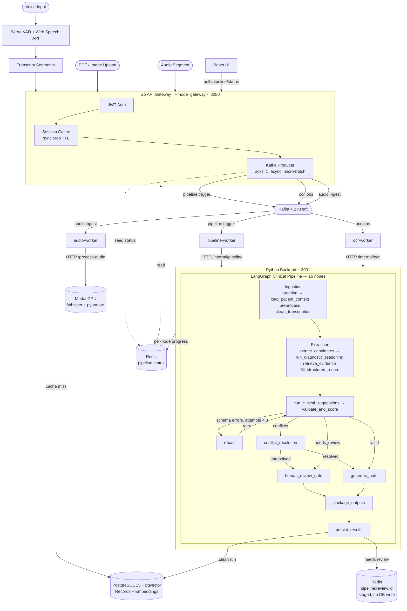

# MedScribe

A distributed, real-time clinical intelligence platform built on a Go API gateway, Kafka event bus, and LangGraph orchestration pipeline for automated medical documentation and patient-first clinical decision support

---

## Demo

**OCR Document Intelligence** — 9-stage pipeline: PDF/image ingestion, deskew, layout detection, structured field extraction

<video src="https://github.com/user-attachments/assets/9d75ba9a-ab37-4bcf-937e-ec9ca55ee5d3" controls poster="examples/thumbnail-agent-query.png" width="100%"></video>

**Agent Query** — Live transcription and voice-triggered assistant with LangGraph clinical reasoning and decision support

<video src="https://github.com/user-attachments/assets/07d598fc-aa8a-4a00-932c-156e4e08d6d4" controls poster="examples/thumbnail-ocr.png" width="100%"></video>


---

## The Problem

Clinical documentation consumes an estimated 30–50% of physician time per shift. Existing transcription tools produce raw text, leaving the burden of structure extraction, conflict detection, and decision support entirely to the clinician. Legacy records exist in fragmented formats — handwritten notes, scanned PDFs, discharge summaries — that cannot be queried or integrated at the point of care.

## The Solution

MedScribe implements a distributed microservices architecture where a Go API gateway handles authentication, session management, and request routing, publishes pipeline triggers to Kafka, and delegates clinical reasoning to a 16-node LangGraph pipeline running on a Python backend. The current benchmark harness and evidence pack for ingestion throughput and hot-path latency live in `docs/benchmarks/gateway-ingestion-qps/`. The system:

- Ingests live voice transcriptions and uploaded historical documents through the Go gateway
- Publishes pipeline triggers asynchronously via Kafka with micro-batching for throughput
- Extracts structured clinical facts through layered NLP and LLM reasoning on the Python service
- Grounds each extracted fact to its source utterance via pgvector semantic search, providing a verifiable audit trail
- Generates SOAP notes and multi-format medical records within a single async pipeline cycle

---

## Pipeline Overview


```mermaid
flowchart TD
    %% ── Clients / inputs ──
    A([Voice Input]) --> B[Silero VAD + Web Speech API]
    B --> C[Transcript Segments]
    C --> GW
    D([PDF / Image Upload]) --> GW
    AU([Audio Segment]) --> GW

    %% ── Go gateway: one binary, --mode=gateway ──
    subgraph GW [Go API Gateway · --mode=gateway · :8080]
        direction LR
        GW1[JWT Auth] --> GW2[Session Cache\nsync.Map TTL]
        GW2 --> GW3[Kafka Producer\nacks=1, async, micro-batch]
    end

    %% ── Kafka topics (one per lane) ──
    GW3 -->|pipeline.trigger| K{{Kafka 4.2 KRaft}}
    GW3 -->|ocr.jobs| K
    GW3 -->|audio.ingest| K

    %% ── Consumer-proxy workers: same image, different --mode ──
    K -->|pipeline.trigger| W1[pipeline-worker]
    K -->|ocr.jobs| W2[ocr-worker]
    K -->|audio.ingest| W3[audio-worker]
    W1 -->|HTTP /internal/pipeline| PY
    W2 -->|HTTP /internal/ocr| PY
    W3 -->|HTTP /process-audio| MODAL[(Modal GPU\nWhisper + pyannote)]

    %% ── Python backend ──
    subgraph PY [Python Backend · :3001]
        direction TB
        subgraph LG [LangGraph Clinical Pipeline — 16 nodes]
            direction TB
            G1[Ingestion\ngreeting → load_patient_context → preprocess → clean_transcription] -->
            G2[Extraction\nextract_candidates → run_diagnostic_reasoning → retrieve_evidence → fill_structured_record] -->
            G3[run_clinical_suggestions → validate_and_score]
            G3 -->|schema errors, attempts < 3| G3R[repair]
            G3R -->|retry| G3
            G3 -->|conflicts| G3C[conflict_resolution]
            G3C -->|unresolved| G3V[human_review_gate]
            G3C -->|resolved| G4
            G3 -->|needs_review| G3V
            G3 -->|valid| G4[generate_note]
            G3V --> G4B[package_outputs]
            G4 --> G4B
            G4B --> G5[persist_results]
        end
    end

    %% ── Persistence + the review gate ──
    GW2 -->|cache miss| PG[(PostgreSQL 15 + pgvector\nRecords + Embeddings)]
    G5 -->|clean run| PG
    G5 -->|needs review| RV[(Redis\npipeline:review:id\nstaged, no DB write)]

    %% ── Status: Python streams progress to Redis; client polls the gateway ──
    PY -->|per-node progress| RD[(Redis\npipeline status)]
    GW3 -.->|seed status| RD
    RD -.->|read| GW
    UI[React UI] -->|poll /pipeline/status| GW
```

> The diagram details the **pipeline lane**; the **OCR** and **audio** lanes follow the identical `gateway → Kafka → worker → backend` shape (see the lane table below).

---

## System Architecture Walkthrough

MedScribe is three tiers separated by two decoupling layers. The **React client** talks only to the **Go gateway**; the gateway never blocks on heavy work — it hands off through **Kafka** (compute decoupling) and communicates results back through **Redis** (cross-process state). The **Python backend** does the clinical reasoning, OCR, and (via Modal) speech.

### 1. One Go binary, five modes

`services/api` compiles to a single binary ([`cmd/app/main.go`](services/api/cmd/app/main.go)) whose role is chosen by `--mode`, dispatched in [`internal/app/app.go`](services/api/internal/app/app.go):

| Mode | Runs | Deployed as |
|---|---|---|
| `gateway` | HTTP API only | gateway Deployment |
| `pipeline-worker` | `pipeline.trigger` consumer | worker Deployment |
| `ocr-worker` | `ocr.jobs` consumer | worker Deployment |
| `audio-worker` | `audio.ingest` consumer | worker Deployment |
| `all` | everything in one process | local dev / `docker compose` (**default**) |

`docker compose` runs `--mode=all` (single process); in production each role is a separate Kubernetes Deployment off the **same image** (`infra/k8s/`), so a slow pipeline backs up only the `pipeline-worker` — scaled on Kafka consumer lag via KEDA — without touching the gateway's request path. This is a deliberate strangler-fig step: the consumers are independently deployable and scalable without yet being separate codebases.

### 2. Request lifecycle — a pipeline run

1. **Client → Gateway.** `POST /api/session/{id}/pipeline` hits [`TriggerPipeline`](services/api/internal/controller/http/v1/session.go), which calls the usecase [`pipeline.go`](services/api/internal/usecase/pipeline.go). The usecase publishes the job to Kafka `pipeline.trigger`, seeds a `pipeline:{id}` status key in Redis, and returns **202 Accepted** immediately — no waiting on inference.
2. **Kafka → Worker.** The `pipeline-worker` consumes the message ([`pipelineproxy/handler.go`](services/api/internal/usecase/pipelineproxy/handler.go)) and makes an HTTP `POST` to the Python backend's internal `/internal/pipeline` endpoint.
3. **Python runs the graph.** [`run_pipeline_internal`](server/app/api/routes/internal_pipeline.py) builds the LangGraph via [`build_graph`](server/app/agents/graph.py) and streams it. As each node completes, the [`pipeline_progress_store`](server/app/core/pipeline_progress.py) writes per-node detail to Redis `pipeline:progress:{id}`.
4. **Persist or stage.** The terminal [`persist_results`](server/app/agents/nodes/persist_results.py) node forks: a clean run writes the record + embeddings to Postgres; a run flagged `awaiting_human_review` instead **stages the proposed record to Redis `pipeline:review:{id}` and writes nothing to the database** (physician sign-off gate).
5. **Client polls.** Throughout, the React UI polls `GET /api/session/{id}/pipeline/status`, which the gateway answers by reading Redis. The Python backend never pushes to the UI.

### 3. The three Kafka lanes

Every heavy operation follows the same `gateway → Kafka → worker → backend` pattern:

| Lane | Entry route | Topic | Worker (`--mode`) | Forwards to |
|---|---|---|---|---|
| Pipeline | `POST /{id}/pipeline` | `pipeline.trigger` | `pipeline-worker` | Python `/internal/pipeline` |
| OCR | `POST /{id}/upload` | `ocr.jobs` | `ocr-worker` | Python OCR (9-stage) |
| Audio | `POST /{id}/audio-segment` | `audio.ingest` | `audio-worker` | Modal Whisper + pyannote |

(Producers: [`pipeline.go`](services/api/internal/usecase/pipeline.go), [`document.go`](services/api/internal/usecase/document.go), [`audio_ingest.go`](services/api/internal/usecase/audio_ingest.go).)

### 4. Inside the clinical pipeline

[`graph.py`](server/app/agents/graph.py) is the **single source of truth** for the 16-node topology; [`pipeline_progress.py`](server/app/core/pipeline_progress.py) and the frontend catalogue ([`pipelineNodes.ts`](client/v2/src/lib/pipelineNodes.ts)) mirror its node names exactly (matched against streamed events, so they must be identical). 13 nodes form the linear main path; 3 are conditional, entered only via `validate_and_score` routing: `repair` (loops back, max 3 attempts), `conflict_resolution`, and `human_review_gate`. LLMs run in only **four** nodes (`run_diagnostic_reasoning`, `repair`, `field_extractor` for OCR disambiguation, `generate_note`); validation, clinical suggestions, and conflict detection are deterministic. Review is **not** a mid-pipeline interrupt — the graph runs to completion and `persist_results` stages flagged runs for end-of-session sign-off (see lifecycle step 4).

### 5. State & contracts

Three Redis keys carry all cross-process state, all readable by the Go gateway:

- `pipeline:{id}` — top-level status (pending/running/completed/failed); seeded by the gateway, finalized by the worker/Python.
- `pipeline:progress:{id}` — per-node progress for the live UI ladder; written by Python.
- `pipeline:review:{id}` — proposed record + discrepancies staged for physician sign-off; written only when review is required.

Durable state lives in **PostgreSQL + pgvector** — clinical records, fact embeddings, and the audit trail co-located under one governance boundary (HIPAA-friendly, no external vector store).

### 6. Performance, measured honestly

- **Gateway router:** ~500 QPS ingestion, p50 < 1 ms — **proven** (router in isolation, not end-to-end).
- **Clinical pipeline:** ~16.4 s warm single run; ~42 s median completed-iteration under a 10-VU load test — **measured** (LangGraph only, excludes Whisper/pyannote).
- **Source-grounded retrieval:** ~85% — **target, not yet measured** (eval harness pending).

Harnesses and dated evidence packs live in [docs/benchmarks/](docs/benchmarks/).

---

## Key Features

**VAD-Gated Live Transcription**
Browser-side Silero VAD (ONNX via `@ricky0123/vad-react`, ~50–100ms onset latency) gates the Web Speech API, eliminating false activations and capturing complete utterances. An 800ms pre-speech audio buffer prevents truncation of utterance-initial words. Today, this browser speech-recognition path is the live transcription source. A server-side Whisper + pyannote speech service (transcription quality + clinician/patient role detection) is **implemented as a Modal GPU worker** (`infra/modal/medscribe_speech_worker.py`, reached via the Go `audioproxy`), but is not yet wired as the default live path — `SPEECH_PROVIDER` defaults to `noop`, so browser recognition remains the live source until the speech provider is switched to `remote_http`.

**16-Node LangGraph Clinical Pipeline**
A stateful directed graph executes the full clinical reasoning workflow behind the Go gateway. The gateway publishes a Kafka trigger; the Python backend consumes it and runs the pipeline. Conditional edges implement a repair loop (validate -> repair -> validate, max 3 iterations) and route to conflict resolution or a physician interrupt gate when validation fails. Pipeline status is streamed to Redis for real-time frontend polling.

**Multi-Stage OCR Document Intelligence**
Uploaded PDFs and images traverse a 9-stage pipeline: page splitting, deskew/denoise, layout detection, handwriting classification, PaddleOCR extraction (PaddleOCR det/rec models served via the RapidOCR ONNX runtime) with engine fallback, medical normalization, document classification, structured field extraction with per-field confidence scores, and conflict detection against existing patient history.

**Semantic Evidence Grounding and Auditability**
Every extracted clinical fact is anchored to its originating source chunk via sentence-transformer embeddings and pgvector ANN search. Per-field confidence scores come from deterministic contract validation — each field has a `min_confidence` threshold defined in `validation_contracts.py`. No "magic" outputs: confidence score and source reference are logged to the per-node audit trace for every field.

**Clinical Decision Support**
Per-session allergy cross-checking and drug-drug interaction detection run as deterministic rule-based lookups over the patient's stored allergy list and medication history. LLM reasoning is used only for disambiguation. The validation node also performs cross-visit contradiction detection — comparing the current session's record against prior finalized records in PostgreSQL.

**Real-Time Pipeline Progress**
The `WorkflowEngine` streams node-level events to Redis as each of the 16 nodes completes. The Go gateway exposes `GET /api/session/{id}/pipeline/status` which reads from Redis to drive a real-time progress sidebar with per-node status, duration, and detail (e.g. "3 clinical facts extracted", "validation passed").

**Multi-Format Record Generation**
SOAP notes, discharge summaries, and referral letters are generated via Jinja2 templates rendered to HTML or PDF via WeasyPrint. Structured patient profiles persist across sessions in PostgreSQL, queryable by patient ID, MRN, or semantic similarity.

---

## Tech Stack

| Category | Technologies |
|---|---|
| Frontend | React 18, TypeScript, Create React App, Tailwind CSS |
| Voice | Silero VAD (ONNX via `@ricky0123/vad-react`), Web Speech API, browser SpeechSynthesis |
| API Gateway | Go 1.26, chi v5, pgx/v5, golang-jwt/v5, Prometheus client |
| Event Bus | Apache Kafka 4.2 (KRaft mode), confluent-kafka-go/v2 |
| Cache / Status Store | Redis Stack, go-redis/v9, sync.Map TTL session cache |
| Agent Orchestration | LangGraph, LangChain |
| LLM Inference | Groq, OpenAI, Anthropic Claude, Google Gemini, OpenRouter (multi-provider) |
| Python Backend | FastAPI, Uvicorn, Python 3.11+ |
| Database | PostgreSQL 15 + pgvector, pgx/v5 (Go), SQLAlchemy 2.0 (Python), Alembic |
| Embeddings | sentence-transformers (all-MiniLM-L6-v2) |
| OCR | PaddleOCR models (via RapidOCR ONNX runtime), pdf2image, OpenCV |
| Document Generation | Jinja2, WeasyPrint |
| Auth | golang-jwt/v5 (Go gateway), python-jose (Python) |
| Observability | Prometheus, k6 load testing |
| Containerisation | Docker, Docker Compose |

---

## Getting Started

### Prerequisites

- Docker Desktop
- At least one LLM API key (Groq, OpenAI, Anthropic, Google, or OpenRouter)

### Quick Start

```bash
# Clone and configure
git clone https://github.com/GuchaIll/MedicalTranscriptionApp.git
cd MedicalTranscriptionApp
cp .env.example .env
# Open .env and set SECRET_KEY plus at least one LLM API key

# Start all services
docker compose up
```

Access the app at `http://localhost:3000`

This starts:
1. PostgreSQL 15 + pgvector (database migrations run automatically on startup)
2. Redis Stack (session cache + pipeline status)
3. Apache Kafka 4.2 in KRaft mode (event bus)
4. Go API gateway at `http://localhost:8080` (JWT auth, routing, Kafka producer)
5. FastAPI Python backend at `http://localhost:3001` (LangGraph pipeline, OCR)
6. React dev server at `http://localhost:3000` with hot-reload

```bash
docker compose down        # stop containers, keep database volume
docker compose down -v     # stop containers and delete database volume
docker compose up --build  # rebuild after dependency changes
```

### Minimum Required Environment Variables

```env
# Configure at least one LLM provider key.
GROQ_API_KEY=gsk_...
OPENAI_API_KEY=sk_...
ANTHROPIC_API_KEY=sk_ant_...
GOOGLE_API_KEY=...
OPENROUTER_API_KEY=sk_or_...

# Optional explicit provider selection when multiple keys are present.
# If omitted, the app auto-selects in priority order:
# groq -> openai -> anthropic -> google -> openrouter
LLM_PROVIDER=groq

# JWT signing secret — generate with: python -c "import secrets; print(secrets.token_hex(32))"
SECRET_KEY=your_random_secret_key_here
```

`DATABASE_URL` is set automatically by `docker-compose.yml` — do not override it when using Docker.

Optional:

```env
# ElevenLabs TTS — browser SpeechSynthesis API is used as fallback if omitted
ELEVEN_LABS_API_KEY=sk_...

# HuggingFace — only needed for local embedding or planned diarisation models
HUGGINGFACE_API_KEY=hf_...
```

See [.env.example](.env.example) for the root Docker Compose template and [server/.env.example](server/.env.example) for the full server variable reference.

---

## Deployment Guide

For a cost-efficient single-host demo deployment and benchmark checklist, see [docs/demo_deployment.md](docs/demo_deployment.md).

---

## Key Engineering Decisions

**Strangler-fig migration to Go gateway**
The monolithic Python server is being decomposed via a strangler-fig pattern. A Go API gateway (`services/api/`) now owns authentication, session management, and request routing. It publishes pipeline triggers to Kafka asynchronously (`acks=1`, micro-batched), and Go Kafka **consumer proxies** pull from `pipeline.trigger` / `ocr.jobs` / `audio.ingest` and forward to the Python backend (and the Modal speech worker). The gateway and these consumers are built as **one binary run in modes** (`--mode=gateway|pipeline-worker|ocr-worker|audio-worker|all`): in production they deploy as separate Kubernetes Deployments off the same image (`infra/k8s/`); `docker compose` runs `--mode=all` as a single process. Reproducible benchmark instructions and raw output locations for gateway ingestion throughput and trigger latency live in `docs/benchmarks/gateway-ingestion-qps/`.

**Kafka async pipeline triggers over synchronous HTTP**
Pipeline execution is decoupled from the HTTP request cycle via Kafka. The gateway produces to `pipeline.trigger` with `acks=1` and async delivery (fire-and-forget with background event draining). Micro-batching (`linger.ms=10`, `batch.size=64KB`) amortises broker round-trips. Pipeline status is seeded in Redis asynchronously so the gateway returns immediately.

**In-process session cache over per-request DB lookups**
A `sync.Map`-based TTL cache in the gateway eliminates PostgreSQL round-trips for session validation on the hot path. Cache entries expire after 1 hour with a background reaper goroutine. The benchmark harness for validating hot-path trigger latency lives in `docs/benchmarks/gateway-ingestion-qps/`.

**LangGraph for clinical orchestration**
LangGraph provides native state serialisation and conditional edge routing for the 16-node clinical pipeline. Physician review is **not** a mid-pipeline interrupt: the mid-pipeline interrupt path exists but is unused (`enable_interrupts=False`); instead, the terminal `persist_results` node stages runs flagged for review to a Redis review queue (`pipeline:review:{id}`) for end-of-session sign-off — so the encounter never blocks mid-pipeline. Pipeline status updates stream to Redis for real-time frontend polling.

**pgvector over an external vector store**
Storing embeddings in PostgreSQL via pgvector eliminates an external dependency and keeps all patient data co-located under a single governance boundary -- important for HIPAA-friendly architecture.

**Multi-provider LLM inference**
MedScribe supports five LLM backends: Groq, OpenAI, Anthropic Claude, Google Gemini, and OpenRouter. Auto-selects based on configured API keys. SOAP note generation runs in approximately 1-3 seconds on Groq.

For full engineering rationale see [docs/design-decisions.md](docs/design-decisions.md).

---

## API Endpoints

All endpoints are served by the Go gateway at port 8080. Auth and session routes are handled natively; pipeline and clinical routes are proxied to the Python backend.

| Method | Endpoint | Handled By | Description |
|--------|----------|------------|-------------|
| POST | `/api/auth/register` | Go | Register a new user |
| POST | `/api/auth/login` | Go | Authenticate and receive JWT |
| GET | `/api/auth/profile` | Go | Get current user profile |
| POST | `/api/session/start` | Go | Start a new session |
| POST | `/api/session/{id}/end` | Go | End a session |
| POST | `/api/session/{id}/transcribe` | Go | Add a transcript segment |
| POST | `/api/session/{id}/upload` | Go -> Python | Upload a document for OCR |
| POST | `/api/session/{id}/pipeline` | Go -> Kafka -> Python | Trigger the 16-node LangGraph pipeline |
| GET | `/api/session/{id}/pipeline/status` | Go (Redis) | Poll real-time node-level pipeline progress |
| GET | `/api/session/{id}/record` | Go -> Python | Get the session's structured record |
| GET | `/api/session/{id}/documents` | Go -> Python | List OCR-processed documents |
| GET | `/api/patient/{id}/profile` | Go -> Python | Get patient profile |
| GET | `/api/patient/{id}/lab-trends` | Go -> Python | Get lab result trends |
| GET | `/api/patient/{id}/risk-score` | Go -> Python | Get patient risk score |
| POST | `/api/records/generate` | Go -> Python | Generate SOAP note / PDF / HTML |
| GET | `/api/llm/providers` | Go -> Python | List available LLM providers |
| POST | `/api/llm/provider` | Go -> Python | Select an LLM provider at runtime |

---

## Future Improvements

**Near-term**
- Rust extraction microservice for field extraction targeting 100ms latency
- gRPC service mesh replacing HTTP proxying between Go gateway and Python backend
- Physician review/sign-off API + worker — the Python staging gate is done (flagged runs are staged to Redis `pipeline:review:{id}` with no DB write); the Go review/approve endpoints and the commit-on-sign-off worker are still pending
- SSE streaming via LangGraph `astream_events` for real-time pipeline progress
- Wire the server-side Whisper + pyannote service (already built as a Modal GPU worker, `infra/modal/`) in as the default live path — switch `SPEECH_PROVIDER` to `remote_http` — while keeping browser-side Silero VAD and speech synthesis: [docs/whisper_pyannote_role_detection_plan.md](docs/whisper_pyannote_role_detection_plan.md)

**Roadmap**
- Kubernetes deployment with horizontal pod autoscaling — manifests for the gateway + three workers (with KEDA lag-based autoscalers, base config/secrets, and ingress) are written in [infra/k8s/](infra/k8s/) but not yet exercised against a live cluster; deployment today is via Docker Compose, and speech inference runs on Modal
- OpenTelemetry distributed tracing across Go, Kafka, and Python services
- FHIR R4 export for direct EHR integration (Epic, Cerner)
- Row-level security in PostgreSQL for multi-tenant clinic deployments
- LangGraph 0.3+ migration for native async checkpointing

---

## Architecture

Full C4 component diagram, node reference table, and GraphState schema: [docs/architecture.md](docs/architecture.md)

---

## Access Points

| Service | URL | Notes |
|---------|-----|-------|
| Go Gateway | http://localhost:8080 | Main entry point, all API traffic |
| Python API | http://localhost:3001 | Internal, not exposed to clients |
| React Client | http://localhost:3000 | Proxies `/api` to gateway |
| Prometheus | http://localhost:9090 | Metrics (monitoring overlay) |
| Grafana | http://localhost:3100 | Dashboards, default admin/admin |
