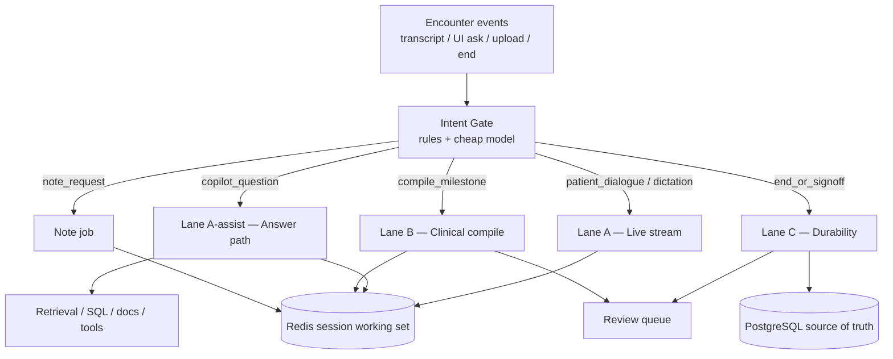
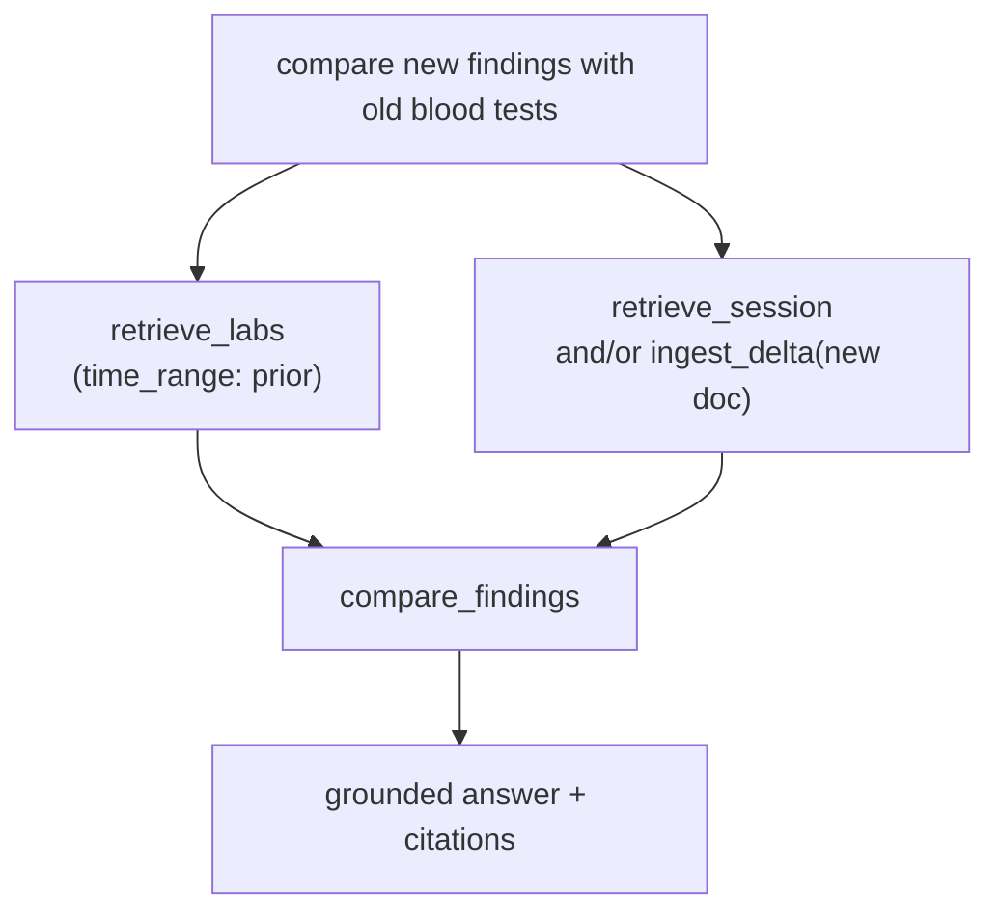
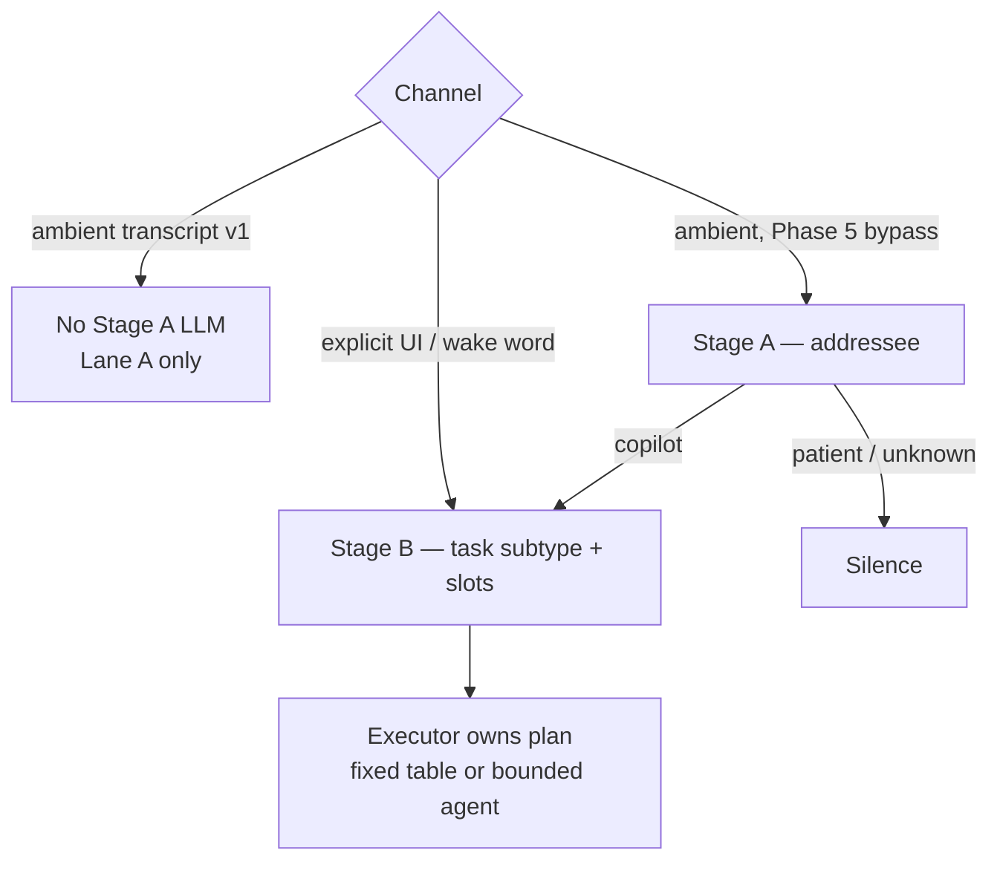
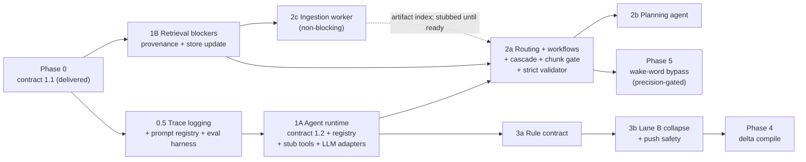

# MedScribe — Agent Refactor Plan

**Status:** Phase 0 delivered (contract `1.1`). Contract `1.2` + revised Phases 1–3 (§11, §18) proposed 2026-09-11, pending review before execution — see [copilot_runtime_contract.md](./copilot_runtime_contract.md)  
**Date:** 2026-09-10  
**Revised:** 2026-09-10 (fixed-vs-agent per lane; router contract; delta-compile; scope)  
**Revised:** 2026-09-11 (tool plan v2 §18: LangGraph without LangChain, targeted workflows + general cascade + hard chunk gate, low-confidence planning agent, provenance prerequisites, split safety tools; phased delivery §11 split into workstreams A/B/C)  
**Branch context:** `feat/load-bench`  
**Related:** [agentic_design.md](./agentic_design.md), [architecture.md](./architecture.md), [design-decisions.md](./design-decisions.md), [revision_plan.md](./revision_plan.md), [copilot_runtime_contract.md](./copilot_runtime_contract.md)

This plan turns the architectural review of the current LangGraph topology into
an actionable redesign. It covers:

1. collapsing the over-linear clinical compile graph
2. separating live encounter UX from durable persistence
3. **fixed paths vs bounded agents per lane/intent** (not one global choice)
4. a **two-stage gate**: addressee (patient vs copilot) then task subtype
5. deciding when the system should intervene with a response vs stay silent
6. elevating a **shared tool registry** so DAG nodes and assist agents call the
   same functions (typed I/O, provenance, patient scope injected)
7. **delta-compile semantics** (fact identity, supersession, review-package rules)
8. push safety alerts from Lane B, not only pull `copilot_safety`

**North star:** *Fixed paths where the output persists, bounded agents where the
output is read, and one tool registry under both.*

It does **not** replace [agentic_design.md](./agentic_design.md) (current + target
model). This document is the **change plan**. Portfolio-defensible delivery scope
is **Phases 0–3: fixed workflows + general cascade + chunk-grounding gate, a
low-confidence planning agent, rule-backed safety, and an eval harness** (§11).
Wake-word bypass (Phase 5) is committed but precision-gated; MCP (Phase 6) is
optional research.

---

## 1. Problem statement

### 1.1 What is wrong today

The clinical pipeline is modeled as a mostly linear 13/16-node DAG. That shape:

- treats housekeeping (`greeting`, repeated `load_patient_context`) as first-class stages
- implies every compile run should march through clean → extract → diagnose →
  evidence → fill → suggestions → validate → note → persist
- confuses **product timelines**:
  - chat/transcript entry visibility
  - background clinical draft readiness
  - final patient-record persistence
- has no first-class **doctor-intent router**, so “what was last RBC?” and
  “continue listening to the visit” are not cleanly differentiated paths

### 1.2 What the product actually needs

MedScribe is a **visit copilot**, not only a batch note compiler.

The system must continuously answer:

| Question | If yes | If no |
|----------|--------|-------|
| Is this patient–clinician dialogue? | Stay on hot path; append transcript; optional silent compile | — |
| Is the clinician asking MedScribe a question? | Route to retrieval / tools / answer | Do not barge into the visit |
| Is this a compile/summary milestone? | Run reduced clinical DAG | Skip heavy graph |
| Is this a durability boundary (end/sign-off)? | Flush + review queue + PG writes | Do not mutate durable chart |

The highest-value missing piece is **intent-aware intervention policy**:

> Be smart enough to differentiate doctor intent — question to the copilot vs
> interaction with the patient — and only then decide whether to intervene and
> produce a response.

Examples that **require retrieval + grounding** (intervene):

- “What was the RBC on the last blood test?”
- “What has this patient’s respiratory trajectory looked like over the last 2 years?”
- “Any prior penicillin reaction documented?”

Examples that **must not hijack the visit** (do not intervene with a chat answer):

- ordinary history-taking between doctor and patient
- ambient transcript segments
- “mm-hmm”, examination chatter, dictation meant as note content rather than a question to the AI

Examples that are **jobs, not chat answers**:

- “Generate SOAP”
- “Summarize session so far”
- end session / sign-off

---

## 2. Design principles (non-negotiable)

1. **Lane A never waits on Lane B/C.** Transcript append stays minimal. **No LLM on Lane A.**
2. **Visible chat ≠ compiled draft ≠ persisted record.**
3. **Fixed path vs bounded agent is chosen per lane/intent**, not globally (section 3.0).
4. **One shared tool registry under both.** Typed input/output, provenance, audit
   receipt; `patient_id` / tenant **injected from session**, never model-supplied
   tool args. DAG nodes and agents call the same functions so the fixed↔agent
   choice is reversible without a rewrite. **This is Phase 1 work, not a later nice-to-have.**
5. **Deterministic contracts remain the authority for durable clinical IR.**  
   Routers and agents must not freely invent chart fields or bypass Lane C.
6. **Router outputs intent + slots only; the executor (or fixed table) owns the plan.**  
   No free-form planner wearing an enum costume (section 5.4).
7. **Addressee and task type are separate stages.** Addressee errors are
   safety-critical; task misroutes are recoverable (section 5.3).
8. **Silence is a feature.** Default during patient interaction is no copilot
   speech/text unless policy says intervene. Precision over recall on intervene.
9. **v1 copilot channel is explicit only:** push-to-ask UI and/or wake word.
   Ambient transcript auto-intervene is research, not a ship commitment.
10. **Review is queued, never chat-blocking.**
11. **Patient context is session-cached**, not reloaded as a fake graph stage every run.
12. **Notes are on-demand tools/jobs**, not mandatory terminal compile nodes.
13. **Groundedness = citation correctness**, not “citation present %.”
14. **Safety is pull and push:** doctor-asked checks *and* Lane B alert cards.
15. **Prefer fewer control-plane stages**; keep rich logic as functions/tools inside them.

---

## 3. Target runtime: three lanes + intent gate



### 3.0 Fixed path vs bounded agent (per lane / intent)

Do **not** pick one orchestration style globally. Pick per lane and intent, and
build tools so the choice is reversible.

**Use a fixed plan when:**

- the plan is fully determined by intent, with roughly ≤3 steps
- the output is durable, touches the chart, or is safety-critical
- you need reproducibility and a clean audit trail

**Use a bounded agent when:**

- the next step depends on what the last step returned  
  (e.g. retrieve → found unparsed PDF → ingest → compare)
- the question space is open-ended
- the output is ephemeral, cited, and read by a human before anything persists

| Lane / intent | Recommendation | Why |
|---------------|----------------|-----|
| Lane A (transcribe) | **No LLM at all** | Latency invariant |
| Lane B compile | **Fixed DAG** with conditional edges | Durable IR, reproducible |
| Lane C | **Fixed, never agentic** | Authority boundary |
| `copilot_factoid` | **Fixed** fallback chain (SQL → session → RAG) | Plan known up front |
| `copilot_safety` (pull) | **Fixed** | Determinism + audit |
| Lane B push safety | **Fixed** post-validate phase → alert card | Must not depend on doctor asking |
| `copilot_trajectory` | **Bounded agent loop** | Depends on what exists for this patient |
| `copilot_compare` | **Bounded agent loop** | Retrieve/ingest/compare order is data-dependent |
| `note_request` | **Fixed job** | Inputs known |
| `compile_request` / `doc_ingest_request` | **Fixed job** | System pipelines |

> **Proposed `1.2` (§18.6) supersedes the trajectory/compare rows:** trajectory
> and compare become fixed workflows when routing is a high-confidence match.
> The per-turn bounded agent is replaced by a **planning agent** that runs only
> when no workflow is a high-confidence match. The guardrails below carry over
> to the planning agent.

**Bounded agent guardrails (assist only):**

- read-only tool allowlist (no Lane C writes)
- max **4–6** tool calls and a wall-clock budget per turn
- `patient_id` and tenant bound from session context — **not** tool arguments the model fills (PHI / tenancy)
- every tool result logged as an audit artifact / receipt
- **post-hoc grounding validator** before the answer renders (section 10.2)
- start fixed where possible; move one intent to agent later without registry rewrite

### 3.1 Lane A — Live encounter stream

**User-visible immediately**

- mic / VAD / transcript segment append
- Redis hot buffer update
- optional async light normalize
- **no full graph**
- **no durable patient-record write**

API shape (conceptual): `POST /transcribe` remains the hot path.

### 3.2 Lane A-assist — Copilot answer path

**Only when the channel is copilot-directed** (explicit UI / wake word in v1)

- Stage B task subtype + slots (section 5); **executor owns plan**
- fixed chain for factoid/safety; **bounded agent** for trajectory/compare
- shared retrieve/ingest/compare tools against session working set
- stream or return grounded answer + citations after grounding validator
- write answer artifact to Redis (not PG chart)

API shape: harden existing `POST /api/session/{id}/assistant` (see runtime
contract). **v1 does not auto-answer ambient transcript.**

### 3.3 Lane B — Clinical compile

**Background IR builder — fixed DAG only**

Reduced DAG (section 4), triggered by:

- explicit “run pipeline”
- periodic milestone (e.g. every N new segments / quiet gap) with **delta semantics** (section 4.7)
- pre-note preparation
- end-session pre-flush compile

**Outputs contract:**

- `candidate_facts` (with stable fact identity keys)
- `structured_record` draft
- `validation_report` / conflict package
- **`safety_alerts` (push)** — allergy/interaction/contraindication cards raised
  without the doctor asking (`copilot_safety` is the pull path; this is the push path)
- `review_package` items when needed
- progress events for reduced stage names

Not necessarily a SOAP note.

### 3.4 Lane C — Durability boundary

**Session end / physician sign-off**

- flush transcript ledger
- apply only approved structured changes
- persist finalized notes
- mark unresolved review pending
- close session

---

## 4. Graph collapse plan (Lane B)

### 4.1 From current always-on nodes

| Current | Disposition |
|---------|-------------|
| `greeting` | **Remove** from graph; session/UI bootstrap only |
| `load_patient_context` | **Session cache loader** at session start + invalidation; inject into state/tools |
| `preprocess` | Split: transcript delta adapter vs document ingest job |
| `clean_transcription` | Fold into `compile_candidates` (rules first, LLM clean on uncertainty) |
| `extract_candidates` | Keep as core of `compile_candidates` |
| `run_diagnostic_reasoning` | Optional enrichment tool/parallel pack; not mandatory serial gate |
| `retrieve_evidence` | **Dual role:** Lane B `enrich` step *and* first-class `retrieve_*` assist tools (same underlying service) |
| `fill_structured_record` | Keep as `materialize_record` |
| `run_clinical_suggestions` | Tool pack after hard-validate (critical safety may run early on trusted fields) |
| `validate_and_score` | Split hard validate vs soft score; remains control authority |
| `repair` / `conflict_resolution` | Keep conditional |
| `human_review_gate` | **Queue producer only**; no chat interrupt in default mode |
| `generate_note` | **Demote to tool/job** |
| `package_outputs` + `persist_results` | Merge operationally into `finalize` with persist-or-queue policy |

### 4.2 Target Lane B backbone (~6 stages)

```text
1. ingest_delta          # transcript and/or doc artifacts for this job
2. compile_candidates    # clean + extract + canonicalize → candidate_facts
3. enrich                # evidence ± diagnostics ± retrieval tools (parallel where safe)
4. materialize_record    # fill structured_record
5. safety_and_validate   # hard validate → safety tools → soft score / conflicts
6. finalize              # package + persist clean OR enqueue review
```

Conditional only:

- `repair` loop (bounded)
- `conflict_resolution`
- review enqueue (not blocking)

### 4.3 Ordering decision: validate vs clinical suggestions

Adopt:

```text
materialize_record
  → hard_validate (schema/types/required)
  → safety_tools on validated or high-confidence fields
  → soft_score + conflict package
```

Rationale:

- full CDS on garbage records creates false alerts
- critical allergy checks should not wait for perfect completeness when
  high-confidence allergen/med facts already exist

Implementation detail: `safety_and_validate` can be one node with ordered phases
to avoid graph sprawl.

### 4.4 Retrieval: node step and tool (same capability)

Retrieval is not “either a graph node or a tool.” It is a **shared capability**
with two call sites:

| Call site | When | Shape | Writes |
|-----------|------|-------|--------|
| **Lane B node/phase** (`enrich`) | Background compile after candidates exist | Fixed step in DAG; often batch over `candidate_facts` | `evidence_map`, trace receipts |
| **Assist tool(s)** | Doctor question or multi-step plan | On-demand, parameterized query | `tool_results` / answer bundle / optional session scratch — **not** durable chart by itself |

```text
                    ┌─────────────────────────────┐
                    │  RetrievalService (shared)  │
                    │  redis | sql | pgvector |   │
                    │  docs | session draft       │
                    └─────────────┬───────────────┘
                                  │
              ┌───────────────────┴───────────────────┐
              │                                       │
              v                                       v
   Lane B enrich node                         Assist tool calls
   retrieve_for_candidates()                  retrieve_labs / retrieve_docs /
   → evidence_map                             retrieve_visits / retrieve_session
                                              → ToolResult + citations
```

**Why both:**

1. **Compile path** needs systematic grounding of extracted facts (anti-chatbot RAG).
2. **Assist path** needs ad hoc and multi-step queries that do not require running
   the full compile DAG first.
3. One implementation avoids drift (different ranking, different citation rules).

**Tool surface (v1, typed):**

| Tool id | Input (sketch) | Output |
|---------|----------------|--------|
| `retrieve_session` | keys / focus | current transcript draft, structured draft slices |
| `retrieve_labs` | analyte, time_range, latest_n | structured lab rows + source ids |
| `retrieve_docs` | query, doc_ids?, time_range | chunks + doc metadata |
| `retrieve_visits` | domain, time_range | visit summaries / prior notes handles |
| `retrieve_for_candidates` | candidate_facts[] | evidence_map (Lane B primary) |
| `ingest_delta` | segments and/or document artifacts | updated session chunks/candidates scratch |
| `compare_findings` | left set, right set, axes | diff table + conflict flags + citations |
| `generate_note` | note_type, grounded bundle | draft note text |
| `safety_check` | meds/allergies/problems slice | alerts |

Lane B `enrich` should call `retrieve_for_candidates` (and optionally other
retrieve tools) through this same registry—not a private codepath.

> This table is contract `1.1`. The proposed `1.2` catalogue (split structured
> retrieval, source-chunk lookup, three rule-backed safety tools) and the
> retrieval workflows / cascade are in **§18**.

### 4.5 Multi-step assist plans (compose tools, don’t grow the DAG)

Clinician requests are often **pipelines of tools**, not a single retrieval hop.

**Example — compare new findings with old blood tests**

> “Compare the new findings with the old blood tests.”

This may need:

1. **Retrieve** prior labs (SQL and/or historical docs) → `retrieve_labs` / `retrieve_docs`
2. **Ingest or read** “new” side from whichever is freshest:
   - session structured draft / recent transcript candidates (`retrieve_session`)
   - document just uploaded (`ingest_delta` on that doc if not already processed,
     else `retrieve_docs` for that `doc_id`)
3. **Compare** grounded sets → `compare_findings`
4. **Answer** with citation-backed diff (synthesis step; still no silent PG write)



**Planning rules:**

1. Gate emits **task_subtype + slots only**; executor selects fixed plan or
   bounded agent (section 3.0 / 5.5). Agents may choose the next allowlisted tool
   from prior `ToolResult`s — they do not bypass the registry.
2. Independent retrieves may run in parallel (old labs ∥ new-side gather).
3. Each tool returns typed `ToolResult` with sources; compare + final answer pass
   a **grounding validator** (citation correctness).
4. Prefer **session working set** before re-ingest:
   - if new lab PDF already OCR’d this session → reuse artifacts
   - if only raw upload exists → `ingest_delta` once, cache, then compare
5. If compare implies chart updates, route proposals through Lane B finalize /
   review queue—**assist compare does not auto-persist.**
6. Bound steps: e.g. max 4–6 tool calls per assist turn; budget in `controls`.

**Intent mapping additions:**

| Intent | Typical plan |
|--------|----------------|
| `copilot_factoid` | `retrieve_session?` → `retrieve_labs` → optional `retrieve_docs` → answer |
| `copilot_trajectory` | parallel retrieves over time_range → synthesize timeline |
| `copilot_compare` | retrieve prior ∥ gather new (session/doc ingest) → `compare_findings` → answer |
| `compile_request` | Lane B job (nodes call same retrieve tools internally) |

`copilot_compare` is first-class precisely because order is **retrieve (old) +
ingest/gather (new) + compare**, which a single fixed linear graph node cannot
express cleanly for arbitrary user phrasings.

### 4.6 What stays a node vs what stays a tool-only

| Capability | Lane B node/phase? | Assist tool? |
|------------|--------------------|--------------|
| Retrieval / evidence | Yes (`enrich`) | Yes (primary) |
| Ingest delta / doc | Yes (`ingest_delta`) | Yes (when plan needs fresh doc) |
| Compile candidates | Yes | Rare (usually via compile job) |
| Materialize record | Yes | No direct user tool |
| Hard validate / finalize | Yes | No (system authority) |
| Compare findings | Optional enrich helper | Yes |
| Generate note | No (demoted) | Yes |
| Safety check | Yes (phase) | Yes |

**Rule of thumb:** if the clinician might ask for it mid-visit as part of a
multi-step request, expose it as a **tool**. If every durable compile must run
it for IR quality, also wire it as a **node step** over the same tool.

### 4.7 Delta-compile semantics (required before Phase 4)

Background compiles must **merge**, not naively rebuild conflicting drafts.
Visits self-correct (“penicillin… actually no, it was amoxicillin”).

**Fact identity**

Each `CandidateFact` (and mapped structured field binding) carries a stable key:

```text
fact_key = canonical_type + normalized_entity_key
  e.g. allergy:amoxicillin | lab:rbc:2024-11-02 | med:lisinopril
```

Plus: `fact_id` (uuid per observation instance), `source_segment_ids[]`,
`source_doc_ids[]`, `confidence`, `status`.

**Statuses**

```text
active | superseded | retracted | needs_review
```

**Supersession / retraction rules**

1. A later compile that extracts a correction for the same `fact_key` marks the
   prior fact `superseded` (or `retracted` if explicitly negated) and points
   `superseded_by` → new `fact_id`.
2. Provenance must retain the **source segment id** of both the old and new claim
   so audit can show the self-correction.
3. Structured draft materialization prefers `active` facts; never silently delete
   history from the session working set (keep superseded rows for trace).

**Interaction with review packages**

| Situation | Rule |
|-----------|------|
| Fact only in working draft, not in review queue | Later compile may upgrade/downgrade freely under merge rules |
| Fact already in an **open** review package | Later compile may attach a `delta_note` / proposed replacement; **must not** silently remove or downgrade the queued item without bumping package version and UI dirty state |
| Fact **approved** pending Lane C write | Treat as sticky; new contradicting evidence opens a **new** review item, does not auto-unapprove |
| Fact already persisted (Lane C) | Assist/compile propose change only via new review item |

**Compile job inputs**

```text
CompileJob {
  session_id,
  base_draft_version,
  new_segment_ids[],      # delta only when possible
  new_document_ids[],
  full_recompute: bool    # rare; end-session or corruption recovery
}
```

If `base_draft_version` is stale (another compile finished), job rebases or
retries; do not clobber with an older merge.

**Exit criteria for “delta compile works”:** golden session where allergy is
stated, then corrected, yields one active allergy fact, one superseded fact,
stable review behavior, and no duplicate conflicting actives in the draft.

### 4.8 Push safety from Lane B

`copilot_safety` is doctor-initiated (pull). High value also requires **push**:

```text
safety_and_validate phase
  → critical allergy / interaction / contraindication
  → SafetyAlertCard { severity, evidence, fact_keys, session_id }
  → Redis alert channel + UI badge
```

- does not block transcript (Lane A)
- does not auto-persist
- appears even if the doctor never asked
- uses the same `safety_check` tool as pull path

Lane B outputs contract **must** include `safety_alerts[]` (section 3.3).

---

## 5. Intent gate (addressee + task) — not a free-form planner

### 5.1 Why a small router exists

A full multi-agent planner on every utterance is the wrong default (latency,
cost, audit risk). A **narrow gate** is still needed because path selection is
high leverage — but it must not invent tool plans.

| Doctor behavior | Needed path |
|-----------------|-------------|
| Talking to patient | Lane A only (silent) |
| Explicit ask: factual question | Fixed factoid chain |
| Explicit ask: trajectory / compare | Bounded agent over shared tools |
| Explicit ask: safety | Fixed safety tools |
| Requesting summary/SOAP | Fixed note job |
| Uploading labs PDF | Fixed doc ingest job |
| Ending visit | Lane C (never voice-auto-execute) |

### 5.2 Two axes (do not mix in one enum)

The old taxonomy mixed **addressee** and **task type**. Those have different
error costs and should be staged separately.



| Stage | Question | Error cost | v1 approach |
|-------|----------|------------|-------------|
| **A — Addressee** | Patient-directed vs copilot-directed? | **Very high** (false barge-in) | **Skip for ambient.** Explicit UI/wake word implies copilot. |
| **B — Task subtype** | Factoid, trajectory, compare, safety, note, …? | Medium (doctor can re-ask) | Rules + optional cheap LLM **slot extraction** on explicit channel only |

Eval sets should be split the same way: addressee precision set vs task-subtype set.

### 5.3 Addressee policy (v1 ship vs research)

**Problem with transcript-only heuristics:**  
“What was your last blood pressure reading?” is doctor → **patient**, yet it
trips interrogative + clinical entity + clinician speaker + “what was…”.
Text heuristics cannot reliably separate this from a copilot question.

**v1 decision (closes former open question on wake vs ambient):**

- **Push-to-ask** (copilot input) and/or **wake word / explicit address** only
- Ambient transcript **does not** auto-run Stage A/B intervene
- Optional later: suggestion chips only after a dedicated addressee model passes
  precision gates — treat as research, not a delivery commitment

If ambient routing is ever attempted, prefer a **local** addressee classifier
(embedding + logistic regression or small fine-tune), not a hosted LLM under a
250 ms budget. Hosted LLM TTFT + network often consumes that budget alone.

> **Revised 2026-09-11 (§18.10):** the wake word is an **optional hard intent**.
> Without it, a side-lane addressee classifier may bypass the wake word when
> confident: chip at `AMBIENT_CHIP_MIN_CONFIDENCE`, text-only answer card above a
> precision-gated threshold. Never TTS or session control without a wake word or
> explicit UI. Start with a hosted small model behind a rules prefilter (adapter);
> a local classifier trained on chip feedback is optional later.

### 5.4 Router / gate contract (executor owns the plan)

**Contradiction removed:** the gate does **not** emit `plan: List[str]`.  
§executor maps `task_subtype` → fixed plan or starts a bounded agent.

```python
class AddresseeDecision(TypedDict):
    addressee: Literal["patient", "copilot", "unknown"]
    confidence: float
    channel: Literal["explicit_ui", "wake_word", "ambient_transcript"]
    reason_codes: List[str]

class TaskSlots(TypedDict):
    task_subtype: Literal[
        "factoid",
        "trajectory",
        "compare",
        "safety",
        "compile",
        "note",
        "doc_ingest",
        "session_control",
        "unknown",
    ]
    query_rewrite: Optional[str]
    time_range: Optional[str]
    domain_hints: List[str]
    source_prefs: List[str]       # hints only, not executable plan
    entity_hints: List[str]       # e.g. RBC, amoxicillin
    speak_policy: Literal["none", "text_only", "text_and_tts"]

class IntentDecision(TypedDict):
    """Composite audit object after Stage A (if any) + Stage B."""
    addressee: AddresseeDecision
    task: TaskSlots
    intervene: bool
    urgency: Literal["silent", "background", "interactive"]
    # NOTE: no plan field — executor owns plans
```

**Gate may:**

- set addressee (explicit channel short-circuits to copilot)
- set `task_subtype` + slots
- set `intervene` / urgency

**Gate must not:**

- choose tool order or tool ids
- answer the clinical question
- write structured record fields
- supply `patient_id` / tenant into tools

### 5.5 Executor: fixed tables and bounded agents

After `IntentDecision`, the **executor** selects mode from section 3.0:

| `task_subtype` | Executor mode | Behavior |
|----------------|---------------|----------|
| `factoid` | Fixed chain | `retrieve_session?` → `retrieve_labs`/`structured` → `retrieve_docs` fallback → synthesize → **grounding validator** |
| `safety` | Fixed | `retrieve_session` + `safety_check` → alert/answer |
| `note` | Fixed job | ensure draft fresh → `generate_note` |
| `compile` | Fixed job | enqueue Lane B |
| `doc_ingest` | Fixed job | `ingest_delta` + artifact index |
| `session_control` | Fixed | confirm chips only for end/sign-off; never auto Lane C |
| `trajectory` | **Bounded agent** | allowlisted tools, 4–6 call cap, wall clock, then validate |
| `compare` | **Bounded agent** | same; typical pattern retrieve prior ∥ gather new → compare |
| `unknown` | Fixed | explicit UI: clarify; ambient: silence |

> **Proposed `1.2`:** executor modes become `fixed | planning_agent`. Stage B
> ranks workflow candidates with calibrated confidence; below threshold, the
> executor dispatches the planning agent instead of a fixed table (§18.6).

**Bounded agent loop (trajectory/compare only):**

```text
while calls < max and time < budget and not done:
    model proposes next allowlisted tool + args (no patient_id field)
    runtime injects session scope, runs tool, appends ToolResult + receipt
    model may stop or continue
answer draft → grounding_validator → render or refuse
```

Start trajectory/compare as fixed skeletons if needed; flip one intent to the
agent loop later without changing the registry.

### 5.6 Intervention policy

| Condition | Intervene? | Mode |
|-----------|------------|------|
| Explicit copilot UI / wake word question | Yes | interactive |
| Ambient transcript (v1) | **No** | silent (Lane A only) — revised in §18.10: chip / text-only card above precision-gated thresholds |
| Ambient research, medium confidence | Chip only, not auto-answer | background suggest |
| Patient dialogue | No | silent |
| **Lane B push safety critical** | Yes | alert card (not chat banter) |
| Note/summary requested | Yes | interactive job |
| Gate timeout on explicit UI | Yes, with default factoid/retrieval fallback | do not look broken |
| Gate timeout on ambient | No | silent + log |

**Product rule:** false-positive interruption during a visit is worse than a
missed opportunistic answer.

### 5.7 Worked examples

**Example A — Factoid (fixed chain)**

> Explicit UI: "What was the RBC on the last blood test?"

```text
addressee: copilot (explicit_ui)
task_subtype: factoid
slots: { query_rewrite: "most recent RBC", domain_hints: [hematology] }
executor: fixed SQL/session → RAG fallback → grounding_validator
```

**Example B — Trajectory (bounded agent)**

> "How has her respiratory system trended the last two years?"

```text
task_subtype: trajectory
slots: { time_range: last_2_years, domain_hints: [respiratory, fev1, ...] }
executor: bounded agent may retrieve_visits, retrieve_labs, retrieve_docs
         depending on what exists; then synthesize + validate citations
```

**Example C — Compare (bounded agent; data-dependent steps)**

> "Compare the new findings with the old blood tests."

```text
task_subtype: compare
executor (illustrative):
  retrieve_labs(prior) 
  → if new side missing and unparsed PDF in session: ingest_delta(doc_id)
  → else retrieve_session / retrieve_docs
  → compare_findings
  → grounding_validator
```

The agent is allowed because step 2 depends on tool results; the allowlist and
caps still apply. Chart writes still go through review / Lane C.

**Example D — Doctor to patient (must stay silent)**

> "What was your last blood pressure reading?"

```text
channel: ambient_transcript (v1) → no intervene
# Even though heuristics would fire — this is why ambient auto-ask is out of v1
```

**Example E — Push safety (Lane B, not assist gate)**

Compile finds penicillin allergy + amoxicillin order → `safety_alerts` card
without any copilot question.

### 5.8 Latency budget (revised, honest)

| Path | Target | Notes |
|------|--------|-------|
| Lane A transcribe | unchanged / no regression | **No LLM** |
| Explicit UI Stage B slot extract | < 500–800 ms p95 acceptable | Hosted small model OK |
| Factoid total interactive | < ~1.5–2 s p95 | Fixed chain |
| Trajectory/compare | < ~3–5 s p95 when caches warm | Show tool progress |
| Cold OCR ingest inside compare | progressive UI | Don't pretend it's sub-second |
| Hosted router < 250 ms p95 | **Not a v1 requirement** | Often unrealistic (TTFT + network) |
| Ambient addressee (Phase 5) | prefiltered hosted small model; local classifier later if needed | side lane, never on `/transcribe` (§18.10) |

### 5.9 `dictation_for_record`

Defer as a first-class ambient intent. It depends on diarization/role quality
not guaranteed on the default path today. Until then:

- use **explicit dictation mode** in UI if needed, or
- treat dictation-like speech as normal Lane A transcript + optional Lane B delta

Do not gate product correctness on perfect speaker roles.

---

## 6. Session context cache

### 6.1 Load once per session

At session start (and on patient switch):

```text
PatientContextSnapshot {
  patient_id,
  version,
  demographics,
  allergies,
  medications,
  problems,
  recent_labs_summary,
  recent_visits_index,
  embedding_handles / retrieval keys,
  loaded_at
}
```

Store in Redis under session key; inject into:

- assist tool plans
- Lane B state as `patient_record_fields`
- safety tools
- retrieve_* default scopes

### 6.2 Invalidation

Refresh when:

- OCR field changes approved
- clinician edits meds/allergies in UI
- external record sync event
- snapshot older than TTL and assist path needs freshness
- end-session reconcile
- `ingest_delta` completes for a doc that affects labs/problems

Do **not** pay full DB reload as graph node 2 on every compile by default.

### 6.3 Working-set reuse for multi-step tools

Before `ingest_delta` or heavy `retrieve_docs`:

1. check session artifact index (doc_id → OCR/chunks/candidates status)
2. reuse completed artifacts
3. only ingest missing pieces
4. write tool receipts noting `cache_hit: true|false`

This is what makes "compare new vs old" cheap when the new doc was already opened
earlier in the visit.

---

## 7. Note generation as tool/job

`generate_note` leaves the always-on compile path.

Triggers:

- UI "Generate SOAP / discharge / summary"
- assist intent `note_request`
- end-session package (optional auto-draft, still not auto-final without policy)

Preconditions:

- structured draft exists or quick compile runs first
- note model may only use structured record + cited retrieval snippets
  (including outputs of retrieve_* tools)

---

## 8. Human review as queue

Default production behavior:

```text
Lane B finalize
  → if needs_review: push ReviewPackage to Redis queue / review worker
  → UI badge / end-session review surface
  → approved diffs only → Lane C PG write
```

- no `interrupt_before` on normal visit path
- chat/transcript continues regardless of review backlog
- assist `compare_findings` may *suggest* chart diffs but still lands in review
- optional special mode may enable synchronous interrupt for offline QA tools

---

## 9. API / event surface (target)

| Event / API | Lane | Notes |
|-------------|------|-------|
| `POST /transcribe` | A | append only + optional intent heuristic hook |
| `POST /api/session/{id}/assistant` (conceptually `/assistant/query`) | A-assist | explicit questions; multi-step tool plans; existing route hardened, not replaced |
| `intent.decision` (internal) | gate | audit log of router outputs |
| `tool.invocation` (internal) | A-assist / B | shared tool receipts |
| `POST /pipeline` or compile job | B | reduced DAG; enrich uses retrieve tools |
| `POST /notes` | note job | `generate_note` tool/job |
| `POST /upload` | doc ingest | OCR worker + session artifact index |
| review queue APIs | B→C | list/approve/reject |
| `POST /session/{id}/end` | C | durability flush |

Automatic intervene from transcript should emit the same assist artifacts as
`/assistant/query` so UI has one answer renderer.

---

## 10. State and observability changes

### 10.1 Session working set (Redis)

- transcript buffer
- patient context snapshot + version
- structured draft
- document artifact index (doc_id → processing state)
- last intent decisions (ring buffer)
- tool_results / assist answers + citations
- review packages
- compile progress (reduced stage names)

### 10.2 Metrics

- intent distribution counts
- intervene rate / false-intervene annotations (offline eval)
- router latency + timeout rate
- per-tool latency + cache_hit rate (`retrieve_*`, `ingest_delta`, `compare_findings`)
- assist **citation correctness** (claimed value/date supported by cited row/chunk; not merely citation-present %)
- SQL citation shape: table + row id + originating visit/doc id when applicable
- multi-step / agent tool-call length + cap hits + wall-clock budget breaches
- push safety alert precision/recall (Lane B)
- delta-compile supersession correctness on gold self-correction sessions
- Lane A transcribe p99 (must not regress)
- Lane B stage latencies after collapse
- review queue depth / time-to-signoff

### 10.3 Eval harness (portfolio-critical)

> Trace schema, prompt versioning, metric definitions, harness layers, dataset
> layout, and gates are specified in **§19** (Phase 0.5). The sets below are the
> original list; §19.6 carries their versioned names and sizes.

Split evals by axis:

1. **Addressee set** (research / ambient only): patient vs copilot vs unknown;
   precision on "copilot" is primary. Include traps like "What was your last BP?"
2. **Task subtype set** (explicit channel): factoid / trajectory / compare /
   safety / note / unknown — extend existing `intent_golden_v1.jsonl`
3. **Grounding set**: answers with correct citations, wrong citations, missing
   evidence (must refuse)
4. **Delta-compile set**: self-correction transcripts (allergy rename, med stop)
5. **Planning agent set** (replaces the bounded agent set in `1.2`): ambiguous and
   multi-step asks with gold plans, must-clarify rows, and traps (disallowed tool,
   scope key in args, plan that drops a chunk gate)
6. **Routing calibration set**: rows labelled high-confidence match vs no match,
   used to set `WORKFLOW_MATCH_MIN_CONFIDENCE` / margin (§18.6)
7. **Cascade stop-rule set**: session-only hit, absence question, chart-vs-visit
   conflict, document-derived row without a recoverable chunk

**Ship criterion for assist (Phases 0–3):** citation correctness + routing
accuracy on the explicit channel + zero planner violations on set 5. Ambient
intervene is **not** a ship gate.

## 11. Phased delivery

**Portfolio-complete story = Phases 0–3** (fixed workflows + general cascade +
chunk-grounding gate, low-confidence planning agent, rule-backed safety, measured
groundedness, strict grounding validator). Phase 4 hardens delta-compile at
scale. Phase 5 (wake-word bypass) is committed but precision-gated and is not a
ship gate for Phases 0–3. MCP (Phase 6) stays optional.

Phase numbers 3 and 4 are referenced from code and the runtime contract, so new
work is split into sub-phases instead of renumbering.



**Workstreams**

| Workstream | Phases | Owner |
|------------|--------|-------|
| A — Agent runtime | 0.5 → 1A → 2a → 2b → 5 | agent refactor (this plan) |
| B — Retrieval data + ingestion | 1B → 2c | separate agent, in parallel with A |
| C — Safety rules + Lane B | 3a → 3b | unassigned; 3a can start once 1A safety wrappers land |

Sizes below are rough single-engineer estimates.

### Phase 0 — Semantics freeze (docs + API contracts)

- publish Lane A/B/C definitions in product language
- document intent enum + `IntentDecision`
- freeze "silence default" policy
- freeze shared tool registry contract (retrieve as node+tool)
- link from `agentic_design.md`

**Exit:** team agreement on intervene rules, lane boundaries, and tool duality.

**Delivered (2026-09-10), runtime contract `1.1`:**

- [copilot_runtime_contract.md](./copilot_runtime_contract.md) — lanes, fixed-vs-agent matrix, two-stage gate, intervene policy, executor, tool registry, Lane B outputs, invariants, change control
- `server/app/agents/intent/schemas.py` — `AddresseeDecision` / `TaskSlots` / `IntentDecision` (no `plan`), validator rejects plan and scope keys
- `server/app/agents/intent/policy.py` — pure `resolve_intervention()`: explicit channels respond, ambient silent in v1, voice never runs session control
- `server/app/agents/intent/executor_contract.py` — task → fixed / bounded agent, fixed tool chains, agent call cap + wall clock, `GroundingReport`
- `server/app/agents/tool_contracts.py` — tool ids and specs (Lane B stage, fixed executor, agent allowlist), scope-injection validator, `ToolResult` / receipt types
- `server/app/agents/compile_contracts.py` — `LaneBOutputs`, push `SafetyAlertCard`, `fact_key` / supersession helpers, review delta rules, `CompileJob`
- `server/tests/fixtures/intent_task_v1.jsonl` (22 rows) + `intent_addressee_v1.jsonl` (17 rows, hard negatives)
- `server/tests/unit/test_intent_contract.py` — locks all of the above plus doc ↔ code sync
- Critique-pass revisions (executor owns plans, addressee/task split, explicit-only v1, scope injection, citation correctness, push safety, delta compile) are folded in
- Remaining for exit: team sign-off (contract §11)

### Phase 0.5 — Trace logging, prompt registry, eval harness (workstream A) · ~3–4 days

Before 1A, so every later phase is measured from its first commit. Design in §19.
Workstream B can start 1B in parallel.

1. `agents/trace_contracts.py`: `TraceSpan`, span kinds, required attributes per
   kind, `feedback.submitted` event, `TRACE_SCHEMA_VERSION`
2. `TraceSink` protocol with `JsonlTraceSink` and Prometheus metrics;
   `PostgresTraceSink` interface only (its migration lands in 1A, coordinated
   with workstream B, which owns `migrations/`)
3. `PromptRegistry` + `agents/prompts/` layout; v1 placeholder prompts for
   router, planner, synthesis, and judge roles
4. `server/evals/` skeleton: runner CLI, record/replay cassette store, report
   writer with bootstrap intervals; scorers for routing, tool calls, context
   tokens, deterministic grounding, and guardrails; judge scorer interface
5. L1 suites on `StubAdapter` against current v1 golden sets; PHI scanner test;
   seed rows and dataset cards for `tool_trajectory_v1`, `grounding_v1`,
   `routing_calibration_v1`; CI job for `pytest server/evals/deterministic`

**Exit:** L1 runs in CI in under 10 s; one stub run writes a JSONL trace and a
report with all four metric groups populated; the PHI scanner fails on a
planted leak; stub baseline committed.


### Phase 1 — Contract `1.2` + shared tool registry (two parallel workstreams)

Highest-leverage foundation; do this before graph cosmetics or ambient ideas.
1A and 1B run in parallel against the handoff contract below.

#### Phase 1A — Agent runtime (workstream A) · ~4–5 days

1. **Contract `1.2` PR** under runtime contract §10 change control (one PR):
   - `tool_contracts.py`: §18.2 tool ids (`retrieve_labs` → `retrieve_structured`;
     new `get_patient_profile`, `retrieve_source_chunks`; `safety_check` →
     `check_med_conflicts` / `check_dosage` / `check_metric_alerts`), caller
     `bounded_agent` → `planning_agent`, `not_covered` safety result
   - `intent/schemas.py`: `TaskSlots.workflow_candidates` (ranked, with
     confidence), `evidence_class`
   - `intent/executor_contract.py`: executor modes `fixed | planning_agent`,
     workflow table (§18.4), `WorkerPlan` / `PlanTask`, provisional
     `WORKFLOW_MATCH_MIN_CONFIDENCE` / `WORKFLOW_MATCH_MIN_MARGIN`
   - `copilot_runtime_contract.md`, golden sets, `test_intent_contract.py`,
     decision log row (§15)
2. **Registry runtime** in `server/app/agents/tools/`: lookup, scope injection,
   `validate_model_tool_args`, `ToolResult` validation, receipts to
   `controls.trace_log`, parallel group runner (thread pool, one SQLAlchemy
   session per tool call)
3. **Stub tools with canned results** (the retrieval store will change in 1B,
   so real backends wait): every §18.2 tool registered with a stub returning a
   contract-valid `ToolResult` from `server/tests/fixtures/tool_results/`;
   receipts flag `stub: true`; stubs cover ok, empty, `no_source`, in-flight
   document, and chart-vs-session conflict cases. Real backends replace stubs
   one tool at a time once the store update lands. Session snapshot loader +
   invalidation (§6) is real, not stubbed.
4. **Safety wrappers**: the three safety tools over `ClinicalSuggestionEngine`,
   `DosageCalculator`, `LabInterpreter` unchanged; `not_covered` computed from
   table coverage
5. **LLM adapters + graph housekeeping** (§18.11): `LLMAdapter` protocol with
   `generate`, `generate_structured`, `generate_with_tools`; OpenAI-compatible
   adapter (Groq / OpenAI / Gemini-compatible endpoint), Anthropic adapter, and a
   `StubAdapter` returning scripted plans / tool calls for tests; per-role model
   config; bump `openai` / `anthropic` SDK pins; drop the `langchain` pin in
   `requirements.docker.txt`; remove `greeting` from the compile path; Lane B
   `enrich` calls `retrieve_for_candidates` via the registry

**Exit:** contract tests pass at `1.2`; registry used by one assist call site and
one Lane B call site in tests; scope-key and disallowed-tool traps rejected;
session snapshot cache hit on second compile; no greeting node; every registry
call and LLM adapter call emits a §19.2 span; `intent_task_v1` migrated to
`intent_task_v2` in the contract PR.

#### Phase 1B — Retrieval blockers (workstream B, separate agent) · ~2–3 days

§18.3 items 1–6, write side only:

1. Extraction returns a chunk id per fact; `provenance.evidence[]` carries
   `chunk_id` + locator (not `chunks[0]`)
2. Evidence snippet verified as a normalized substring of the cited chunk, else
   flagged ungrounded
3. `source_chunk_ids[]` on `LabResult`, `Vitals`, `Medication`, `Allergy`,
   `Problem` (and other models with `source`)
4. `clinical_embeddings.source_chunk_ids` column + persist write path
5. `chunk_embeddings.document_id` + `page` for document chunks + write path
6. `LabResult.observed_at` (normalized ISO-8601) + Alembic migration; legacy rows
   keep null ids
7. **Retrieval store update** (§16 Q10 resolved: update the store): short design
   note, then migration, for a normalized observations store (analyte / kind,
   numeric value, unit, `observed_at`, `source_chunk_ids`, record + session ids)
   that `retrieve_structured` reads instead of filtering `clinical_embeddings`
   JSON. 1A's stub `ToolResult` shapes are the reader contract.

**Exit:** multi-chunk golden batch where a fact from chunk N cites chunk N;
`source_chunk_ids` round-trip through Postgres; persisted labs carry
`observed_at` or an explicit null; store design note agreed with workstream A.

#### 1A ↔ 1B handoff contract (freeze at Phase 1 start)

| Field | Where | Writer | Reader |
|-------|-------|--------|--------|
| `source_chunk_ids: List[str]` | structured record models, `clinical_embeddings` | 1B | 1A `retrieve_structured`, `retrieve_source_chunks` |
| `provenance.evidence[].chunk_id` | `CandidateFact` | 1B | 1A `retrieve_for_candidates`, grounding validator |
| `document_id`, `page` | `chunk_embeddings` | 1B | 1A `retrieve_docs`, `retrieve_source_chunks` citations |
| `observed_at` | `LabResult` / lab facts | 1B | 1A `retrieve_structured` ordering (`latest_n`) |
| Artifact index (`state`, `pages_done`, `pages_total`, `eta_ms`, `content_hash`, `priority`, `error`) | Redis, per session doc (§18.9) | 2c | 2a in-flight policy, compare new side |
| `doc.ingest.completed` event | Kafka (§18.9) | 2c | 2a "update when ready", Lane B delta compile, snapshot invalidation |

- Null or missing ids mean a legacy row: `retrieve_source_chunks` returns
  `no_source` and the answer follows §16 Q11.
- 1A tests use fixtures carrying these fields; 1B tests assert the writes.

**File ownership** (avoid cross-agent conflicts)

| Workstream | Owns | Coordinate before editing |
|------------|------|---------------------------|
| A | `server/evals/`, `agents/trace_contracts.py`, `agents/prompts/`, `app/logging.py`, `app/monitoring.py`, `agents/tool_contracts.py`, `agents/intent/`, `agents/tools/`, `models/llm.py`, `services/assistant_service.py`, `api/routes/assistant.py`, `agents/graph.py`, `docs/copilot_runtime_contract.md`, `tests/unit/test_intent_contract.py`, `tests/fixtures/intent_*`, `requirements.docker.txt` | `agents/nodes/evidence.py`, `services/hybrid_retrieval.py` |
| B | `agents/nodes/extract.py`, `agents/nodes/record_schema.py`, `agents/nodes/persist_results.py`, `database/models.py`, `migrations/`, `services/embedding_service.py` write methods, `core/ocr/`, upload route in `api/routes/session.py`, new ingest worker entrypoint, `docker-compose*.yml` ingest service | same as A |

### Phase 2a — Routing + fixed workflows + cascade + chunk gate (workstream A) · ~5 days

Depends on 1A. Grounding exit on real data depends on 1B.

- Stage B ranking on the **explicit channel only**: rules first, then
  `generate_structured` slot extraction → `workflow_candidates`; calibrate
  threshold and margin on the routing calibration set (§10.3 item 6)
- Assist LangGraph graph (§18.5) with targeted workflows `session`,
  `measurement`, `document`, `trajectory`, `compare`, plus fixed `safety` (pull),
  `note`, `compile`, `doc_ingest`, `session_control`
- Wake word = hard copilot intent on this path (same as explicit UI); ambient
  bypass is Phase 5
- `general` cascade L1 → L3 with stop rules (§18.4)
- Hard chunk gate + **strict grounding validator** (§18.12): structured claims,
  deterministic value/unit/date checks, cross-family judge for paraphrase only,
  refuse instead of graded confidence
- Multi-tool execution: parallel groups inside workflows and cascade levels;
  receipts carry `workflow_id` + `evidence_class`
- Compare new side = session draft + documents uploaded this session (§16 Q4)
- **In-flight document policy** (§18.9) against the artifact index (stubbed until
  2c): short wait, partial answer with coverage banner, "update when ready",
  no absence claims while a relevant doc is processing
- Trajectory answers attach to session summary artifacts; compare stays in the
  assist UI (§16 Q6)
- Per-role models via adapters (§18.11)
- Harden `POST /api/session/{id}/assistant` onto the graph; retire the
  single-blob `ask_question` path
- Below-threshold routing returns a clarify chip until 2b lands
- Evals: routing calibration, grounding (incl. wrong-number / wrong-date traps),
  cascade stop rules, in-flight document cases (§10.3 items 2, 3, 6, 7)

**Exit:** "last RBC", "does she smoke?", "is a penicillin reaction documented?",
2-year respiratory trajectory, and compare-new-vs-old pass citation correctness;
a document-derived claim without a verified chunk is refused; a session-only hit
never ends the cascade; a question about a still-processing document never says
"not documented"; factoid p95 ≤ 2 s.

### Phase 2c — Ingestion worker (workstream B) · ~3–4 days

Depends on 1B. Runs in parallel with 2a; 2a codes against the artifact index
contract and stubs it until 2c lands. Design in §18.9.

- `POST /{session_id}/upload` stores the file, writes the artifact index entry
  (`queued`), publishes `doc.ingest.requested`, returns `202 {doc_id}` instead of
  running OCR inside the request
- `ingest-worker` service (same server image, own command, CPU limits) consumes
  the topic: OCR → chunk → embed → commit per page → update artifact index
- Idempotency on `session_id + content_hash`; bounded concurrency; priority bump
  API used by 2a when a live question needs a doc
- On completion: `ready`, publish `doc.ingest.completed` → session snapshot
  invalidation, Lane B delta `CompileJob.new_document_ids`, wake waiting assist
  requests
- Failure: `failed` + reason in the index and UI

**Exit:** uploading an 8-page PDF during a live session returns immediately;
transcription p99 and assist factoid p95 do not regress while it ingests; pages
become retrievable as they commit; completion triggers one delta compile.

### Phase 2b — Planning agent (workstream A) · ~3–4 days

Depends on 2a (ranking + workflows as plan steps).

- `WorkerPlan` via `generate_structured`; validate before running (refs exist and
  allowlisted, no scope keys, acyclic `depends_on`, ≤ `6` expanded tool calls,
  one replan)
- Workflows as plan steps; runtime re-attaches chunk gates
- Dependency-level parallel execution; one synthesis call; grounding validator
- `8000` ms wall clock; progress event per task
- Plan transport per provider: `generate_structured`, or a single `submit_plan`
  tool call where the provider's tool calling is more reliable (§18.11)
- Plan-shape logging to promote recurring shapes to fixed workflows
- Human-in-the-loop feedback on planner answers (accept / wrong / missing source)
  feeds the planner golden set and routing calibration (§18.6)
- Planning agent eval set (§10.3 item 5)

**Exit:** every planner golden row yields a validated plan with a grounded answer
or a clarify question; zero disallowed-tool, scope-key, or dropped-gate
violations; planner never runs on ambient input or when a workflow matched above
threshold; receipts logged; no chart writes.

### Phase 3 — Rule contract, then collapse Lane B graph + push safety

#### Phase 3a — Rule contract (workstream C) · ~3 days

Starts once the 1A safety wrappers run through the registry; can run in parallel
with Phase 2.

- §18.7 items 1–5: versioned rule data, four typed rule kinds, `alert` /
  `no_alert` / `not_covered`, unit normalization, dedupe key
- Move current tables out of `ClinicalSuggestionEngine`, `DosageCalculator`,
  `LabInterpreter` into rule data without changing behavior (golden parity test)

**Exit:** parity golden cases pass on the data-backed rules; every alert receipt
carries `ruleset_version`; mmol/L vs mg/dL cases do not false-alert.

#### Phase 3b — Collapse Lane B graph + push safety (workstream C) · ~4 days

- ~6-stage fixed DAG
- `enrich` uses `retrieve_for_candidates` via registry
- hard-validate, then the three safety tools
- **push** `safety_alerts` in Lane B outputs + UI alert cards, deduped by
  `fact_key` + rule id; `not_covered` shown, never a clear state
- demote note to job; review enqueue-only finalize
- progress catalogue + frontend stage map updated together; old node names are
  **removed, no progress aliases** (§16 Q2)

**Exit:** reduced topology; push alerts demoable; compile p95 ≤ prior baseline;
no old node name appears in progress events or the frontend stage map.

### Phase 4 — Delta-compile productionization

- implement section 4.7 (fact keys, supersession, review interaction, job versions)
- milestone/quiet-gap jobs with rebase on stale `base_draft_version`
- gold self-correction session tests

**Exit:** “penicillin → amoxicillin” yields one active fact + supersession trail
without silently clobbering open review packages.

### Phase 5 — Wake-word bypass via ambient addressee (workstream A; committed, precision-gated) · ~4–5 days

Depends on 2a; can run in parallel with 2b. Design in §18.10.

- Side-lane addressee consumer of transcript events (never inside `/transcribe`;
  Lane A keeps no LLM)
- Rules prefilter → hosted small model via adapter (§18.11) → `AddresseeDecision`
- Chip at `AMBIENT_CHIP_MIN_CONFIDENCE`; text-only answer card at
  `AMBIENT_ANSWER_MIN_CONFIDENCE` only after the precision gate passes
- Ambient bypass runs fixed workflows only: no planning agent, no TTS, no
  `session_control`
- Chip accept / dismiss logged as addressee labels (human-in-the-loop feedback)
- Addressee eval set with "What was your last BP?" style traps
- Optional later: local classifier trained on those labels if cost or latency
  requires it

**Exit:** copilot-label precision on the addressee set meets the gate before
answer cards are enabled; default config ships chips only; zero TTS or session
control from ambient input.

### Phase 6 — MCP (optional)

- read-only servers behind same tool interface
- never Lane C writes

## 12. Mapping to current code (initial touch list)

| Area | Likely files |
|------|----------------|
| Graph topology | `server/app/agents/graph.py` |
| State | `server/app/agents/state.py` |
| Context DI | `server/app/agents/config.py` |
| Runtime | `server/app/core/workflow_engine.py` |
| Progress labels | `server/app/core/pipeline_progress.py` |
| Review queue | `server/app/core/review_queue.py` |
| Evidence / retrieval today | `server/app/agents/nodes/evidence.py`, hybrid retrieval services |
| Pipeline routes | `server/app/api/routes/session.py`, `internal_pipeline.py` |
| Assistant route | existing assistant API under `server/app/api` / docs `docs/api/assistant.md` |
| New intent module | `server/app/agents/intent/` (router, schemas, heuristics) |
| New shared tools | `server/app/agents/tools/retrieve.py`, `compare.py`, registry |
| Frontend | copilot input, suggestion chips, compare answer UI, review badge, pipeline stages |
| Docs | this plan, `agentic_design.md`, `architecture.md` |

Exact file-level tasks should be ticketed per phase; do not big-bang rewrite graph
and ambient intervene together. Land **shared tool registry (Phase 1)** before
graph collapse and before bounded agents so assist and compile do not diverge.
Align intent schemas with executor-owned plans (no router `plan` field).

---

## 13. Risks and mitigations

| Risk | Mitigation |
|------|------------|
| LLM on Lane A | Forbidden; transcribe path has no gate model |
| False intervene during visit | Wake word / explicit UI answer; ambient bypass chips by default, answer cards only after precision gate (§18.10) |
| Question about a still-processing document | In-flight policy: coverage banner, update when ready, no absence claims (§18.9) |
| Ingestion starves transcription or retrieval | Separate `ingest-worker` with CPU limits; per-page commits (§18.9) |
| Validator passes a wrong number or date | Deterministic value / unit / date match before any LLM judge (§18.12) |
| PHI sent to a provider without a BAA | Per-role model config limited to BAA-covered providers for real data (§18.11) |
| Router emits free-form plans | **Removed** — executor owns plans |
| Hosted router <250ms fantasy | Not a requirement; local classifier if ambient ever ships |
| Cheap model misroutes task subtype | Explicit channel + re-ask; eval set; fixed fallbacks |
| Duplicate retrieval stacks | Phase 1 registry; Lane B must call tools |
| Agent wrong-patient / PHI scope | `patient_id` injected; not a tool arg |
| Multi-step re-ingest every time | Artifact index + cache_hit metrics |
| Compare without sources | Grounding validator + refuse |
| Background compile conflicts | Delta semantics §4.7 before trusting Phase 4 |
| Review package clobber | Open package versioning; no silent downgrade |
| Graph collapse breaks UI progress | Progress catalogue + frontend same PR |
| Weak groundedness metric | Citation **correctness**, not presence |
| Pull-only safety | Lane B push `safety_alerts` |
| Dictation intent without diarization | Deferred / explicit dictation mode |
| Scope creep multi-agent | Allowlist + caps; only below-threshold asks reach the planning agent |
| Planner drops grounding | Runtime re-attaches chunk gates; validator refuses ungrounded claims |
| Overconfident routing | Thresholds calibrated on a labelled set, not raw LLM self-scores |
| Workstream A/B conflicts | Handoff contract + file ownership (§11 Phase 1) |

---

## 14. Success criteria

1. Ambient conversation never produces TTS or session control; without a wake word it produces at most chips, or text-only cards after the precision gate.
2. Explicit RBC / trajectory / compare questions pass **citation correctness** checks.
3. Shared tool registry is the only retrieve/safety implementation for assist + Lane B.
4. High-confidence asks run **fixed multi-tool workflows** (including trajectory/compare);
   only below-threshold asks reach the **planning agent**; compile stays fixed.
5. Lane A transcribe latency does not regress (**no LLM on A**).
6. Lane B collapsed; greeting gone; note not mandatory; **push safety alerts** work.
7. Patient context loaded once per session in common path.
8. Review never blocks chat; Lane C remains the only authority write path.
9. Delta-compile gold self-correction session passes (when Phase 4 done).
10. Statuses distinguish transcript visible / draft updated / answer ready /
    review pending / persisted (Appendix B).

---

## 15. Decision log

| Decision | Choice | Rationale |
|----------|--------|-----------|
| Global fixed vs agent | **Per lane/intent** | Durable → fixed; ephemeral read → bounded agent |
| Full free-form orchestrator every turn | **No** | latency, audit, unsafe writes |
| Tool registry | **Phase 1**, shared under DAG + agent | Reversible orchestration choice |
| Router emits `plan` | **No** — intent + slots only | Executor owns plans |
| Addressee vs task taxonomy | **Split stages** | Different error costs; cleaner evals |
| v1 ambient auto-intervene | **Out** — push-to-ask / wake only | "What was your last BP?" trap |
| Hosted addressee <250ms | **Not required** | TTFT reality; local model if ever |
| `factoid` / `safety` / `note` | **Fixed** | Known plans, audit |
| `trajectory` / `compare` | **Bounded agent** | Data-dependent tool order |
| Lane B / Lane C | **Fixed only** | Durable IR + authority |
| Patient scope in tool args | **Injected, never model-filled** | PHI / tenancy |
| Groundedness metric | **Citation correctness** | Presence is gameable |
| Safety | **Pull + push** | Lane B alert cards |
| `dictation_for_record` ambient | **Defer** | Diarization dependency |
| Delta-compile semantics | **Required before trusting bg compile** | Self-correction + review rules |
| Ambient Phase 5 / MCP Phase 6 | ~~Optional research~~ → Phase 5 committed, precision-gated (§18.10); MCP optional | Wake-word bypass decision 2026-09-11 |
| Portfolio ship slice | **Phases 0–3 + eval harness** | Compile + assist + groundedness |
| Explicit assist API | Harden `POST /api/session/{id}/assistant` | One renderer |
| Voice end/sign-off | Confirm only, never auto Lane C | Authority boundary |
| Gate failure on explicit UI | Default fixed retrieval/clarify | Don't look broken |
| Intent contract | Versioned + this log | Lockstep components |
| Notes as jobs | **Yes** | Not compile prerequisite |
| Validate before broad CDS | **Yes** | Fewer false alerts |
| Assist auto-persist | **No** | Review / Lane C |
| Phase 0 code stubs | **Revised to contract 1.1**: two-stage gate, executor-owned plans, Lane B output types | Align critique |
| Agent framework | **Keep LangGraph, drop LangChain** (§18.1) | `langchain` pinned but never imported; LangGraph already runs Lane B |
| Fixed workflow tool count | **Multi-tool, parallel groups, deterministic escalation** (§18.5) | "Fixed" = code picks tools, not one tool per request |
| Retrieval control | **Targeted workflows run parallel lookups; general patient questions use the session → Postgres → chunks cascade** (§18.4) | Known evidence classes have known sources; open questions start cheap and widen |
| Chunk retrieval grounding | **Hard-gated by the workflow** (§18.4) | Required step + validator; neither an LLM nor the planner can skip it |
| Document-derived claims | **Must cite a chunk via provenance lookup** (§18.4) | Structured rows alone are not source grounding |
| Safety tool shape | **Proposed:** `check_med_conflicts` / `check_dosage` / `check_metric_alerts` (§18.2) | Different inputs; pull runs only what was asked; receipts name the ruleset |
| Rule contract timing | **After safety tools run through the registry** (§18.7) | Wrap current engines first, then move rules to versioned data |
| Orchestration model | **Router + fixed multi-tool workflows; planning agent dispatched only when no workflow is a high-confidence match** (§18.6) | Deterministic by default; planning reserved for ambiguous / multi-step asks |
| Trajectory / compare | **Fixed workflows** (supersedes bounded agent row above) | Artifact-index check and time-range fan-out make the steps known |
| Planning agent shape | **Plan-first (`WorkerPlan`), workflows as steps, validated before running** | Whole plan auditable; no per-turn tool calling needed |
| Delivery split | **Workstream A (agent runtime) ∥ B (retrieval data + ingestion); rule contract Phase 3a** (§11) | Parallel agents with a frozen handoff contract |
| Wake word | **Optional hard intent; confident ambient addressee may bypass it** (§18.10) — supersedes "v1 ambient auto-intervene: out" | Explicit when spoken; low-friction when confident; precision gate protects the visit |
| Progress node names after collapse | **Rename; no aliases** | One vocabulary across backend and UI |
| Compare new side | **Session draft + documents uploaded this session** | Matches how clinicians say "new findings" |
| Ingestion | **Separate non-blocking worker, parallel to Lane B; completion enqueues delta compile** (§18.9) | Transcription and retrieval stay live during OCR |
| Trajectory output | **Attaches to session summary artifacts**; compare stays in assist UI | Trajectory feeds notes and end-of-visit summary |
| Addressee model | **Hosted small model via adapter behind a prefilter first; local classifier optional later** | Faster to ship; chip feedback builds training labels |
| Grounding validator | **Strict: structured claims, deterministic checks, cross-family judge, refuse** (§18.12) | Medical domain; graded confidence is not a substitute |
| Planning agent feedback | **Human-in-the-loop signals, not self-critique loops** (§18.6) | Agents have little internal feedback; clinicians do |
| Retrieval store | **Update to a normalized observations store (workstream B)**; 1A ships stub tools meanwhile | Real backends wait for the new store |
| Orchestration model tier | **Groq `gpt-oss-20b` router, `gpt-oss-120b` planner / synthesis, cross-family judge** (§18.11), eval-gated | Cheap, fast, native tool calling, OpenAI-compatible |
| Logging + eval before building | **Phase 0.5 precedes 1A** (§19) | Every later phase is measured from its first commit |
| Trace format | **Own PHI-free span schema, OpenTelemetry-shaped ids; JSONL / Postgres / Prometheus sinks** | Vendor-neutral; export later is an adapter |
| Prompt management | **Versioned prompt files + registry; version and sha on every LLM span** | Reports attribute changes to a prompt version |
| Eval style | **Behavioral assertions; strict for fixed paths, judge for open-ended; batch runs with `k` repeats** [1] | Avoids brittle exact-trajectory checks and single noisy runs |
| Eval data | **Synthetic only; dev / held-out splits; record-replay in CI** | No PHI; cheap and repeatable CI |

---

## 16. Open questions

**Resolved**

- v1 channel: **push-to-ask and/or wake word only** (not always-on ambient intervene)
- Router `plan` field: **removed**; executor owns plans
- Fixed vs agent: **per intent matrix** (section 3.0)
- Orchestration (2026-09-11): router + fixed workflows; planning agent only below the routing threshold (§18.6)
- Retrieval (2026-09-11): targeted workflows with hard chunk gate; general cascade session → Postgres → chunks (§18.4)
- Tool calls (2026-09-11): multiple per workflow, cascade level, and plan (§18.5)
- Q1 wake word (2026-09-11): both supported; wake word is an optional hard intent; confident ambient addressee may bypass it (§18.10)
- Q2 node names (2026-09-11): rename, no progress aliases
- Q3 model tier (2026-09-11): proposed per-role tiers in §18.11, confirmed by routing eval
- Q4 compare new side (2026-09-11): session draft + documents uploaded this session
- Q5 ingest vs Lane B (2026-09-11): separate non-blocking ingestion worker; completion enqueues delta compile (§18.9)
- Q6 answer artifacts (2026-09-11): trajectory attaches to session summary artifacts; compare stays in assist UI
- Q7 addressee model (2026-09-11): hosted small model via adapter behind a prefilter; local classifier optional later
- Q8 validator strictness (2026-09-11): strict; refuse, no graded confidence (§18.12)
- Q10 structured store (2026-09-11): update the store (workstream B, Phase 1B item 7)

**Still open**

9. Initial values for `WORKFLOW_MATCH_MIN_CONFIDENCE` / `WORKFLOW_MATCH_MIN_MARGIN` before calibration data exists? (provisional `0.75` / `0.15`)
11. `measurement` answer with a PG row but no recoverable source chunk. Proposed under the strict validator: the model may not state the value; UI shows the raw chart row card labelled "source document not linked".
12. Precision gate for ambient answer cards (proposed: copilot-label precision ≥ `0.95` on the addressee set, trap rows included)?
13. `INFLIGHT_WAIT_MS` for waiting on a nearly finished document (proposed `3000`)?
14. Which providers have a signed BAA for real PHI (demo uses synthetic data)?
15. Eval gate thresholds in §19.6: keep the provisional values until the first live baseline, then reset from measured intervals?
16. `k` repeats and live-run budget for L2 (proposed `k = 5` nightly, replay on PRs)?
17. Production trace retention for `agent_trace_spans` (proposed 30 days)?
18. Judge-vs-human agreement bar before an LLM judge can gate (proposed ≥ `0.8` on a 50-row human-labelled subset)?
19. Tracing backend later (Langfuse self-hosted, Phoenix, or Grafana Tempo), or stay on Postgres + Grafana?

---

## 17. Immediate next actions

1. Sign off section 3.0 matrix + section 5 contract (no `plan` on router).
2. Ticket **Phase 1 tool registry** as the critical path.
3. ~~Revise Phase 0 schemas/golden set for addressee vs task split and executor-owned plans.~~
   Done in runtime contract 1.1 (`schemas.py`, `executor_contract.py`, `tool_contracts.py`,
   `compile_contracts.py`, split golden sets, runtime contract doc).
4. Spec grounding validator rules (SQL row citation + chunk entailment).
5. Spec delta-compile `fact_key` + review interaction (implement in Phase 4, design now).
6. Keep `agentic_design.md` pointer current.
7. Review §19 (trace schema, metrics, gates) and revised §11 (Phases 0.5–5) and §18; sign off before execution starts.
8. Dispatch workstream B (1B retrieval blockers + store update, then 2c ingestion worker) with §18.3, §18.9, and the handoff contract.
9. Start Phase 0.5 (trace contract, prompt registry, eval harness), then Phase 1A.

---

## 18. Tool plan v2 (proposed contract `1.2`)

**Status:** proposed 2026-09-11. Code and
[copilot_runtime_contract.md](./copilot_runtime_contract.md) stay at `1.1`
until the Phase 1 registry PR lands these ids under contract §10 change control
(version bump, doc, golden sets, and tests in one PR).

### 18.1 LLM runtime

| Decision | Detail |
|----------|--------|
| Keep LangGraph | `StateGraph` for Lane B and the assist executor. Conditional edges for escalation; parallel reads inside a node. |
| Drop LangChain | `langchain==0.2.17` is pinned but never imported. Remove the pin; keep `langchain-core` only as a LangGraph dependency. No LangChain agents, `ToolNode`, or chat-model wrappers. |
| Structured output on `LLMClient` | Add `generate_structured(messages, schema)`: JSON mode + Pydantic validation + one repair retry. Covers slot extraction + workflow ranking, planning-agent plans, and synthesis. Today `generate_response(prompt) -> str` sends one user message and returns text only. |
| Native tool calling | **Supported in adapters, stubbed first** (§18.11). The runtime still executes every tool; a model may only *propose* calls (e.g. a single `submit_plan` tool as plan transport). `openai==1.3.5` accepts `tools=` but predates `beta.chat.completions.parse` (`>=1.40`); `anthropic==0.7.1` predates tool use — bump both pins in 1A. |
| Tools are LLM-free | Except `generate_note` and the narrative part of `compare_findings`. Move `IterativeRetrievalService._llm_decompose` into Stage B slot extraction so retrieval stays deterministic and inside the call budget. |

### 18.2 Tool catalogue v2

**Retrieval** (LLM-free; must cite when ok):

| Tool id | Backend today | Model-visible input | Citation |
|---------|---------------|---------------------|----------|
| `get_patient_profile` | session snapshot (§6.1) built from finalized `medical_records` + `clinical_embeddings` | `sections[]` | record id + snapshot version |
| `retrieve_structured` | `clinical_embeddings` exact filter on `patient_id` + `fact_type` + `fact_key` (index `idx_ce_patient_type`); **no vector** | `kind` (lab_result / vital / medication / allergy / problem / procedure / diagnosis), `entity`, `time_range`, `latest_n` | fact row id + record id + session id |
| `retrieve_source_chunks` | `chunk_embeddings` lookup by `chunk_id` | `chunk_ids[]` taken from provenance of returned rows | chunk id + session/doc + time or page span |
| `retrieve_docs` | `HybridRetrievalService` (pgvector + BM25, RRF) | `query`, `source_type`, `time_range`, `top_k` | chunk id + session/doc + span |
| `retrieve_session` | Redis transcript + structured draft | `focus`, `last_n_segments` | segment ids, flagged unconfirmed |
| `retrieve_visits` | sessions + finalized records index | `domain`, `time_range` | session id + record id |
| `retrieve_for_candidates` | Lane B batch evidence (`nodes/evidence.py`) | `candidate_facts[]` | chunk ids |

`retrieve_labs` (1.1) becomes `retrieve_structured(kind="lab_result")`. New in
1.2: `get_patient_profile`, `retrieve_structured`, `retrieve_source_chunks`.

**Ingest / compare / note:** `ingest_delta`, `compare_findings`,
`generate_note` unchanged from §4.4.

**Safety** (rule-backed, LLM-free; replaces `safety_check`; not planner-allowlisted, reachable from a plan only through the `safety` workflow):

| Tool id | Wraps today | Input | Output |
|---------|-------------|-------|--------|
| `check_med_conflicts` | `ClinicalSuggestionEngine` allergy cross-reactivity, interactions, contraindications; `DrugCheckerTool` | meds + allergies + problems slice | alerts + `not_covered[]` |
| `check_dosage` | `DosageCalculator` | meds with dose + age / weight / renal params | alerts + `not_covered[]` |
| `check_metric_alerts` | `LabInterpreter` reference ranges | timestamped labs / vitals with units | alerts + `not_covered[]` |

Lane B `safety_and_validate` calls all three; the pull path calls only what the
question needs. First version wraps the current engines unchanged; the rule
contract is §18.7.

**Existing code → tool owner**

| Today | Becomes |
|-------|---------|
| `AssistantService.ask_question` (one blob: facts + chunks + last 3 records + live transcript → one prompt) | targeted workflows + `general` cascade (§18.4) + synthesis |
| `load_patient_context_node`, `PatientLookupTool` | session snapshot loader behind `get_patient_profile` |
| `EmbeddingService.search_patient_facts` | escalation step inside `retrieve_structured` |
| `HybridRetrievalService`, `IterativeRetrievalService` (minus LLM decompose) | backend of `retrieve_docs` |
| `ClinicalSuggestionEngine`, `DosageCalculator`, `LabInterpreter` | backends of the three safety tools |

### 18.3 Provenance prerequisites

Grounding (citation correctness) cannot pass until these are fixed:

1. `nodes/extract.py` sets every fact's `source_id` to `chunks[0]` of the batch
   and leaves `locator` empty, so a fact from chunk 3 cites chunk 1. Extraction
   must return the chunk id per fact.
2. `snippet` is LLM-written `evidence_text`. Verify it is a normalized substring
   of the cited chunk, else mark the fact ungrounded.
3. `LabResult` and `Vitals` have no `source` field; `Medication` / `Allergy` /
   `Problem` carry only a label (`"transcript"` / `"document"`). Add
   `source_chunk_ids[]`.
4. `clinical_embeddings` stores `source_span` text but no chunk id. Add
   `source_chunk_ids` so `retrieve_structured` → `retrieve_source_chunks` is an
   id lookup, not a second similarity search.
5. `chunk_embeddings` has no `patient_id` (join through `sessions`) and no
   document id or page. Add `document_id` + `page` for document chunks.
6. `LabResult.date` is an optional free string. "Latest RBC" needs a normalized
   `observed_at`.

### 18.4 Retrieval: targeted workflows, general cascade, chunk gate (decided 2026-09-11)

Stage B slots (`task_subtype`, `entity_hints`, `domain_hints`) map to an
**evidence class**. Targeted classes run a fixed workflow with parallel lookups;
the `general` class runs the cascade. No LLM chooses tools on either path.

**Targeted workflows**

| Evidence class | Example asks | Steps (∥ = parallel) | Escalate if empty | Chunk gate |
|----------------|--------------|----------------------|-------------------|------------|
| `session` | "what did she just say about chest pain" | `retrieve_session` | — | none (segment ids) |
| `measurement` | blood tests, labs, vitals, "last RBC" | `retrieve_structured` ∥ `retrieve_session` → `retrieve_source_chunks` | `retrieve_docs` (widened) | **hard**: every returned row; no chunk → §16 Q11 |
| `document` | summaries, reports, imaging, discharge letters, "is X documented?" | `retrieve_docs` ∥ `retrieve_structured` ∥ `retrieve_session` | widen `top_k`, expand terms | **hard**: every claim |
| `trajectory` | "respiratory trend over 2 years" | `retrieve_structured(time_range)` ∥ `retrieve_visits` ∥ `retrieve_docs` → `retrieve_source_chunks` | widen domain terms | **hard**: document-derived points |
| `compare` | "compare new findings with old blood tests" | artifact index check (in-flight policy §18.9) → prior `retrieve_structured` ∥ new side = session draft (`retrieve_session`) + documents uploaded this session (`retrieve_docs`) → `compare_findings` | — | **hard**: both sides |

Fixed jobs `safety` (pull), `note`, `compile`, `doc_ingest`, `session_control`
keep their §5.5 behavior with the §18.2 tool ids.

**Hard chunk gate** — what "hard-gated by the workflow" means:

1. Chunk retrieval (`retrieve_docs`, `retrieve_source_chunks`) is a declared
   required step of the workflow, not optional and not model-chosen.
2. The workflow cannot reach `synthesize` until that step returned cited chunks
   or `no_source`.
3. `grounding_validator` blocks render of any document-derived claim without a
   verified chunk citation (claim supported by chunk text: substring check +
   `EmbeddingService.verify_grounding`) → refuse or `no_source`.
4. The planning agent cannot remove a gate: the runtime re-attaches it to any
   plan task in a gated class (§18.6).

**General cascade** — patient questions with no targeted workflow ("does she
smoke?", "any allergies?", "how has he been since the last visit?"):

| Level | Source | Tools (may run together within a level) |
|-------|--------|------------------------------------------|
| L1 | Session working set (Redis) | `retrieve_session` + `get_patient_profile` (cached snapshot) |
| L2 | Postgres structured facts | `retrieve_structured` per `entity_hint` / domain |
| L3 | Chunk embeddings | `retrieve_docs` (hybrid), chunk gate applies |

Stop rules:

1. Stop after a level only when every `entity_hint` has a cited answer.
2. L1 profile hits are chart data (cached from Postgres) and may stop the
   cascade. L1 transcript / draft hits are unconfirmed: continue to L2 to check
   the chart; if they differ, show both with dates as a conflict.
3. Absence questions ("any history of…", "has she ever…") run all three levels;
   "not documented" only after L3.
4. A hit extracted from a document fetches its source chunk
   (`retrieve_source_chunks`) before it can be the answer. This is the chunk
   gate, not an L3 search.
5. All levels exhausted with no cited answer → `no_source`.

**Shared rules**

- **Merge by authority, surface recency.** Headline order for one `fact_key`:
  finalized PG (`is_final`) > non-final PG > session draft (unconfirmed) > chunk
  text alone. A newer session statement that contradicts the chart ("stopped
  lisinopril last week") is a conflict shown with both dates, never merged
  silently.
- Retrieval tools stay LLM-free; query expansion comes from Stage B slots.

### 18.5 Multiple tool calls everywhere (decided 2026-09-11)

"Fixed" means **code** picks the tool set and order. It does not mean one tool
per request. This holds for targeted workflows, cascade levels, and planning
agent plans.

| A workflow, cascade level, or plan may | It may not |
|----------------------------------------|------------|
| call several tools | let an LLM add, drop, or reorder tools inside a fixed workflow |
| run independent tools in parallel groups | exceed `max_tools_per_workflow` (provisional `6`) or the §5.8 wall clock |
| take deterministic conditional edges (escalate on empty; ingest if the artifact index says unparsed) | write PostgreSQL |

LangGraph shapes (assist):

```text
targeted: slot_extract → route → run_steps (parallel groups, in-node)
            → [empty?] escalate → chunk_gate → merge → synthesize → grounding_validator → render | refuse
general:  slot_extract → route → L1 → [stop?] → L2 → [stop?] → L3
            → chunk_gate → merge → synthesize → grounding_validator → render | refuse
planner:  slot_extract → route → plan → validate_plan → run_by_dependency_level
            → chunk_gate → synthesize → grounding_validator → render | refuse | clarify
```

- Parallel in-node via a thread pool; each tool call opens its own SQLAlchemy
  session (sessions are not thread-safe).
- One receipt per tool call, escalations included; receipts carry
  `workflow_id` (or `plan_id` + `task_id`) and `evidence_class`.

### 18.6 Routing and the planning agent (decided 2026-09-11)

**Dispatch**

```text
explicit ask ─► Stage B ranks workflow_candidates
                 top.confidence ≥ WORKFLOW_MATCH_MIN_CONFIDENCE
                 and top − second ≥ WORKFLOW_MATCH_MIN_MARGIN ?
                   yes ─► fixed workflow / general cascade (§18.4)
                   no  ─► planning agent ─► WorkerPlan | clarify
ambient transcript (v1) ─► silent; never the planner
```

- The orchestrator is Stage B ranking + executor dispatch. It picks a workflow
  or the planning agent; it never picks tools (§5.4 still holds).
- `general` is itself a workflow candidate. A clear general patient question
  goes to the cascade, not the planner.
- Confidence: rule matches score high; LLM candidates are calibrated on the
  routing calibration set (§10.3 item 6), never raw self-reported scores.
- Provisional thresholds until calibration: `0.75` confidence, `0.15` margin
  (§16 Q9).

**Planning agent** — for ambiguous or multi-step asks no workflow matches with
confidence, e.g. "is her fatigue explained by anything in her labs or meds?",
"what changed since cardiology, and does it matter for today's plan?"

```python
class PlanTask(TypedDict):
    task_id: str
    kind: Literal["workflow", "tool"]
    ref: str                      # workflow id (evidence class / fixed job) or planner-allowlisted tool id
    args: Dict[str, Any]          # never scope keys
    depends_on: List[str]

class WorkerPlan(TypedDict):
    plan_id: str
    tasks: List[PlanTask]
    synthesis_goal: str
    clarify_question: Optional[str]   # set instead of tasks when too ambiguous to plan
```

Rules:

1. **Workflows first.** A task may call a fixed workflow (keeps its gates) or a
   planner-allowlisted retrieval / ingest / compare tool. Safety tools are
   reachable only through the `safety` workflow.
2. **Validate before running:** refs exist and are allowed; no scope keys
   (`validate_model_tool_args`); `depends_on` acyclic; expanded tool calls ≤ `6`;
   one plan call plus at most one replan.
3. **Gates re-attached** by the runtime for gated classes (§18.4).
4. **Execute by dependency level**, independent tasks in parallel; a task may
   call several tools.
5. **Workers are workflows and tools, never free LLM generation.** One synthesis
   call over collected `ToolResult`s → `grounding_validator` → render or refuse.
6. **Read-only:** no PG writes, no Lane C, no review-package changes; state per
   request, never on a long-lived object.
7. **Budget:** `8000` ms wall clock; progress event per task.
8. **Learning loop:** log plan shapes; a recurring shape becomes a new fixed
   workflow, so planner traffic should shrink over time.
9. **Human-in-the-loop feedback, not self-critique.** Agents get little useful
   internal feedback, so no reflect-and-retry loops beyond the one replan.
   Clinician signals are the feedback: answer accepted / marked wrong / missing
   source, clarify answered, chip accepted / dismissed. They feed the planner
   golden set, routing calibration, and plan-shape promotion offline, never the
   live chart.

**Contract `1.2` deltas this implies:** executor mode and tool caller
`bounded_agent` → `planning_agent`; `TaskSlots.workflow_candidates`;
`evidence_class`; `WorkerPlan` / `PlanTask`; routing thresholds as provisional
numbers; bounded-agent golden set → planning agent set (§10.3 item 5).

### 18.7 Rule contract (after the tool pipeline is built)

Starts once the three safety tools run through the registry wrapping current
engines. The contract must provide:

1. Versioned rule data (YAML or PG), schema-validated, loaded at startup;
   `ruleset_version` on every alert receipt; golden cases pass before a version loads.
2. Four typed rule kinds, no general rules DSL: allergy cross-reactivity,
   drug–drug interaction / contraindication, dose limits (age / weight / renal),
   metric thresholds.
3. Results distinguish `alert`, `no_alert`, and `not_covered`; the UI never shows
   a clear state for `not_covered`.
4. Unit normalization before thresholds (e.g. glucose mmol/L vs mg/dL).
5. Push alerts deduped by `fact_key` + rule id across delta compiles.

### 18.8 Build order

Sequenced in §11:

| §18 item | Phase |
|----------|-------|
| Contract `1.2`, registry, stub tools, safety wrappers, LLM adapters §18.11 | 1A |
| Provenance prerequisites §18.3 + retrieval store update | 1B (parallel with 1A) |
| Routing, targeted workflows, general cascade, chunk gate, strict validator §18.4–§18.5, §18.12 | 2a |
| Planning agent §18.6 | 2b |
| Ingestion worker + artifact index §18.9 | 2c (parallel with 2a) |
| Rule contract §18.7 | 3a |
| Lane B push safety over the three safety tools | 3b |
| Wake-word bypass §18.10 | 5 |

### 18.9 Parallel lanes and the ingestion worker (decided 2026-09-11)

**Feasibility:** yes. The pieces mostly exist: Kafka, the Go gateway, and a
separate `speech-worker` are already in `docker-compose.yml`. The blocker is that
`POST /{session_id}/upload` runs the OCR pipeline inside the request, one file
at a time (`api/routes/session.py`), so OCR and embedding compete with the API
process that serves retrieval.

| Lane | Process | Trigger | Blocks others? |
|------|---------|---------|----------------|
| A — transcription | `speech-worker` (existing) | always on | never waits on anything |
| A-assist — retrieval | `api` | explicit ask / wake word / ambient bypass | reads Redis + PG; waits on ingestion at most `INFLIGHT_WAIT_MS` |
| Ingestion | new `ingest-worker` (same image, own command, CPU limits) | upload | upload returns `202` |
| B — compile | job runner | milestone, `doc.ingest.completed` | never blocks A or assist |
| C — durability | `api` | end / sign-off | — |

**Ingestion flow**

1. Upload stores the file, computes `content_hash`, writes the artifact index
   entry `queued`, publishes `doc.ingest.requested`, returns `202 {doc_id}`.
2. Worker runs OCR → chunk → embed and commits **per page**, updating
   `processing`, `pages_done / pages_total`, `eta_ms`.
3. Completion sets `ready` and publishes `doc.ingest.completed`, which
   invalidates the session snapshot (§6.2), enqueues a Lane B delta
   `CompileJob` with `new_document_ids`, and wakes assist requests waiting on
   that doc.
4. Failure sets `failed` with a reason, shown in the UI and in any answer that
   needed the doc.

**Concurrency rules**

- OCR and batch embedding run only in `ingest-worker`; `api` keeps its own
  small query-embedding instance so retrieval latency is unaffected.
- Idempotency on `session_id + content_hash`; a re-upload does not re-ingest.
- Per-page transactions: retrieval sees completed pages only, and chunk citations
  carry `page`.
- Bounded worker concurrency; a live question can bump a doc's `priority`.
- Lane B races resolve through `base_draft_version` rebase (§4.7).

**In-flight document policy** (question about a document still processing)

1. Workflows in `document`, `measurement`, `compare`, and `trajectory` check the
   artifact index for relevant docs: a doc named in the ask, "latest upload", or
   any non-`ready` doc in the session.
2. All relevant docs `ready` → normal path.
3. `processing` with `eta_ms ≤ INFLIGHT_WAIT_MS` (provisional `3000`) → wait,
   then answer.
4. Otherwise bump the doc's priority and answer now from ready pages and other
   sources, with a coverage banner ("Lab report uploaded 2 min ago: pages 1–3 of
   8 processed; this answer covers those pages"). Offer **Update when ready**:
   the request subscribes to `doc.ingest.completed`, re-runs the same workflow,
   and posts a new answer card marking what changed.
5. While any relevant doc is not `ready`, absence claims become "not found in
   processed documents; 1 still processing", never "not documented".
6. `failed` → say the document could not be processed and why; the answer never
   implies it was checked.

### 18.10 Wake word and ambient bypass (decided 2026-09-11)

Both input styles are supported.

| Input | Addressee | What can happen |
|-------|-----------|-----------------|
| Explicit UI (push-to-ask) | copilot, confidence `1.0` | full assist path, incl. planning agent |
| Wake word | **hard intent**: copilot, confidence `1.0`, Stage A skipped | full assist path, incl. planning agent |
| Ambient, addressee ≥ `AMBIENT_CHIP_MIN_CONFIDENCE` (`0.6`) and Stage B high-confidence match | copilot (classified) | suggestion chip; tap runs the workflow |
| Ambient, addressee ≥ `AMBIENT_ANSWER_MIN_CONFIDENCE` (provisional `0.9`), precision gate passed | copilot (classified) | text-only answer card in the copilot panel |
| Ambient, below thresholds or patient / unknown | — | silent |

Rules:

1. The wake word is optional. It is never required when the addressee classifier
   is confident, and always sufficient when spoken.
2. The addressee classifier is a **side-lane consumer** of transcript events,
   never inside `/transcribe`; Lane A keeps no LLM.
3. Rules prefilter first (question form, clinician speaker, no second-person
   patient address such as "your"), so the hosted model sees only candidate
   utterances.
4. Without a wake word or explicit UI: no TTS, no `session_control`, no planning
   agent; only fixed workflows with a high-confidence Stage B match.
5. Answer cards stay disabled until copilot-label precision on the addressee set
   passes the gate (§16 Q12); default config ships chips only.
6. Chip accept / dismiss is logged as an addressee label.

**"Local addressee model" (former Q7), in plain terms:** the addressee model is
the component that decides, from ambient transcript alone, whether the clinician
is talking to the patient or to MedScribe. "Local" meant a small classifier on
our own server instead of a cloud LLM: no per-call cost, lower latency, no PHI
leaving the host. Decision: start with a hosted small model behind the prefilter
through the §18.11 adapter; train a local classifier from chip labels later only
if cost or latency requires it.

### 18.11 Model tiers and adapters (proposed 2026-09-11, eval-gated)

**Adapters** (`server/app/models/`): one `LLMAdapter` protocol with
`generate(messages)`, `generate_structured(messages, schema)`, and
`generate_with_tools(messages, tools, tool_choice)` returning normalized
`ToolCallProposal[]`.

| Adapter | Covers |
|---------|--------|
| `OpenAICompatibleAdapter` | OpenAI, Groq, Gemini's OpenAI-compatible endpoint, OpenRouter (synthetic data only) |
| `AnthropicAdapter` | Claude (needs the `anthropic` SDK bump) |
| `StubAdapter` | scripted text / plans / tool calls for tests and 1A stubs |

Model per role comes from config (for example
`LLM_ROLE_ROUTER=groq:openai/gpt-oss-20b`), so swapping a model is a config
change plus an eval run.

**Proposed tiers** (all support native tool calling; prices per 1M input / output
tokens as listed September 2026)

| Role | Volume | Primary | Fallback | Why |
|------|--------|---------|----------|-----|
| Stage B routing + slots | every explicit ask | Groq `openai/gpt-oss-20b` ($0.075 / $0.30) | OpenAI `gpt-5-nano` ($0.05 / $0.40) | cheapest and fastest; OpenAI-compatible, existing Groq client |
| Ambient addressee (prefiltered) | candidate utterances | Groq `openai/gpt-oss-20b` | `gpt-5-nano` | same; replaceable by a local classifier |
| Planning agent | below-threshold asks only | Groq `openai/gpt-oss-120b` ($0.15 / $0.60) | OpenAI `gpt-5-mini` ($0.25 / $2.00) | better multi-step reasoning, still cheap |
| Synthesis | every answer | Groq `openai/gpt-oss-120b` | `gpt-5-mini` | quality at low cost |
| Grounding judge (paraphrased claims only) | claims not settled deterministically | Claude Haiku 4.5 ($1 / $5) | `gpt-5-mini` | different model family from synthesis, so errors are less correlated |

Notes:

- Confirm with the routing calibration and grounding eval sets before locking tiers.
- The registry default `meta-llama/llama-4-scout-17b-16e-instruct` does not
  appear on Groq's current price list; verify it is still served before relying
  on it.
- Gemini 2.5 Flash-Lite is scheduled for retirement on 2026-10-16; do not build on it.
- **PHI:** real patient data only through providers with a signed BAA. Groq
  publishes a Business Associate Addendum but requires prior written consent for
  PHI; OpenAI, Anthropic, and Google (Vertex) offer BAAs. Do not send PHI
  through an aggregator such as OpenRouter. Demo runs on synthetic data (§16 Q14).

### 18.12 Strict grounding validator (decided 2026-09-11)

Medical domain: the validator refuses rather than showing graded confidence. It
supersedes today's `AssistantService` behavior of answering with a
low-confidence disclaimer.

1. **Structured claims.** Synthesis returns
   `claims[]: {text, claim_type, value?, unit?, date?, negated?, citation_ids[]}`
   via `generate_structured`; the UI renders claims, not free prose.
2. **Citations exist.** Every claim cites at least one id returned by a
   `ToolResult` in this request, for this patient.
3. **Deterministic match first.** Numbers, units, dates, medication names, and
   doses must match the cited row or chunk after normalization. A mismatch fails
   the claim, and no LLM can override it.
4. **Chunk support.** Document-derived claims need a quoted span that is a
   normalized substring of the cited chunk.
5. **Judge only for paraphrase.** Claims not settled by 3–4 go to the
   cross-family judge (§18.11), pass / fail with the supporting span.
6. **Absence claims** ("no documented allergy") pass only after the full cascade
   ran and no relevant document is in flight (§18.9).
7. **Outcome.** Failed claims are removed. If the claim that answers the
   question fails, refuse with `no_source` and show the retrieved sources.
8. **Audit.** Every claim decision is logged in receipts; grounding eval set
   includes wrong-number, wrong-date, wrong-patient, stale-vs-new, and in-flight
   traps.

---

## 19. Trace logging, prompt versioning, and eval harness (proposed 2026-09-11)

**Status:** proposed; delivered as **Phase 0.5, before Phase 1A** (§11). Locks
how orchestrator classification, routing, tool calls, context use, and task
success are logged and measured before any of them are built.

Approach follows the harness-engineering practice in [1]: treat the harness as
software with unit and integration tests; prefer behavioral assertions (did the
expected action happen) over one composite score; use strict checks where one
path is correct and outcome-based judging where several paths are valid; run
batch evaluations instead of blocking on single noisy runs.

### 19.1 What exists today

- `ToolInvocationReceipt` and `IntentDecisionEvent` types are PHI-free
  (`args_hash`, `segment_ref`, no raw text), but no sink writes them.
- `app/logging.py` configures loggers; `app/monitoring.py` has in-process timers;
  Prometheus + Grafana exist in `docker-compose.monitoring.yml`.
- Golden sets: `intent_task_v1.jsonl` (22 rows; `expected_tools` use 1.1 ids
  such as `retrieve_labs`) and `intent_addressee_v1.jsonl` (17 rows), checked by
  `test_intent_contract.py`.
- Prompts are inline strings (`_PROMPT_TEMPLATE` in `assistant_service.py`,
  prompts in `nodes/extract.py` and `api/routes/session.py`) with no version or hash.
- No eval runner, scorers, LLM-as-judge, baselines, or feedback events.

### 19.2 Trace logging

One trace per assist request, Lane B compile job, or ingestion job. Spans are
OpenTelemetry-shaped (`trace_id`, `span_id`, `parent_span_id`) so exporting to a
tracing backend later is an adapter, not a schema change. Types live in
`server/app/agents/trace_contracts.py` with `TRACE_SCHEMA_VERSION`, versioned
separately from the runtime contract.

```python
SpanKind = Literal[
    "request", "addressee", "route", "slot_extract", "plan", "plan_validate",
    "workflow", "cascade_level", "tool_call", "synthesis", "grounding_check",
    "judge", "render",
]

class TraceSpan(TypedDict):
    trace_schema_version: str
    trace_id: str
    span_id: str
    parent_span_id: Optional[str]
    kind: SpanKind
    name: str                     # workflow_id, tool_id, or prompt_id
    session_id: str
    started_at: str               # ISO-8601
    duration_ms: float
    status: Literal["ok", "error", "refused", "timeout", "cap_hit", "rejected"]
    attributes: Dict[str, Any]    # kind-specific and PHI-free (table below)
```

| Span kind | Required attributes |
|-----------|---------------------|
| LLM spans (`addressee`, `slot_extract`, `plan`, `synthesis`, `judge`) | `prompt_id`, `prompt_version`, `prompt_sha`, `model_role`, `provider`, `model`, `temperature`, `input_tokens`, `output_tokens`, `cached_tokens`, `cost_usd`, `context_tokens_by_segment`, `schema_valid`, `repair_retry`, `finish_reason` |
| `route` | ranked `workflow_candidates` with confidences, thresholds, margin, `dispatch` (`workflow` / `planning_agent` / `clarify` / `silent`), `reason_codes` |
| `plan_validate` | `task_count`, `expanded_tool_calls`, `violations[]` (allowlist, scope key, cycle, cap), `gates_reattached` |
| `tool_call` | all `ToolInvocationReceipt` fields + `stub`, `gate_required`, `evidence_class` |
| `cascade_level` | `level`, `stop`, `stop_rule`, `hits_by_entity` (counts) |
| `grounding_check` | `claims_total`, `passed`, `failed_by_check` (`deterministic` / `substring` / `judge`), `refused` |

`context_tokens_by_segment` keys: `system`, `instructions`, `patient_profile`,
`session`, `tool_results`, `history`.

**Feedback events** (`feedback.submitted`): `trace_id`, `kind`
(`answer_accept` / `answer_wrong` / `missing_source` / `clarify_answered` /
`chip_accept` / `chip_dismiss`), `reason_code`. Joined to traces offline; this is
the human-in-the-loop signal from §18.6 rule 9.

**PHI rules**

1. Production spans carry ids, hashes, counts, and codes only: never utterance
   text, prompts, completions, or tool payloads.
2. Payload capture (`TRACE_CAPTURE_PAYLOADS=true`) is allowed only in dev and
   eval runs on synthetic data.
3. A scanner test fails the build if a fixture patient name, MRN, or lab value
   appears in production-mode trace output.

**Sinks** (`TraceSink` protocol)

| Sink | Use |
|------|-----|
| `JsonlTraceSink` | dev and eval runs; one file per run; replayable |
| `PostgresTraceSink` | production spans in `agent_trace_spans` with retention (§16 Q17) |
| `PrometheusMetrics` | derived counters and histograms: dispatch counts, tool errors, latency, tokens, cost, refusals, guardrail violations |

Existing receipts in `controls.trace_log` become `tool_call` spans;
`intent.decision` events become `route` span attributes.

### 19.3 Prompt versioning

1. Every prompt is a file: `server/app/agents/prompts/<prompt_id>/v<N>.yaml` with
   `id`, `version`, `model_role`, `template`, `input_schema`, `output_schema`,
   `changelog`. Judge rubrics are prompts too.
2. `PromptRegistry` loads them; code references `prompt_id` only. New code has no
   inline prompt strings; existing inline prompts migrate when their code path
   moves onto the registry.
3. Any text change is a new version file; old versions stay for replay. The
   active version per role is pinned in config.
4. Every LLM span records `prompt_id`, `prompt_version`, and a sha256 of the
   template (not the filled-in text).
5. Eval reports are keyed by git sha, runtime contract version, trace schema
   version, prompt versions, model ids per role, and dataset versions.
6. A PR that changes a prompt, a model assignment, or a tool schema attaches an
   eval report diff against the committed baseline (§19.6).

### 19.4 Metrics

**Classification and routing**

| Metric | Definition |
|--------|------------|
| Workflow accuracy, macro-F1 | predicted top workflow vs gold on explicit-channel rows; confusion matrix |
| Dispatch correctness | `workflow` vs `planning_agent` vs `clarify` vs gold `expected_dispatch` |
| Addressee precision (copilot label) | primary Phase 5 gate; trap rows ("What was your last BP?") included |
| Calibration | expected calibration error of route confidence; reliability table; threshold sweep showing planner rate vs misroute rate |
| Slot accuracy | `entity_hints` F1; `time_range` and `evidence_class` exact match |

**Tool call accuracy** (strict for fixed workflows, flexible for plans, per [1])

| Metric | Definition |
|--------|------------|
| Required-tool recall | gold required tools present; fixed workflows must score `1.0` |
| Tool precision | share of called tools that gold marks allowed; extra allowed tools lower the score but do not fail the case |
| Argument accuracy | per-argument normalized match (`kind`, `entity`, `time_range`, `latest_n`) |
| Order constraints | gold partial order (`depends_on`) satisfied; not an exact sequence |
| Execution success | `ok` rate; error codes |
| Efficiency | calls per task vs gold minimum; duplicate calls (same tool + `args_hash`); cap hits |
| Gate compliance | required chunk gates present on gated classes; must be `1.0` |

**Prompt and context efficiency**

| Metric | Definition |
|--------|------------|
| Tokens by segment | input tokens per LLM call split by `context_tokens_by_segment` |
| Context noise ratio | citation ids placed in context but never cited by a passing claim ÷ ids placed |
| Duplicate context ratio | repeated chunk or row ids within one context |
| Tokens per grounded claim | synthesis input tokens ÷ passing claims |
| Distractor robustness | task success change as irrelevant chunks are added (`context_noise_v1`) |
| Headroom | truncation events; peak context used vs model limit |
| Cost and latency | `cost_usd`, p50 / p95 per role and per workflow; prompt cache hit rate |

**Task success and guardrails**

| Metric | Scorer |
|--------|--------|
| Task success, factual asks | deterministic: expected value / unit / date in passing claims; required citation ids cited; `no_source` when gold expects refusal |
| Task success, open-ended (trajectory, planner answers) | LLM-as-judge rubric (faithfulness, completeness, clinical relevance, concision) from a different model family than synthesis (§18.11) |
| Judge trust | judge vs human labels on a held subset; the judge is not a gate until agreement meets the bar (§16 Q18) |
| Consistency | each case runs `k` times: pass rate and pass^k (every run passes) |
| Guardrails (deterministic, zero violations) | scope key rejected; disallowed tool rejected; no PG writes from assist; ambient never reaches TTS, `session_control`, or the planner; absence claim blocked while a doc is in flight; chunk gate present; wrong-number trap refused; call cap and wall clock respected; no PHI in production traces |

### 19.5 Harness layers

| Layer | Covers | Model | Runs | Blocking |
|-------|--------|-------|------|----------|
| L1 Deterministic | contracts, validators, guardrails, fixed workflow tool sequences, cascade stop rules, trace schema, PHI scanner | `StubAdapter` | every PR: `pytest server/evals/deterministic`, target < 10 s | yes |
| L2 Behavioral | routing, slots, planner, tool call accuracy, grounding, context sets, with `k` runs | real models via adapters; record/replay in CI | PRs touching prompts, models, or tool schemas; nightly live | yes, against baseline tolerance |
| L3 Scenario | synthetic visits end to end (transcript + uploads + questions) through the assist graph | real models | weekly and at phase exits | at phase exits |
| L4 Production | traces, Prometheus, feedback events | — | continuous | alerts only |

**Record / replay:** L2 caches model responses keyed by provider, model,
`prompt_sha`, and input hash. CI replays by default; `--live` refreshes the
cache. Scorer changes re-score recorded traces with no model calls.

**Iteration loop** (from [1]):

1. Pick one failure mode, from a feedback event or a trace.
2. Write the smallest eval case that fails for that reason: strict enough to
   catch it, loose enough to allow valid alternative paths.
3. Fix the prompt, router, workflow, or tool; a prompt text change is a new version.
4. Batch-evaluate: the new case passes and no suite regresses beyond tolerance;
   commit the new baseline.

### 19.6 Datasets, reports, and gates

```text
server/evals/
  datasets/       <suite>_v<N>.jsonl + <suite>.card.md (source, size, splits)
  scorers/        routing.py, tools.py, context.py, grounding.py, guardrails.py, judge.py
  deterministic/  L1 pytest suites
  behavioral/     L2 pytest suites
  runner.py       python -m evals run --suite routing --role router --k 5 [--live]
  baselines/      committed report per suite
  cassettes/      recorded model responses (synthetic data only)
  reports/        per-run JSON + markdown (gitignored)
```

| Suite | Initial size target | Contents |
|-------|---------------------|----------|
| `intent_task_v2` | 22 → ≥ 60 | v1 rows on 1.2 tool ids + `expected_dispatch`, `evidence_class` (migrated in the 1A contract PR) |
| `intent_addressee_v2` | 17 → ≥ 80, ≥ 30% traps | v1 + patient-directed traps |
| `routing_calibration_v1` | ≥ 100 | high-confidence matches vs no-match asks |
| `tool_trajectory_v1` | ≥ 40 | gold required / allowed tools, arguments, partial order, gates |
| `planner_v1` | ≥ 30 | ambiguous asks, gold plans, must-clarify rows, traps |
| `grounding_v1` | ≥ 60 | correct, wrong-number, wrong-date, wrong-patient, stale-vs-new, in-flight |
| `cascade_v1`, `inflight_v1` | ≥ 20 each | stop-rule and in-flight document cases |
| `context_noise_v1` | ≥ 20 | the same ask with 0 / 5 / 20 distractor chunks |
| `scenario_sessions_v1` | ≥ 5 visits | synthetic end-to-end visits |

All rows are synthetic. Each suite has a dev split for iteration and a held-out
test split used only for baselines and phase exits.

**Report fields:** the §19.3 keys, `k`, each metric with a bootstrap 95%
interval, and deltas vs baseline.

**Gates** (provisional until the first real baseline, §16 Q15)

| Gate | Threshold |
|------|-----------|
| L1 guardrails | zero violations |
| Fixed workflows: required-tool recall, gate compliance | `1.0` |
| Explicit-channel workflow accuracy | ≥ `0.90` |
| Planner: required-tool recall, argument accuracy | ≥ `0.90` each; zero allowlist or scope violations |
| Grounding citation correctness | ≥ `0.95`; wrong-number and wrong-date traps refused at `1.0` |
| Ambient copilot precision (Phase 5 answer cards) | ≥ `0.95` |
| L2 regression | fail when a metric falls below its baseline 95% interval |

### 19.7 Suites that gate each phase exit

| Phase | Blocking at exit |
|-------|------------------|
| 0.5 | L1 on stubs: contracts, guardrails, trace schema, PHI scanner; stub baseline committed |
| 1A | L1 on `1.2`; a `tool_call` span for every registry call; `intent_task_v2` migrated |
| 1B | provenance fixtures feeding `grounding_v1` |
| 2a | `intent_task_v2`, `routing_calibration_v1`, `tool_trajectory_v1` (fixed workflows), `grounding_v1`, `cascade_v1`, `inflight_v1`, `context_noise_v1` |
| 2b | `planner_v1`; judge agreement check |
| 2c | scenario runs show no transcribe p99 or factoid p95 regression during ingestion |
| 3a | rule parity golden cases |
| 5 | `intent_addressee_v2` precision gate |

### References

[1] Google Developers Blog, "The Anatomy of Harness Engineering: How to
Evaluate, Iterate, and Guard AI Coding Agents."
https://developers.googleblog.com/the-anatomy-of-harness-engineering-how-to-evaluate-iterate-and-guard-ai-coding-agents/

---

## Appendix A — Gate cheat sheet

```text
Channel:  explicit_ui | wake_word | ambient_transcript(v1=no auto intervene)

Addressee (Stage A, mostly skipped in v1):
  patient | copilot | unknown

Task subtype (Stage B, executor input):
  factoid | trajectory | compare | safety
  compile | note | doc_ingest | session_control | unknown

Executor mode:
  fixed(factoid, safety, note, compile, doc_ingest, session_control)
  bounded_agent(trajectory, compare)

Proposed 1.2 (§18.6):
  route: workflow_candidates ranked; top ≥ threshold and margin → fixed
  fixed workflows: session | measurement | document | trajectory | compare
                   | general (cascade) | safety | note | compile | doc_ingest | session_control
  planning_agent: only below threshold → WorkerPlan | clarify
```

## Appendix B — Status model cheat sheet

```text
listening / transcript_appended
intent_detected
assist_answering / assist_answered
compile_running / draft_ready
note_running / note_ready
safety_alert_raised
review_pending / review_approved
session_finalizing / persisted
```

## Appendix C — Shared tool cheat sheet

```text
retrieve_session | retrieve_labs | retrieve_docs | retrieve_visits
retrieve_for_candidates   # Lane B enrich primary
ingest_delta | compare_findings | generate_note | safety_check

Contract: typed I/O + provenance + audit receipt
Runtime injects: patient_id, tenant, session_id
Model never supplies: patient_id / tenant

Proposed 1.2 (§18.2):
get_patient_profile | retrieve_structured | retrieve_source_chunks
retrieve_docs | retrieve_session | retrieve_visits | retrieve_for_candidates
ingest_delta | compare_findings | generate_note
check_med_conflicts | check_dosage | check_metric_alerts
```

## Appendix D — Product north star

**Fixed paths where the output persists, bounded agents where the output is read, and one tool registry under both.**

Complement: listen by default, retrieve when asked on an explicit channel, compile in the background, persist only with authority.
