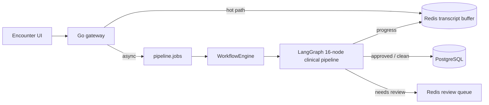
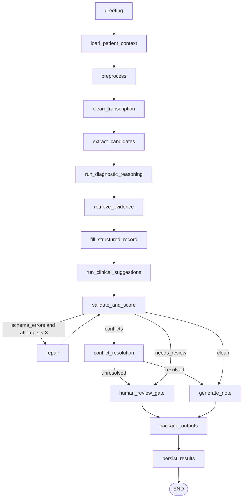
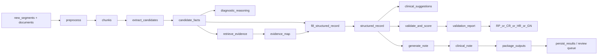
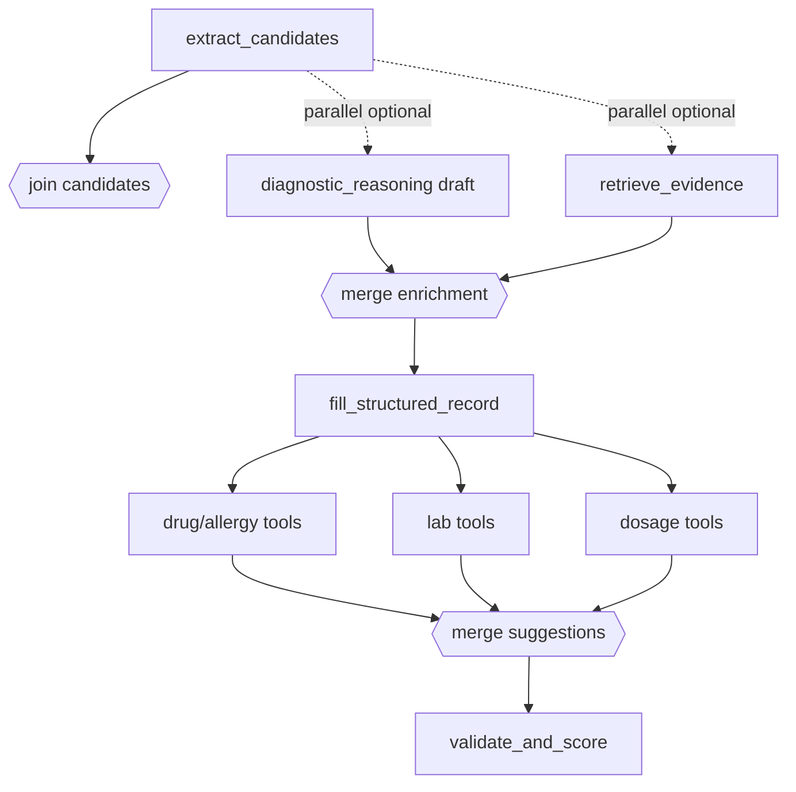
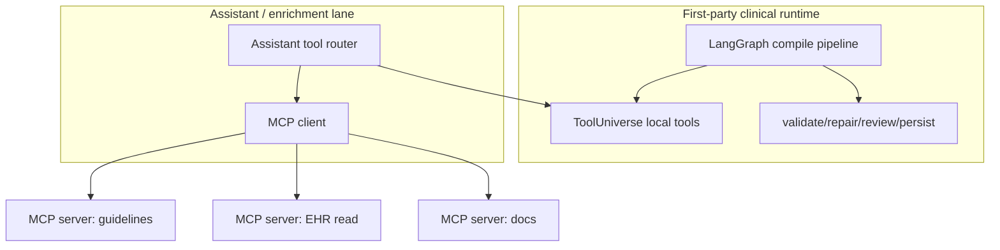

# MedScribe — Agentic Design

This document describes **how clinical agent orchestration works today**, what
`GraphState` carries between nodes, and how that model should evolve toward
parallel tool use and optional MCP-style external capabilities.

Canonical implementation sources:

| Concern | Source of truth |
|---------|-----------------|
| Graph topology | `server/app/agents/graph.py::build_graph` |
| Shared state schema | `server/app/agents/state.py::GraphState` |
| Dependency injection | `server/app/agents/config.py::AgentContext` |
| Runtime execution | `server/app/core/workflow_engine.py::WorkflowEngine` |
| Progress surface | `server/app/core/pipeline_progress.py` |
| System placement | `docs/architecture.md` |
| Engineering rationale | `docs/design-decisions.md` |

Related internal notes (node intent, not topology source of truth):
`server/app/agents/Agents.md`.

**Execution roadmap for the refactor** (graph collapse, session context cache,
intent-aware copilot intervene policy, retrieval as shared node+tool capability):
[agent_refactor_plan.md](./agent_refactor_plan.md).

**Frozen semantics for that refactor** (lane definitions, fixed-vs-agent matrix,
two-stage addressee/task gate, executor-owned plans, silence-default intervene
policy, shared tool registry, Lane B outputs):
[copilot_runtime_contract.md](./copilot_runtime_contract.md). Code contracts live
in `server/app/agents/intent/`, `server/app/agents/tool_contracts.py`, and
`server/app/agents/compile_contracts.py`.

---

## 1. Role of the agent graph in the system

The LangGraph pipeline is the **background clinical intelligence lane**, not the
transcription hot path.

Per `docs/architecture.md`:

1. Browser / gateway capture transcript segments quickly (Redis + async event).
2. A pipeline job is enqueued (`pipeline.jobs` / internal pipeline route).
3. Python `WorkflowEngine` builds the graph via `build_graph(ctx)` and runs it.
4. Each node completion updates Redis progress for the UI.
5. Final structured record / note is either auto-persisted or staged for
   physician review.

The agent graph must never block `POST /transcribe`.



Entry points today:

- `POST` session pipeline route → `WorkflowEngine(enable_interrupts=False)`
- internal pipeline route used by distributed / Kafka consumers → same setting

Production path intentionally disables graph-level interrupts. Review is
handled as **end-of-session sign-off**, not a mid-graph human pause.

---

## 2. Orchestration model today: mostly linear DAG

The checked-in graph is a **single-threaded linear main path** with two
conditional branch points after validation. It is *not* a free-form multi-agent
chat loop, and it does **not** currently use LangGraph `Send` fan-out, parallel
supersteps, or MCP tool servers.

### 2.1 Topology (canonical 16 nodes)

**Always-on main path (13 nodes)**

| # | Graph node name | Implementation | Role |
|---|-----------------|----------------|------|
| 1 | `greeting` | `graph.py` | Seeds welcome `message` |
| 2 | `load_patient_context` | `nodes/load_patient_context.py` | Loads prior facts into `patient_record_fields` |
| 3 | `preprocess` | `nodes/preprocess.py` | Ingest + normalize + chunk (merged former ingest/normalize/segment) |
| 4 | `clean_transcription` | `nodes/clean.py` | Disfluency cleanup / abbreviation expansion |
| 5 | `extract_candidates` | `nodes/extract.py` | Typed `candidate_facts` with provenance |
| 6 | `run_diagnostic_reasoning` | `nodes/diagnostic_reasoning.py` | Differential / workup / risk flags |
| 7 | `retrieve_evidence` | `nodes/evidence.py` | Ground candidates via hybrid/pgvector retrieval |
| 8 | `fill_structured_record` | `nodes/fill_record.py` | Map candidates → `structured_record` |
| 9 | `run_clinical_suggestions` | `nodes/clinical_suggestions.py` | Allergy / interaction / ToolUniverse checks |
| 10 | `validate_and_score` | `nodes/validate.py` | Contracts, confidence, conflict signals |
| 14 | `generate_note` | `nodes/generate_note.py` | Grounded SOAP / clinical note |
| 15 | `package_outputs` | `nodes/package.py` | Assemble response payload + exports |
| 16 | `persist_results` | `nodes/persist_results.py` | DB write or Redis review staging |

**Conditional nodes (3)**

| # | Graph node name | Implementation | Entered when |
|---|-----------------|----------------|--------------|
| 11 | `repair` | `nodes/repair.py` | schema errors and repair attempts < 3 |
| 12 | `conflict_resolution` | `nodes/conflicts.py` | validation conflicts present |
| 13 | `human_review_gate` | `nodes/review_gate.py` | needs review / unresolved conflicts |

> Naming note: graph keys use `run_diagnostic_reasoning` and
> `run_clinical_suggestions`, while docs/UI catalogues often say
> `diagnostic_reasoning` / `clinical_suggestions`. Progress mapping must keep
> both aligned.

### 2.2 Edge map



### 2.3 Routing authority

All non-linear behavior is concentrated in two routers in `graph.py`:

**After `validate_and_score` (`_route_after_validate`)** — priority order:

1. `validation_report.schema_errors` and `controls.attempts.repair < 3` → `repair`
2. `validation_report.conflicts` → `conflict_resolution`
3. `validation_report.needs_review` → `human_review_gate`
4. else → `generate_note`

**After `conflict_resolution` (`_route_after_conflict`)**:

1. `conflict_report.unresolved` → `human_review_gate`
2. else → `generate_note`

`repair` always edges back to `validate_and_score` (bounded loop).

### 2.4 What "agentic" means in this codebase

In MedScribe terms, an "agent" is **a node's policy + tools**, not an autonomous
peer process:

| Logical agent | Primary node(s) | Hard constraint |
|---------------|-----------------|-----------------|
| Session greeter | `greeting` | No clinical mutation |
| Context loader | `load_patient_context` | Read-only prior facts |
| Transcript preprocessor | `preprocess`, `clean_transcription` | Never invent medical facts |
| Candidate extractor | `extract_candidates` | Evidence span required; low confidence if weak |
| Diagnostic reasoner | `run_diagnostic_reasoning` | Structured differentials only; rule fallback if LLM down |
| Evidence linker | `retrieve_evidence` | Retrieval justifies fields; not open-ended Q&A |
| Record compiler | `fill_structured_record` | Compile only from evidenced candidates |
| Safety checker | `run_clinical_suggestions` | Never suppress critical alerts |
| Validator | `validate_and_score` | Deterministic contracts first |
| Repair specialist | `repair` | Patch only failed fields; budget-bounded |
| Conflict arbiter | `conflict_resolution` | Policy-first; escalate on tie |
| Review gatekeeper | `human_review_gate` | Minimal, answerable questions |
| Note generator | `generate_note` | No entities absent from structured record |
| Packager / persister | `package_outputs`, `persist_results` | Review flags block durable patient mutation |

This is intentionally closer to a **clinical compiler pipeline** than a chatbot.

---

## 3. GraphState: shared memory contract

Defined in `server/app/agents/state.py`.

### 3.1 Identity

| Field | Type | Meaning |
|-------|------|---------|
| `session_id` | `str` | Encounter / pipeline run id |
| `patient_id` | `str` | Patient key |
| `doctor_id` | `str` | Clinician key |
| `is_new_patient` | `bool` | Skip/limit historical DB lookups |

### 3.2 Inputs

| Field | Type | Meaning |
|-------|------|---------|
| `conversation_log` | `List[ConversationTurn]` | Prior turns already in session |
| `new_segments` | `List[TranscriptSegment]` | Fresh transcript batch for this run |
| `documents` | `List[DocumentArtifact]` | OCR/text artifacts attached to the run |
| `inputs` | `Dict[str, Any]` | Free-form run knobs (e.g. complexity signals) |

`TranscriptSegment` carries `raw_text`, optional `cleaned_text`, speaker,
timings, uncertainties, and confidence.

### 3.3 Intermediate working set

| Field | Type | Written mainly by |
|-------|------|-------------------|
| `patient_record_fields` | `Optional[Dict]` | `load_patient_context` |
| `chunks` | `List[ChunkArtifact]` | `preprocess` |
| `candidate_facts` | `List[CandidateFact]` | `extract_candidates`, patched by `repair` |
| `evidence_map` | `Dict[str, List[EvidenceItem]]` | `retrieve_evidence` |
| `structured_record` | `Dict[str, Any]` | `fill_structured_record` (+ repair/conflict patches) |
| `diagnostic_reasoning` | `Optional[Dict]` | `run_diagnostic_reasoning` |
| `clinical_suggestions` | `Optional[Dict]` | `run_clinical_suggestions` |
| `session_summary` | `Optional[Dict]` | optional summarizer paths |
| `message` | `Optional[str]` | human-readable status / greeting |

### 3.4 Validation / control plane

| Field | Type | Meaning |
|-------|------|---------|
| `validation_report` | `Optional[ValidationReport]` | schema_errors, missing_fields, conflicts, needs_review |
| `conflict_report` | `Optional[ConflictReport]` | unresolved flag, resolutions, evidence |
| `flags` | `Dict[str, bool]` | e.g. `awaiting_human_review`, `processing_error` |
| `controls` | `Controls` | `attempts`, `budget`, `trace_log` |

`Controls.trace_log` is the per-node audit trail later persisted by
`persist_results` when a durable write occurs.

### 3.5 Outputs

| Field | Type | Meaning |
|-------|------|---------|
| `clinical_note` | `Optional[str]` | Grounded note text |
| packaged artifacts | via `package_outputs` side effects / nested outputs | JSON/markdown/export bundle |

### 3.6 Dataflow sketch



State is treated as a **mutable working document** passed node-to-node. Nodes
should shallow-copy before write (`state = {**state}` / `state.copy()` pattern)
to avoid accidental upstream mutation.

---

## 4. AgentContext and tools (capability injection)

Nodes do not import infrastructure singletons directly when possible. Capabilities
are injected through `AgentContext`:

| Capability | Typical consumers |
|------------|-------------------|
| `llm` / `llm_factory` | extract, diagnostic reasoning, repair, note generation |
| `patient_service` / `patient_repo` | load context, suggestions, conflicts |
| `record_repo` / `session_repo` | persist path |
| `embedding_service` / `hybrid_retrieval_service` | evidence grounding |
| `clinical_engine` | safety suggestions |
| `tool_universe_service` | drug / lab / dosage / diagnostics tool facade |
| `db_session_factory` | audit + repo operations |
| knobs: `max_llm_calls`, `grounding_threshold`, `persistence_floor`, `trace_enabled` | budgets and gates |

`make_node(fn, ctx)` adapts:

- `(state) -> state` context-free nodes
- `(state, ctx) -> state` context-aware nodes

into LangGraph's uniform `(state) -> state` signature.

### 4.1 Local tool surface today

Under `server/app/agents/tools/`:

| Tool / service | Purpose |
|----------------|---------|
| `LLMTool` | Budget-aware LLM wrapper around `controls.budget` |
| `PatientLookupTool` | Structured patient history fetch |
| `DrugCheckerTool` | Interaction / allergy checks |
| `OCRReaderTool` | Document text extraction helper |
| `ToolUniverseService` | Unified local medical tool facade |

`ToolUniverseService` categories (local/sync by default):

- `medical_drugs`
- `medical_diagnostics`
- `lab_interpretation`
- `dosage_calculation`
- `medical_symptoms`

External APIs (RxNorm / OpenFDA) are only used when the underlying engine is
configured with external DB access. There is **no MCP client/server wiring in
the repo today**.

### 4.2 Where LLM is used vs deterministic logic

Rough split (see also `docs/design-decisions.md`):

| Mostly deterministic | LLM-assisted |
|----------------------|--------------|
| preprocess / clean heuristics | extract_candidates (JSON extraction) |
| fill_structured_record mapping | diagnostic_reasoning (with rule fallback) |
| validate_and_score contracts | repair targeted patching |
| clinical_suggestions engine + ToolUniverse | generate_note grounded prose |
| conflict policy checks | optional ambiguous disambiguation |

This split is deliberate: routing and safety should not depend on model whim.

---

## 5. Runtime execution semantics

### 5.1 Initial state

`WorkflowEngine.create_initial_state()` seeds empty collections, empty
`structured_record`, and:

```python
controls = {
    "attempts": {},
    "budget": {},
    "trace_log": [],
}
```

Callers attach `new_segments`, `documents`, and optional `inputs` before invoke.

### 5.2 Streaming and progress

`execute_async()` runs `graph.stream(..., stream_mode="updates")` on a worker
thread and maps each node delta into `pipeline_progress_store` so the frontend
can poll per-node status without waiting for full completion.

### 5.3 Human review model (important)

Two mechanisms exist; only one is production-default:

| Mechanism | Status | Behavior |
|-----------|--------|----------|
| LangGraph `interrupt_before=["human_review_gate"]` | Available, usually off | Synchronous pause mid-graph |
| Flag + Redis review queue in `persist_results` | Production path | Graph completes; durable patient record write is deferred until physician sign-off |

If `flags.awaiting_human_review` is set, `persist_results` **does not** mutate
the durable medical record. It stages the proposal for review-and-persist.

This matches architecture rule 4: physician sign-off gates record persistence,
not transcription, and should not freeze the encounter pipeline unnecessarily.

### 5.4 Checkpointing caveat

Redis/LangGraph checkpointing is currently limited by version skew notes in
`graph.py` (LangGraph 0.1.x vs newer checkpoint packages). Correctness today
relies on local stream accumulation of final state, not durable mid-graph
checkpoints.

---

## 6. Why the architecture doc feels more "agentic" than the code

`docs/architecture.md` describes the **target production shape**:

- reliable ingest lane vs background work lane
- queue fan-out (`transcript.events`, `ocr.jobs`, `pipeline.jobs`, `note.jobs`, `review.jobs`)
- Redis-first assistant answers with optional RAG / DB tools
- OCR and LangGraph as separate worker pools

That is **system-level parallelism and tool routing**, not "every LangGraph node
is a concurrent agent."

| Layer | Parallelism today | Parallelism target |
|-------|-------------------|--------------------|
| Capture vs intelligence | Separated by design | Keep strict |
| OCR vs clinical graph | Separate workers/queues | Keep coarse services |
| Inside LangGraph main path | Serial node chain | Selective fan-out only where independent |
| Assistant / profile Q&A | Ad hoc Redis/DB/RAG | Explicit tool router + optional MCP |
| Note generation | Queued job | Keep async |

Architecture guidance also says **avoid** one-service-per-LangGraph-node and
one-service-per-OCR-stage. Parallelism should follow latency class and ownership,
not maximal graph fragmentation.

`distributed_plan2.md` similarly notes the current pipeline is effectively a
linear chain with a few branches; a full dynamic fan-out engine is not required
to ship the distributed cutover.

---

## 7. Target agentic evolution

The linear graph is a stable clinical compiler. Evolution should add
**controlled concurrency and tool abstraction** without turning the hot path
into an open agent loop.

### 7.1 Design principles

1. **Keep transcription non-blocking.** Agent work stays on background jobs.
2. **Deterministic validators remain the router.** LLMs propose; contracts dispose.
3. **Parallelize only independent pure reads / enrichments.** Do not parallel-write the same record fields without a merge policy.
4. **Tools are capabilities, not peers.** Prefer typed tool results over free chat transcripts.
5. **MCP is an integration boundary, not the core runtime.** Core safety tools stay in-process or behind first-party services.
6. **Provenance is mandatory.** Every persisted field needs source spans / tool receipts.
7. **Budgets are first-class.** `controls.attempts` and `controls.budget` gate loops and external calls.

### 7.2 Candidate parallel regions inside the graph

Safe-to-consider fan-out once state merge rules exist:



| Region | Why parallel is plausible | Merge requirement |
|--------|---------------------------|-------------------|
| post-extract diagnostic draft + evidence retrieval | both read `candidate_facts`; weak write overlap | diagnostic output and evidence_map are separate keys |
| clinical suggestion tool pack | drug/lab/dose queries are independent reads | reduce into one `clinical_suggestions` object |
| multi-document OCR pre-graph | docs independent before candidate extract | document artifact list append-only |
| assistant query tools (outside main compile graph) | Redis / SQL / vector / MCP lookups independent | ranked answer with citations |

Still keep serial:

- `fill_structured_record` before safety validation
- `validate_and_score` before repair/conflict routing
- `generate_note` after a stable structured record
- `persist_results` after packaging and review flags

### 7.3 Proposed tool-calling model

Move from "node body reaches into services" toward an explicit tool router used
by a small number of nodes:

```text
Node policy
  -> ToolRouter.plan(state, goal)
  -> parallel ToolInvocation[]
  -> ToolResult[] (typed)
  -> Node reducer writes GraphState fields + trace_log receipts
```

Each tool invocation receipt should record:

- tool name / version
- args hash (no secrets in plain logs)
- latency_ms
- ok / error
- provenance pointers (doc id, chunk id, URI, row key)

This is compatible with current `controls.trace_log` and audit persistence.

### 7.4 MCP integration posture (proposed, not implemented)

MCP (Model Context Protocol) is a good fit for **external or swappable tools**,
especially assistant/query workflows and non-core knowledge sources.

**Good MCP candidates**

- external formulary / guideline browsers
- EHR read adapters (with strict scopes)
- enterprise document stores
- calculator / unit / coding systems not owned in-process
- developer/ops inspection tools in non-prod

**Keep first-party / in-process**

- validation contracts
- review gating
- persistence and audit
- critical allergy/interaction policy engine
- budget enforcement
- anything that can silently mutate patient state

Suggested boundary:



Rules if/when MCP is added:

1. MCP tools are **read-mostly** by default.
2. Writes require explicit physician-approved workflows, never autonomous MCP write.
3. Results enter GraphState only through typed adapters (no raw tool prose as source of truth).
4. Networked MCP calls count against `controls.budget` and have timeouts/circuit breakers.
5. PHI leaving the trust boundary needs policy review; prefer local servers in VPC.
6. Assistant answers that used MCP must show source receipts in UI.

### 7.5 Assistant path vs compile path

Do not force every clinician question through the full 16-node compile graph.

| Path | Trigger | State needs | Tools |
|------|---------|-------------|-------|
| Compile pipeline | explicit pipeline/note job, session milestones | full GraphState | extract → validate → note |
| Assistant / profile QA | ad hoc question | session cache + retrieval bundle | Redis, SQL, pgvector, optional MCP |
| OCR review package | upload | document artifacts + field diffs | OCR stages + review queue |
| Note-only job | user requests SOAP/discharge | transcript + structured draft | note generator + retrieval |

This matches architecture's Redis-first then PostgreSQL/pgvector then direct DB
tool preference for profile questions.

### 7.6 State extensions for parallel + MCP (suggested)

Additive fields (backward compatible):

```python
# proposed extensions to GraphState / controls
pending_tool_calls: List[ToolCallSpec]
tool_results: List[ToolResult]
mcp_context: {
    "servers": [...],
    "allowed_tools": [...],
    "call_count": int,
}
flags: {
    "awaiting_human_review": bool,
    "processing_error": bool,
    "partial_enrichment": bool,   # parallel tool subset failed soft
}
controls.budget: {
    "llm_calls": int,
    "mcp_calls": int,
    "retrieval_calls": int,
    "max_parallel_tools": int,
}
```

Merge policy sketch:

- append-only lists (`trace_log`, `tool_results`, `chunks`) concatenate
- maps (`evidence_map`) key-merge with confidence ranking
- single-writer fields (`structured_record`, `clinical_note`) update only in serial owner nodes

---

## 8. Failure, budget, and safety controls

| Control | Mechanism | Location |
|---------|-----------|----------|
| Repair bound | max 3 attempts | `_route_after_validate` + `controls.attempts.repair` |
| LLM budget | `max_llm_calls` / budget helpers | `AgentContext`, `tools/llm.py`, guardrails |
| Soft dependency failure | node skip + trace reason | many nodes (no patient history, no engine) |
| Critical safety | never suppress critical alerts | clinical suggestions |
| Review gate | flag + non-persist path | review_gate + persist_results |
| Cross-visit contradictions | deterministic compare to prior facts | validate_and_score |
| Grounding floor | `grounding_threshold` | evidence / persistence gating |
| Persistence floor | `persistence_floor` | embedding/final confidence gating |

Parallel/MCP work must inherit the same controls: a failed side tool marks
`partial_enrichment` and downgrades confidence; it must not invent fields.

---

## 9. Implementation roadmap (practical)

### Phase A — Document and freeze the linear compiler (current)

- Keep `graph.py` as topology source of truth
- Keep node names aligned across backend progress defs and frontend catalogues
- Preserve deterministic validation as sole router

### Phase B — Explicit tool interface without topology change

- Route `clinical_suggestions` / diagnostic enrichment fully through
  `ToolUniverseService`
- Standardize tool receipts in `controls.trace_log`
- Add unit tests for tool failure soft-degrade paths

### Phase C — Selective in-graph parallel enrichment

- Introduce parallel drug/lab/dose suggestion pack with deterministic merge
- Optionally overlap evidence retrieval with diagnostic draft
- Measure against full-pipeline benchmarks before expanding fan-out

### Phase D — Assistant tool router + optional MCP client

- Implement assistant-lane tool router separate from compile graph
- Add MCP client behind allowlist + budget + timeout
- Start with read-only servers; no autonomous persistence

### Phase E — Distributed ownership remains coarse

- Gateway / ingest, pipeline worker, OCR worker, review worker, assistant worker
- Do not explode to one deployable per node
- gRPC inference can replace local `LLMClient` via `AgentContext` without
  changing node semantics

---

## 10. Non-goals

- Autonomous multi-agent debate as the default clinical path
- MCP write tools with direct EHR mutation
- One microservice per LangGraph node
- Blocking transcription on tool or MCP latency
- Replacing deterministic validation with LLM self-judgment
- Free-form chat history as the system of record

---

## 11. Quick reference: current vs target

| Dimension | Current | Target |
|-----------|---------|--------|
| Graph shape | Linear + repair/conflict/review branches | Same backbone + selective parallel enrichment |
| Tool calls | In-process services via `AgentContext` | Explicit router; parallel typed invocations |
| MCP | Not present | Optional read-mostly assistant/enrichment boundary |
| Human review | End-of-session queue (prod) | Keep; optional interrupt only for special modes |
| State | Single `GraphState` working set | Same + tool_results/mcp budget fields |
| Parallelism locus | Queues/workers around the graph | Queues/workers + limited in-graph fan-out |
| Source of clinical truth | Structured record + provenance + PG after approval | Unchanged |

---

## 12. File map for contributors

```text
server/app/agents/
  graph.py                 # topology + routers
  state.py                 # GraphState and artifact types
  config.py                # AgentContext + make_node
  validation_contracts.py  # field contracts used by validator
  nodes/                   # one module per stage
  tools/                   # LLM, patient lookup, drug checker, OCR, ToolUniverse
  guardrails/              # budget / medical fact guards
server/app/core/
  workflow_engine.py       # invoke/stream + initial state
  pipeline_progress.py     # Redis progress projection
  review_queue.py          # deferred persistence staging
docs/
  architecture.md          # system lanes, queues, durability rules
  design-decisions.md      # why LangGraph / DI / review model
  agentic_design.md        # this document
```

When topology changes, update in this order:

1. `graph.py` node registration and edges
2. `pipeline_progress.py` node catalogue
3. frontend pipeline node catalogue (if present)
4. `docs/architecture.md` node table
5. this document
