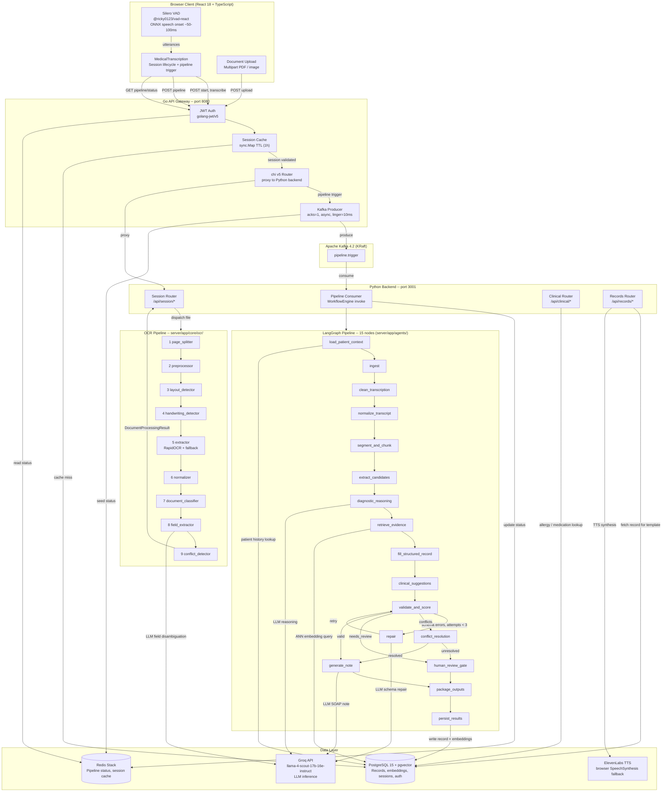

# MedScribe — System Architecture

## Component Diagram



---

## Persistence Model

Three persistence mechanisms serve distinct purposes:

| Store | Technology | What it holds | When written |
|-------|-----------|---------------|--------------|
| **Session / Auth** | PostgreSQL 15 (pgxpool via Go gateway) | Users, sessions, auth tokens | On register, login, session start/end |
| **Patient records** | PostgreSQL 15 + pgvector (SQLAlchemy via Python) | `StructuredRecord`, embeddings, audit trace | Only in `persist_results` (final node) |
| **Pipeline status** | Redis Stack | Per-node progress, pipeline state | Seeded by Go gateway on trigger, updated by Python after each node |
| **Session cache** | In-process sync.Map (Go gateway) | Session ID -> session object, 1h TTL | On first session lookup (cache miss fills from PG) |

**Pipeline trigger flow:**
1. Client sends `POST /api/session/{id}/pipeline` to Go gateway (port 8080)
2. Gateway validates JWT, checks session cache (sync.Map), falls back to PG on cache miss
3. Gateway seeds pipeline status in Redis (async goroutine) and produces a Kafka message to `pipeline.trigger` (acks=1, async delivery, micro-batched)
4. Gateway returns `202 Accepted` immediately
5. Python backend consumes from Kafka, invokes `WorkflowEngine.run()` which executes the 15-node LangGraph pipeline
6. Each node completion updates Redis pipeline status
7. Frontend polls `GET /api/session/{id}/pipeline/status` (served by Go gateway reading from Redis)

**Interrupt/resume flow:**
1. When `interrupt_before=["human_review_gate"]` is active, the graph pauses before executing that node
2. The partial state lives in the Python process; the pipeline status in Redis reflects the paused state
3. To resume: the gateway publishes a resume trigger to Kafka
4. **Current status:** `enable_interrupts=False` -- the infrastructure is in place but the gate runs non-interactively

---

## LangGraph Node Reference

All 15 nodes in execution order:

| # | Node | File | Description |
|---|------|------|-------------|
| 1 | `load_patient_context` | `nodes/load_patient_context.py` | Loads prior patient facts from PostgreSQL into `patient_record_fields` |
| 2 | `ingest` | `nodes/ingest.py` | Loads transcript segments + OCR artifacts into `GraphState.chunks` |
| 3 | `clean_transcription` | `nodes/clean.py` | Removes disfluencies, expands abbreviations |
| 4 | `normalize_transcript` | `nodes/normalize.py` | Standardises medical terminology |
| 5 | `segment_and_chunk` | `nodes/segment.py` | Splits transcript into topical clinical chunks |
| 6 | `extract_candidates` | `nodes/extract.py` | NLP entity recognition -> `candidate_facts` list |
| 7 | `diagnostic_reasoning` | `nodes/diagnostic_reasoning.py` | LLM differential diagnosis over extracted candidates |
| 8 | `retrieve_evidence` | `nodes/evidence.py` | pgvector ANN search -> `evidence_map` (fact_id -> source chunks) |
| 9 | `fill_structured_record` | `nodes/fill_record.py` | Maps candidates to typed `StructuredRecord` schema |
| 10 | `clinical_suggestions` | `nodes/clinical_suggestions.py` | Allergy + drug interaction lookup; LLM for disambiguation |
| 11 | `validate_and_score` | `nodes/validate.py` | Pydantic + contract validation; cross-visit contradiction detection; sets `validation_report.needs_review` |
| -- | `repair` | `nodes/repair.py` | LLM schema repair (loops back to validate, max 3 iterations) |
| -- | `conflict_resolution` | `nodes/conflicts.py` | Resolves discrepancies against stored patient history |
| -- | `human_review_gate` | `nodes/review_gate.py` | Interrupt point for physician approval |
| 12+ | `generate_note` | `nodes/generate_note.py` | LLM SOAP note generation |
| 13+ | `package_outputs` | `nodes/package.py` | Assembles final response payload |
| 14+ | `persist_results` | `nodes/persist_results.py` | Writes record, embeddings, audit trace to PostgreSQL |

**Routing from `validate_and_score`** (conditional edges, in priority order):
1. `schema_errors` present AND `repair_attempts < 3` → `repair` → back to `validate_and_score`
2. `conflicts` present → `conflict_resolution` → `human_review_gate` (if unresolved) or `generate_note`
3. `needs_review` true → `human_review_gate` → `package_outputs`
4. Default (valid record) → `generate_note` → `package_outputs`

---

## GraphState Schema

Defined in `server/app/agents/state.py`:

```python
class GraphState(TypedDict):
    # Session identifiers
    session_id: str
    patient_id: str
    doctor_id: str

    # Raw input
    conversation_log: List[ConversationTurn]
    new_segments: List[TranscriptSegment]       # incoming transcript
    documents: List[DocumentArtifact]           # OCR-processed uploads

    # Intermediate state
    session_summary: Optional[Dict[str, Any]]
    patient_record_fields: Optional[Dict[str, Any]]  # loaded from DB by load_patient_context
    chunks: List[ChunkArtifact]                 # segmented text chunks
    candidate_facts: List[CandidateFact]        # extracted clinical facts
    evidence_map: Dict[str, List[EvidenceItem]] # fact_id → source references

    # Validated output
    structured_record: Dict[str, Any]           # filled StructuredRecord
    validation_report: Optional[ValidationReport]
    conflict_report: Optional[ConflictReport]
    clinical_suggestions: Optional[Dict[str, Any]]
    diagnostic_reasoning: Optional[Dict[str, Any]]

    # Final output
    clinical_note: Optional[str]                # generated SOAP note

    # Control flow
    flags: Dict[str, bool]                      # awaiting_human_review, processing_error, etc.
    is_new_patient: bool
    message: Optional[str]
    inputs: Dict[str, Any]
    controls: Controls                          # attempts, budget, trace_log
```

`Controls.trace_log` accumulates a structured entry per node (node name, action, timestamp, detail) and is written to PostgreSQL by `persist_results` as the audit trail.

---

## Confidence Scoring

Per-field confidence is **not** derived from LLM logits. It follows a deterministic rule-based approach:

1. Each `CandidateFact` carries a `confidence: float` set during extraction (0.0–1.0)
2. `validation_contracts.py` defines a `CONTRACT` dict with per-field rules including optional `min_confidence` thresholds
3. `validate_and_score_node` checks each field against its contract — if `fact.confidence < rules["min_confidence"]`, a schema error is recorded
4. `validation_report.needs_review` is set to `True` if **any** of the following are present: schema errors, missing required fields, or intra-session or cross-visit conflicts

---

## OCR Pipeline Reference

| Stage | File | Description |
|-------|------|-------------|
| 1 — Page Splitter | `core/ocr/page_splitter.py` | Converts PDF pages and images to normalised page images |
| 2 — Preprocessor | `core/ocr/preprocessor.py` | Deskew, denoise, contrast enhancement |
| 3 — Layout Detector | `core/ocr/layout_detector.py` | Region segmentation |
| 4 — Handwriting Detector | `core/ocr/handwriting_detector.py` | Classifies handwritten vs printed regions for engine selection |
| 5 — Extractor | `core/ocr/extractor.py` | RapidOCR with engine fallback |
| 6 — Normalizer | `core/ocr/normalizer.py` | Medical spelling correction |
| 7 — Document Classifier | `core/ocr/document_classifier.py` | Document type classification (lab report, discharge summary, etc.) |
| 8 — Field Extractor | `core/ocr/field_extractor.py` | Structured field extraction with per-field confidence scores |
| 9 — Conflict Detector | `core/ocr/conflict_detector.py` | Flags value conflicts against active patient record |

"9 processing stages" refers to these 9 sequential files. Stages 2+3 and 6+7 are logically related pairs but are implemented as separate modules.
