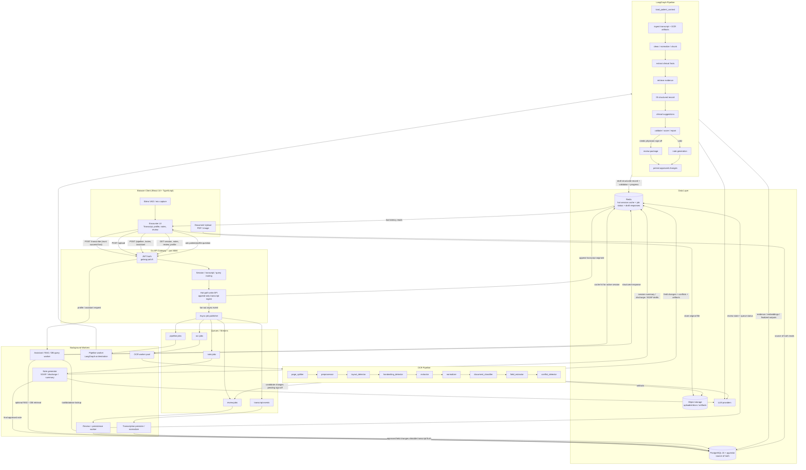

# MedScribe — System Architecture

## Reliability Criteria

The production design is driven by five rules:

1. **Transcription is the protected hot path.**
   Capturing utterances must not wait on OCR, LangGraph, note generation, RAG,
   or physician-review work.
2. **Everything expensive is non-blocking.**
   OCR, SOAP/discharge generation, evidence grounding, record validation, and
   background persistence can return later through status updates.
3. **Session state must survive worker lag.**
   If a worker is slow or unavailable, the active encounter still continues and
   newly captured transcript segments are never dropped.
4. **Physician sign-off gates record persistence, not transcription.**
   Reviewable field changes can wait; the conversation cannot.
5. **Ending a session is a durability boundary.**
   On session end, all in-session transcript, queued outputs, and approved
   structured changes must be flushed to durable storage.

---

## Target Production Shape

This document describes the **target production design**, not just the current
single-process implementation in the repo.

The key design choice is to split the system into:

- a **reliable ingest lane** for transcript capture
- a **background work lane** for OCR, LangGraph, note generation, RAG, and
  post-processing

That separation ensures that slow clinical intelligence work never blocks the
capture of speech.

## Component Diagram


```mermaid
flowchart TB
    subgraph FE["Browser Client (React 18 + TypeScript)"]
        VAD["Silero VAD / mic capture"]
        UI["Encounter UI\nTranscript, profile, notes, review"]
        UPL["Document Upload\nPDF / image"]
    end

    subgraph GW["Go API Gateway -- port 8080"]
        AUTH["JWT Auth\ngolang-jwt/v5"]
        ROUT["Session / transcript / query routing"]
        HOT["Hot-path write API\nappend-only transcript ingest"]
        QPUB["Async job publisher"]
    end

    subgraph QUEUES["Queues / Streams"]
        TQ["transcript.events"]
        OQ["ocr.jobs"]
        PQ["pipeline.jobs"]
        NQ["note.jobs"]
        RQ["review.jobs"]
    end

    subgraph WORKERS["Background Workers"]
        TW["Transcription persister / normalizer"]
        OW["OCR worker pool"]
        PW["Pipeline worker\nLangGraph orchestration"]
        NW["Note generator\nSOAP / discharge / summary"]
        AW["Assistant / RAG / DB query worker"]
        RW["Review + persistence worker"]
    end

    subgraph OCR["OCR Pipeline"]
        direction LR
        S1["page_splitter"] --> S2["preprocessor"] --> S3["layout_detector"] --> S4["handwriting_detector"]
        S4 --> S5["extractor"] --> S6["normalizer"] --> S7["document_classifier"] --> S8["field_extractor"] --> S9["conflict_detector"]
    end

    subgraph LG["LangGraph Pipeline"]
        direction TB
        N1["load_patient_context"] --> N2["ingest transcript + OCR artifacts"] --> N3["clean / normalize / chunk"]
        N3 --> N4["extract clinical facts"] --> N5["retrieve evidence"] --> N6["fill structured record"]
        N6 --> N7["clinical suggestions"] --> N8["validate / score / repair"]

        N8 -->|"needs physician sign-off"| N9["review package"]
        N8 -->|"valid"| N10["note generation"]
        N9 --> N11["persist approved changes"]
        N10 --> N11
    end

    subgraph DATA["Data Layer"]
        PG[("PostgreSQL 15 + pgvector\nsource of truth")]
        RD[("Redis\nhot session cache + job status + draft responses")]
        OBJ[("Object storage\nuploaded docs / artifacts")]
        LLM["LLM providers"]
    end

    VAD --> UI
    UI -->|"POST /transcribe (must succeed fast)"| AUTH
    UI -->|"POST /upload"| AUTH
    UI -->|"POST /pipeline, /notes, /assistant"| AUTH
    UI -->|"GET session, notes, review, profile"| AUTH

    AUTH --> ROUT
    ROUT --> HOT
    HOT -->|"append transcript segment"| RD
    HOT -->|"fan-out async event"| QPUB
    QPUB --> TQ
    QPUB --> OQ
    QPUB --> PQ
    QPUB --> NQ
    QPUB --> RQ

    UPL -->|"store original file"| OBJ
    OQ --> OW
    OW --> OCR
    OCR -->|"field changes + conflicts + artifacts"| RD
    OCR -->|"artifacts"| OBJ
    OCR -->|"candidate changes pending sign-off"| RQ

    PQ --> PW
    PW --> LG
    LG -->|"draft structured record + validation + progress"| RD
    LG -->|"evidence / embeddings / finalized outputs"| PG

    NQ --> NW
    NW -->|"session summary / discharge / SOAP drafts"| RD
    NW -->|"final approved note"| PG

    UI -->|"ask patient/profile question"| AUTH
    AUTH -->|"profile / assistant request"| AW
    AW -->|"cache hit for active session"| RD
    AW -->|"optional RAG + DB retrieval"| PG
    AW -->|"tool/database lookup"| PG
    AW -->|"structured response"| RD

    RQ --> RW
    RW -->|"approved field changes only"| PG
    RW -->|"review state + queue status"| RD

    TQ --> TW
    TW -->|"durable transcript flush"| PG

    RD -->|"low-latency reads"| UI
    PG -->|"source of truth reads"| UI
    LG --> LLM
    OCR --> LLM
    NW --> LLM
```

---

## Persistence Model

The target design uses **four** storage layers with different guarantees:

| Store | Technology | What it holds | When written |
|-------|-----------|---------------|--------------|
| **Session / Auth / Durable transcript** | PostgreSQL 15 | Users, encounters, transcript ledger, finalized notes | On auth events, session lifecycle events, transcript flush, session end |
| **Patient record source of truth** | PostgreSQL 15 + pgvector | Patient medical record, approved field changes, embeddings, audit log | After physician sign-off or validated auto-persist |
| **Hot session cache** | Redis | Current transcript buffer, draft structured record, note drafts, assistant responses, review queue | On every active session mutation |
| **Artifact storage** | Object storage / disk | Uploaded documents, OCR artifacts, rendered exports | On upload and on export generation |

### Hot-path guarantee

The write path for `POST /transcribe` is intentionally minimal:

1. Validate session and user
2. Append transcript segment to Redis hot session state
3. Publish an async event for downstream consumers
4. Return success immediately

The transcript path must **not** synchronously wait on:

- OCR
- LangGraph pipeline execution
- note generation
- patient-profile retrieval
- RAG / embedding search
- physician-review logic
- final PostgreSQL persistence

If downstream workers are slow, the session continues and later consumers catch
up from queued transcript events.

### Redis responsibilities

Redis is used as the **active encounter memory layer**:

- latest transcript buffer for the active session
- note drafts (session summary, discharge note, SOAP draft)
- pipeline progress and worker status
- OCR field-change packages waiting for review
- assistant / patient-profile response cache for recent queries
- transient merged views used to build structured responses quickly

Redis is not the final source of truth for patient history. It is the low-
latency session working set.

### PostgreSQL responsibilities

PostgreSQL remains the durable source of truth for:

- finalized transcript ledger
- finalized patient profile and medical record
- approved OCR-driven field changes
- finalized SOAP/discharge/session notes
- embeddings and audit trace

### End-session durability boundary

`POST /session/{id}/end` is not just a UI toggle. It performs a final flush:

1. Persist any transcript segments still buffered in Redis
2. Persist any approved but not-yet-written structured changes
3. Persist finalized note outputs generated during the session
4. Mark unresolved review items explicitly as pending follow-up
5. Mark the session closed in PostgreSQL

If background workers are behind, end-session moves the remaining in-session
state through a durable flush path before acknowledging completion.

---

## Primary Runtime Flows

### 1. Reliable transcription flow

1. Browser captures utterance
2. Gateway validates encounter and appends segment to Redis
3. Gateway publishes transcript event
4. UI receives immediate acknowledgement and continues recording
5. Background transcript persister later flushes transcript ledger to PostgreSQL

This is the only path that must feel effectively real-time.

### Planned transcription-quality upgrade

The checked-in repo still uses browser speech recognition for the first-pass
transcript. The intended next step is to keep browser-side Silero VAD for
utterance detection, send voiced audio segments to a server-side Whisper +
pyannote worker, and reconcile the active transcript with corrected text and
speaker-role labels asynchronously. Browser speech synthesis remains unchanged;
no neural output voice model is in scope for this phase.

Implementation plan: [whisper_pyannote_role_detection_plan.md](./whisper_pyannote_role_detection_plan.md)

### 2. OCR review-and-persist flow

1. User uploads document
2. Upload service stores original file and queues OCR job
3. OCR worker extracts fields, low-confidence markers, and conflicts
4. Redis is updated with a review package for the active session
5. Physician signs off on field changes
6. Approved changes are persisted into the patient medical record in PostgreSQL

The important rule is that OCR completion can be delayed, but approved changes
must persist cleanly once sign-off occurs.

### 3. Patient profile / assistant query flow

When the user asks a patient-profile-related question, the system can answer by
either:

- reading recent session state from Redis
- doing RAG over patient embeddings in PostgreSQL
- issuing tool/database lookups directly against structured tables

The assistant should prefer:

1. Redis for current-session context
2. PostgreSQL / pgvector for grounded historical context
3. direct DB/tool lookups for exact structured facts

This keeps recent-session questions fast without forcing every request through a
full pipeline run.

### 4. Session summary / discharge / SOAP generation flow

1. User requests note generation
2. Gateway queues a note-generation job
3. Worker builds a structured response from:
   - active transcript + draft record in Redis
   - optional RAG retrieval over prior patient data
   - direct DB retrieval for exact patient facts
4. Draft note is written back to Redis for UI display
5. Once approved/finalized, note is persisted to PostgreSQL

These note-generation calls are background-friendly by design.

### 5. End-session flow

1. User ends session
2. Service stops accepting new utterances for that encounter
3. Remaining Redis session state is flushed durably
4. Final approved record and notes are persisted
5. Session status becomes closed

This guarantees that the session boundary is meaningful for data durability.

---

## Service Boundary Guidance

The system should be decomposed by **latency class and ownership**, not by
individual OCR or LangGraph steps.

### Recommended coarse-grained services

- **Gateway / ingest service**
  Owns auth, encounter validation, transcript append, job enqueue, and status
  reads.
- **Pipeline worker**
  Owns LangGraph orchestration and background clinical reasoning.
- **OCR worker**
  Owns document processing and field-change packages.
- **Review / persistence worker**
  Owns physician sign-off application and final record persistence.
- **Assistant / query worker**
  Owns Redis-first profile queries, optional RAG, and structured DB/tool calls.

### Avoid these splits

- one service per LangGraph node
- one service per OCR stage
- synchronous RPC between every clinical transformation step

Those boundaries usually increase:

- image/state serialization costs
- queueing latency
- failure surface area
- tracing/debug complexity

without improving the reliability of the protected transcription path.

---

## LangGraph Node Reference

All 16 nodes in execution order (13 always-on main-path + 3 conditional).
The canonical source is `server/app/agents/graph.py::build_graph`; the names
below must match the keys registered there.

| # | Node | File | Description |
|---|------|------|-------------|
| 1 | `greeting` | `agents/graph.py` | Seeds initial state with a welcome message |
| 2 | `load_patient_context` | `nodes/load_patient_context.py` | Loads prior patient facts from PostgreSQL into `patient_record_fields` |
| 3 | `preprocess` | `nodes/preprocess.py` | Ingests segments + OCR artifacts, normalises speaker labels, and chunks into clinical segments (merges the former ingest/normalize/segment nodes) |
| 4 | `clean_transcription` | `nodes/clean.py` | Removes disfluencies, expands abbreviations |
| 5 | `extract_candidates` | `nodes/extract.py` | NLP entity recognition -> `candidate_facts` list |
| 6 | `diagnostic_reasoning` | `nodes/diagnostic_reasoning.py` | LLM differential diagnosis over extracted candidates |
| 7 | `retrieve_evidence` | `nodes/evidence.py` | pgvector ANN search -> `evidence_map` (fact_id -> source chunks) |
| 8 | `fill_structured_record` | `nodes/fill_record.py` | Maps candidates to typed `StructuredRecord` schema |
| 9 | `clinical_suggestions` | `nodes/clinical_suggestions.py` | Allergy + drug interaction lookup; LLM for disambiguation |
| 10 | `validate_and_score` | `nodes/validate.py` | Pydantic + contract validation; cross-visit contradiction detection; sets `validation_report.needs_review` |
| 11 | `repair` *(conditional)* | `nodes/repair.py` | LLM schema repair (loops back to validate, max 3 iterations) |
| 12 | `conflict_resolution` *(conditional)* | `nodes/conflicts.py` | Resolves discrepancies against stored patient history |
| 13 | `human_review_gate` *(conditional)* | `nodes/review_gate.py` | Interrupt point for physician approval |
| 14 | `generate_note` | `nodes/generate_note.py` | LLM SOAP note generation |
| 15 | `package_outputs` | `nodes/package.py` | Assembles final response payload |
| 16 | `persist_results` | `nodes/persist_results.py` | Writes record, embeddings, audit trace to PostgreSQL |

**Routing from `validate_and_score`** (conditional edges, in priority order):
1. `schema_errors` present AND `repair_attempts < 3` → `repair` → back to `validate_and_score`
2. `conflicts` present → `conflict_resolution` → `human_review_gate` (if unresolved) or `generate_note`
3. `needs_review` true → `human_review_gate` → `package_outputs`
4. Default (valid record) → `generate_note` → `package_outputs`

---

## GraphState Schema

Defined in `server/app/agents/state.py`:

```python
class GraphState(TypedDict):
    # Session identifiers
    session_id: str
    patient_id: str
    doctor_id: str

    # Raw input
    conversation_log: List[ConversationTurn]
    new_segments: List[TranscriptSegment]       # incoming transcript
    documents: List[DocumentArtifact]           # OCR-processed uploads

    # Intermediate state
    session_summary: Optional[Dict[str, Any]]
    patient_record_fields: Optional[Dict[str, Any]]  # loaded from DB by load_patient_context
    chunks: List[ChunkArtifact]                 # segmented text chunks
    candidate_facts: List[CandidateFact]        # extracted clinical facts
    evidence_map: Dict[str, List[EvidenceItem]] # fact_id → source references

    # Validated output
    structured_record: Dict[str, Any]           # filled StructuredRecord
    validation_report: Optional[ValidationReport]
    conflict_report: Optional[ConflictReport]
    clinical_suggestions: Optional[Dict[str, Any]]
    diagnostic_reasoning: Optional[Dict[str, Any]]

    # Final output
    clinical_note: Optional[str]                # generated SOAP note

    # Control flow
    flags: Dict[str, bool]                      # awaiting_human_review, processing_error, etc.
    is_new_patient: bool
    message: Optional[str]
    inputs: Dict[str, Any]
    controls: Controls                          # attempts, budget, trace_log
```

`Controls.trace_log` accumulates a structured entry per node (node name, action, timestamp, detail) and is written to PostgreSQL by `persist_results` as the audit trail.

---

## Confidence Scoring

Per-field confidence is **not** derived from LLM logits. It follows a deterministic rule-based approach:

1. Each `CandidateFact` carries a `confidence: float` set during extraction (0.0–1.0)
2. `validation_contracts.py` defines a `CONTRACT` dict with per-field rules including optional `min_confidence` thresholds
3. `validate_and_score_node` checks each field against its contract — if `fact.confidence < rules["min_confidence"]`, a schema error is recorded
4. `validation_report.needs_review` is set to `True` if **any** of the following are present: schema errors, missing required fields, or intra-session or cross-visit conflicts

---

## OCR Pipeline Reference

| Stage | File | Description |
|-------|------|-------------|
| 1 — Page Splitter | `core/ocr/page_splitter.py` | Converts PDF pages and images to normalised page images |
| 2 — Preprocessor | `core/ocr/preprocessor.py` | Deskew, denoise, contrast enhancement |
| 3 — Layout Detector | `core/ocr/layout_detector.py` | Region segmentation |
| 4 — Handwriting Detector | `core/ocr/handwriting_detector.py` | Classifies handwritten vs printed regions for engine selection |
| 5 — Extractor | `core/ocr/extractor.py` | PaddleOCR det/rec models (served via the RapidOCR ONNX runtime) with engine fallback |
| 6 — Normalizer | `core/ocr/normalizer.py` | Medical spelling correction |
| 7 — Document Classifier | `core/ocr/document_classifier.py` | Document type classification (lab report, discharge summary, etc.) |
| 8 — Field Extractor | `core/ocr/field_extractor.py` | Structured field extraction with per-field confidence scores |
| 9 — Conflict Detector | `core/ocr/conflict_detector.py` | Flags value conflicts against active patient record |

"9 processing stages" refers to these 9 sequential files. Stages 2+3 and 6+7 are logically related pairs but are implemented as separate modules.
