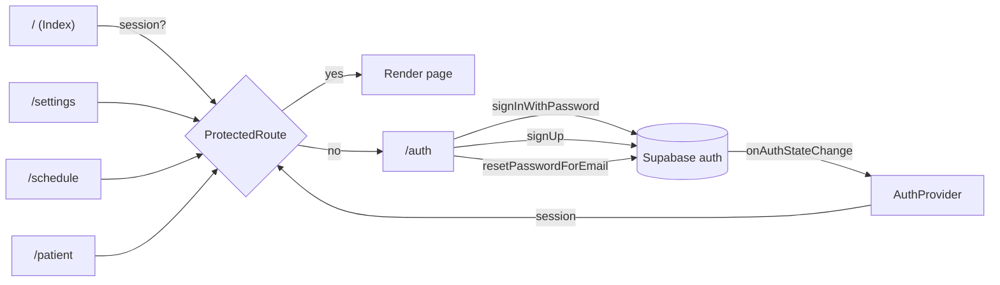
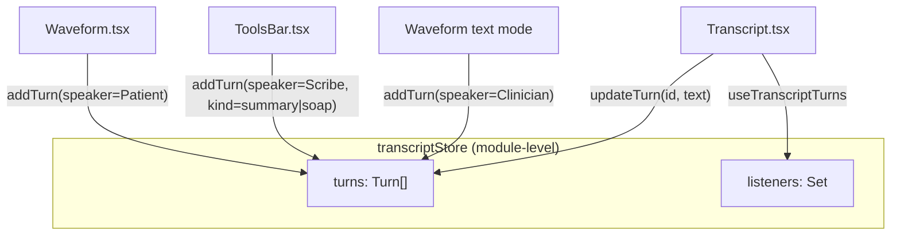
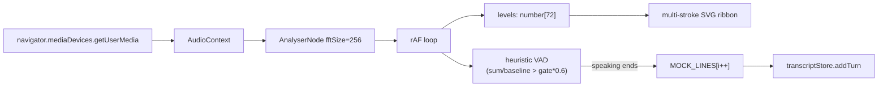

# WhisperWave Frontend — Architecture & Integration Notes

The `whisperwave-transcribe/` workspace is a Lovable-generated rebuild of the
MedScribe clinical UI. It is a standalone Vite/React app that lives in the same
monorepo as the rest of the MedScribe backend (`server/`, `services/`, `proto/`,
the LangGraph pipeline) but does **not** yet call any of it. Every clinical
data flow inside WhisperWave is currently mocked in-memory; the only real
external dependency is Supabase, used purely for auth + a single `profiles`
table.

This document captures what's there, what it depends on, and where the seams
are for replacing the mocks with the real MedScribe pipeline.

---

## Tech Stack

| Layer            | Choice                                                                |
| ---------------- | --------------------------------------------------------------------- |
| Build / dev      | Vite 5 + `@vitejs/plugin-react-swc`                                   |
| Language         | TypeScript 5.8 (strict mode on — see `tsconfig.app.json`)             |
| UI framework     | React 18.3                                                            |
| Routing          | `react-router-dom` 6 (BrowserRouter)                                  |
| Data fetching    | `@tanstack/react-query` 5 (provider wired; not yet used)              |
| State (local)    | React hooks + a `useSyncExternalStore` singleton for the transcript   |
| Styling          | Tailwind CSS 3.4 + `tailwindcss-animate` + `@tailwindcss/typography`  |
| UI primitives    | Radix UI primitives wrapped as shadcn-style components in `src/components/ui/` |
| Icons            | `lucide-react`                                                         |
| Forms / validation | `react-hook-form` + `zod` (resolvers via `@hookform/resolvers`)     |
| Charts           | `recharts`                                                             |
| Toasts           | `sonner` and the shadcn `toaster` (both providers mounted)            |
| Auth + DB        | `@supabase/supabase-js` v2                                            |
| Theming          | `next-themes` (provider not yet mounted; class-based theme only)      |
| Tests            | Vitest + `@testing-library/react` + `jsdom`                            |
| Lovable tagging  | `lovable-tagger` (dev-only Vite plugin)                                |

`bun.lockb` is committed alongside `package-lock.json`. The app uses npm
scripts; either runtime works.

---

## Top-Level Structure

```
whisperwave-transcribe/
├── src/
│   ├── main.tsx                 # ReactDOM mount
│   ├── App.tsx                  # Providers + route table
│   ├── pages/                   # Route components
│   │   ├── Index.tsx            # /         — main transcription workspace
│   │   ├── Auth.tsx             # /auth     — sign-in / sign-up / forgot
│   │   ├── ResetPassword.tsx    # /reset-password
│   │   ├── Schedule.tsx         # /schedule — mock recents list
│   │   ├── PatientProfile.tsx   # /patient  — multi-tab patient chart
│   │   ├── Settings.tsx         # /settings — profile editor
│   │   └── NotFound.tsx
│   ├── components/
│   │   ├── ProtectedRoute.tsx
│   │   ├── clinical/            # Domain-specific composites
│   │   │   ├── LeftRail.tsx     # Persistent nav rail
│   │   │   ├── Transcript.tsx   # Bubble feed + PDF export dialog
│   │   │   ├── Waveform.tsx     # Mic capture + animated SVG ribbon
│   │   │   ├── ToolsBar.tsx     # Upload / Patient summary / SOAP / Discharge
│   │   │   ├── PatientTabs.tsx  # Overview / BGL / Meds / Labs / MiniGoals
│   │   │   ├── _shared.tsx      # Panel / SectionHeader / tone classes
│   │   │   └── transcriptStore.ts # External store (turns + mutations)
│   │   ├── patient/             # Sub-components for /patient
│   │   │   ├── AllergiesEditor.tsx
│   │   │   ├── LabsTable.tsx
│   │   │   └── PatientHeaderCard.tsx
│   │   └── ui/                  # ~50 shadcn primitives over Radix
│   ├── hooks/
│   │   ├── useAuth.tsx          # Supabase session context
│   │   ├── useProfile.tsx       # profiles row fetcher
│   │   ├── use-mobile.tsx
│   │   └── use-toast.ts
│   ├── data/
│   │   └── patientMock.ts       # All hardcoded clinical fixtures
│   ├── integrations/
│   │   └── supabase/
│   │       ├── client.ts        # createClient<Database>(URL, ANON_KEY)
│   │       └── types.ts         # Generated DB types (profiles only)
│   ├── lib/utils.ts             # cn() helper (clsx + tailwind-merge)
│   └── test/                    # Vitest setup + placeholder spec
└── supabase/migrations/         # 3 SQL files — profiles table + RLS + trigger
```

---

## Routing & Auth Flow



- `AuthProvider` (`hooks/useAuth.tsx`) subscribes to
  `supabase.auth.onAuthStateChange` and exposes `{ session, user, loading,
  signOut }` via context.
- `ProtectedRoute` blocks render until `loading === false`, then either
  renders children or navigates to `/auth` while preserving the original path
  in `location.state.from`.
- Session storage backend: `localStorage` (see `client.ts`). Auto-refresh and
  persist are both on.

---

## Transcript State Model

The transcript is the only piece of "live" data in the app. It uses
`useSyncExternalStore` over a module-level singleton (`transcriptStore.ts`):



A `Turn` is `{ id, speaker: Clinician | Patient | Scribe, time, text,
partial?, attachment?, kind?: message | document | summary | soap }`. The
Scribe `kind: soap | summary` triggers the `FormattedScribe` renderer
(section-heading detection via regex) and unlocks an inline editor + per-bubble
download.

Implications:

- The store lives for the page session — reloads wipe it.
- One global encounter — every visitor sees the same conversation. The
  hardcoded `Encounter #4821` in `Transcript.tsx` is the only identifier.
- This is the seam to replace with a real session-scoped channel
  (WebSocket / SSE / WebRTC datachannel from the MedScribe backend).

---

## Audio Pipeline (current, mocked)



- The "VAD" is a simple energy-over-baseline threshold with a 1.5s
  end-of-utterance window, persisted as `peakBaseline` + `noiseGate` in
  `localStorage`. The Settings popover exposes a calibration button.
- If mic permission is denied, the same loop runs against a synthesised
  sine wave so the demo never breaks.
- When voice "ends", the app appends the next canned line from
  `MOCK_LINES` to the transcript. **No audio is uploaded anywhere.**

This is the entry point to swap in the real MedScribe streaming
transcription (the parent repo's pipeline has Silero VAD running client-side
in the original frontend — see `docs/design-decisions.md`).

---

## External Libraries (Runtime)

| Package                              | Purpose in app                                              |
| ------------------------------------ | ----------------------------------------------------------- |
| `react`, `react-dom`                 | Core                                                        |
| `react-router-dom`                   | Routing + `<Navigate>` + `useLocation`                      |
| `@tanstack/react-query`              | Provider mounted; **not yet used** by any component         |
| `@supabase/supabase-js`              | Auth (`signInWithPassword`, `signUp`, `resetPasswordForEmail`, `updateUser`, `onAuthStateChange`) + `from('profiles')` reads/writes |
| `zod`                                | Email / password / name / URL schemas in Auth + Settings    |
| `react-hook-form`, `@hookform/resolvers` | Available; current forms use plain `useState`            |
| `recharts`                           | Area + Line charts on `OverviewTab`, `BglAnalysisTab`, `LabResultsTab` |
| `sonner`                             | All success / error toasts                                  |
| `lucide-react`                       | Icons (entire app)                                          |
| `next-themes`                        | Listed; no `<ThemeProvider>` mounted yet                    |
| `date-fns`                           | Listed; not currently used                                  |
| `class-variance-authority`, `clsx`, `tailwind-merge` | shadcn variants + `cn()` helper            |
| `@radix-ui/react-*` (28 packages)   | Primitives backing the shadcn components in `src/components/ui/` |
| `embla-carousel-react`, `vaul`, `cmdk`, `input-otp`, `react-day-picker`, `react-resizable-panels` | Available via shadcn primitives; not yet referenced from app code |

Dev-only: `lovable-tagger` is a Vite plugin enabled in `mode === "development"`
that decorates JSX with Lovable identifiers for their visual editor. It is a
no-op in production builds.

## Browser / Web APIs

- `navigator.mediaDevices.getUserMedia({ audio: true })`
- `AudioContext` / `AnalyserNode` / `getByteFrequencyData`
- `requestAnimationFrame` for the waveform render loop
- `URL.createObjectURL` for uploaded-file previews and generated PDFs
- `Blob` for PDF / TXT downloads
- `localStorage` for: Supabase session, waveform calibration (`waveform.peakBaseline`, `waveform.noiseGate`)
- `crypto.randomUUID()` for client-generated goal IDs

## External Services

- **Supabase** (`VITE_SUPABASE_URL`, `VITE_SUPABASE_PUBLISHABLE_KEY`,
  `VITE_SUPABASE_PROJECT_ID`).
  - Auth: email/password sign-in, sign-up with `display_name` metadata,
    password reset (email link → `/reset-password`).
  - DB: a single `profiles` table (id = `auth.users.id`, `display_name`,
    `avatar_url`, timestamps) with RLS allowing all authenticated reads and
    owner-only writes. A trigger seeds `profiles` from `auth.users` on
    insert.

That's the entire external surface. No MedScribe gateway, no LangGraph
pipeline call, no Kafka, no Postgres, no inference service.

---

## What's Mocked vs Real

| Surface                          | Real?     | Source                                                  |
| -------------------------------- | --------- | ------------------------------------------------------- |
| Sign-in / sign-up / reset        | real      | Supabase auth                                           |
| Profile (display name, avatar)   | real      | `profiles` table                                        |
| ProtectedRoute guard             | real      | Supabase session                                        |
| Live transcript                  | mock      | `MOCK_LINES` in `Waveform.tsx`                          |
| SOAP note draft                  | mock      | Hardcoded string in `ToolsBar.tsx` + `Transcript.tsx`   |
| Discharge note                   | mock      | Hardcoded string in `ToolsBar.tsx`                      |
| Patient summary chip             | mock      | Hardcoded "Jordan Reyes" in `ToolsBar.tsx`              |
| Patient profile page             | mock      | `data/patientMock.ts` (was inline before refactor)      |
| Schedule page                    | mock      | Hardcoded `recents` map                                 |
| BGL / labs / meds / goals charts | mock      | Hardcoded arrays in `PatientTabs.tsx`                   |
| Audio upload                     | none      | Mic is captured for visualisation only                  |
| File upload                      | stub      | Attached as `URL.createObjectURL` only; no upload       |
| PDF export                       | client    | Hand-rolled PDF byte writer (see `Transcript.tsx`)      |

---

## Seams for Integration with the MedScribe Backend

The minimum set of edits to switch this from a demo to a thin client over the
real pipeline:

1. **Transcript stream.** Replace `transcriptStore` with a session-scoped
   channel keyed by an encounter ID from the route or server. The store API
   (`addTurn`, `updateTurn`, `subscribe`, `getSnapshot`) is the right shape;
   only the backing data source changes.

2. **Audio capture.** Stop short-circuiting `MOCK_LINES` and start a real
   upload from the `Waveform` audio loop — either streaming chunks via
   `MediaRecorder` over WebSocket, or hand the existing `MediaStream` to a
   WebRTC transport that the gateway in `server/` already understands.

3. **Patient + encounter data.** Add tables (or call existing
   `services/records`) for patient, encounter, transcript-turn, lab, med,
   goal, allergy. Replace `data/patientMock.ts` with React Query hooks
   (`useQueryPatient`, etc.) — `@tanstack/react-query`'s provider is already
   mounted.

4. **SOAP / discharge generation.** `ToolsBar.tsx` should `POST` to the
   pipeline endpoint that already produces SOAP notes (the 15-node LangGraph
   pipeline — see `docs/architecture.md`) and append the streamed result via
   `transcriptStore.addTurn({ kind: 'soap' })`. The bubble renderer and the
   inline editor already handle this content shape.

5. **Auth bridge.** Decide whether Supabase remains the auth source of truth
   or whether the Go gateway's JWT issuance does. If gateway, swap the
   Supabase client for a thin wrapper that talks to `auth.users` via the
   gateway and stores the JWT.

6. **Encounter ID propagation.** The hardcoded `Encounter #4821` in the
   transcript header and the PDF title needs to come from `useParams()` /
   route state. The `/patient` route currently has no `:id` segment — add
   one once patients are real.

---

## Known Mismatches & Gotchas

- **Supabase types are stale.** `src/integrations/supabase/types.ts` is the
  generated type for a DB that has only `profiles`. Anything richer requires
  regenerating after running new migrations.
- **localStorage session.** XSS exfiltration of the Supabase access token is
  possible if any user-controlled HTML is ever rendered unescaped. Currently
  no `dangerouslySetInnerHTML` is used.
- **Avatar URL** is a user-supplied string written straight to the row and
  rendered as ``. Validation is restricted to `https:` after the
  cleanup pass, but the URL is not fetched / proxied — any tracking pixel
  works.
- **Mic calibration is global.** `localStorage` keys for the waveform are
  not scoped per user, so they bleed across accounts on shared workstations.
- **One global transcript.** See above — `transcriptStore` is module-level.
- **Hand-rolled PDF.** `Transcript.tsx` ships ~170 lines of PDF byte-writing
  with a `charWidth = fontSize * 0.5` heuristic. Fine for the demo, but
  switch to `pdf-lib` before any real document leaves the app.

---

## Build / Run

```bash
cd whisperwave-transcribe
npm install        # or: bun install
npm run dev        # vite dev server on :8080
npm run build      # production build
npm run lint       # eslint
npm run test       # vitest run (single placeholder spec at present)
```

`@` resolves to `src/` (`vite.config.ts`, `tsconfig.app.json`).
